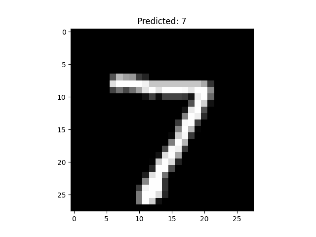

# MNIST手写字符识别

该项目用来实现对手写数字的识别

## 项目结构图

```plaintext
MNIST Handwritten Digit Classification
|
|-- model.py # 定义神经网络结构
|   |-- NeuralNet (class) # 构建用于MNIST数字分类的神经网络模型
|
|-- train_model.py # 包含模型训练和评估的代码
|   |-- train (function) # 训练模型，返回每次epoch的训练损失
|   |-- test (function) # 评估模型，打印准确率和平均损失
|   |-- main execution block # 执行模型训练和测试流程
|
|-- mnist_predict.py # 使用训练好的模型进行预测
|   |-- preprocess_image (function) # 对新图像进行预处理以适应模型
|   |-- predict (function) # 使用模型对预处理后的图像进行预测
|	|-- main execution block # 执行图像预测流程
|
|-- data/
|	|-- MNIST/ # 该文件夹用来存储MNIST中的数据
|
|-- examples/ # 该文件夹中用来存储100个样例图片
|
|-- predict_images/ # 该文件夹中用来存储需要识别的图片
|
|-- docs/
|	|-- MNIST手写字符识别实验报告.docx # 本次实验的word实验报告
|	|-- MNIST手写字符识别实验报告.pdf  # 本次实验的pdf实验报告
|
|-- model.pth # 训练出的神经网络模型
|-- readme.md # 项目简介
|-- requirements.txt # 项目中依赖的包
```

## 项目依赖

运行该项目,需要安装一下的依赖(版本不一样时不保证可以运行成功):

```python
Pillow==10.1.0
torch==2.1.1
torchvision==0.16.1

matplotlib~=3.8.2
```

您可以通过运行以下命令来安装这些依赖项：

```bash
pip3 install -r requirements.txt
```

## 项目运行方式:

安装项目依赖后执行以下执行来训练模型:

```bash
python3 train_model.py
```

1.   该python文件首先会下载MNIST数据到`./data`文件夹中,大小约为500MB.
2.   然后该项目会加载MNIST数据集,训练时会对数据集中的数据进行适当的转换(转为张量、标准化)
3.   其次为训练和测试数据集创建 `DataLoader`，以便在训练和评估过程中批量加载数据。
4.   
     
     + `train` 函数用于训练模型。它遍历训练数据加载器中的批次数据，执行前向和后向传播，更新模型参数。
     + `test` 函数用于评估模型。它遍历测试数据加载器中的数据，计算模型的损失和准确率。
5.   

     +   设置训练的epochs数。

     +   对于每个epoch，调用 `train` 函数进行训练，并调用 `test` 函数进行评估。

     +   训练完成后，模型状态（权重和偏差）被保存到 `model.pth` 文件中。

6.   使用 `plot_examples` 函数，从测试数据集中显示一些图片和模型的预测。
7.   使用 `save_examples` 函数，将一些测试样本的图片及其模型预测保存到指定文件夹。

## 模型训练效果:

```
Epoch 1
-------------------------------
loss: 2.354920  [    0/60000]
loss: 0.412174  [ 6400/60000]
loss: 0.354146  [12800/60000]
loss: 0.344568  [19200/60000]
loss: 0.362949  [25600/60000]
loss: 0.451336  [32000/60000]
loss: 0.431929  [38400/60000]
loss: 0.251388  [44800/60000]
loss: 0.199853  [51200/60000]
loss: 0.130820  [57600/60000]
Test Error: 
 Accuracy: 93.4%, Avg loss: 0.225899 

Epoch 2
-------------------------------
loss: 0.185689  [    0/60000]
loss: 0.139291  [ 6400/60000]
loss: 0.355247  [12800/60000]
loss: 0.170598  [19200/60000]
loss: 0.220295  [25600/60000]
loss: 0.128450  [32000/60000]
loss: 0.065901  [38400/60000]
loss: 0.127051  [44800/60000]
loss: 0.072048  [51200/60000]
loss: 0.303864  [57600/60000]
Test Error: 
 Accuracy: 95.4%, Avg loss: 0.150283 

Epoch 3
-------------------------------
loss: 0.124232  [    0/60000]
loss: 0.115441  [ 6400/60000]
loss: 0.058861  [12800/60000]
loss: 0.083369  [19200/60000]
loss: 0.066679  [25600/60000]
loss: 0.118891  [32000/60000]
loss: 0.054929  [38400/60000]
loss: 0.210742  [44800/60000]
loss: 0.075034  [51200/60000]
loss: 0.110859  [57600/60000]
Test Error: 
 Accuracy: 96.1%, Avg loss: 0.133264 

Epoch 4
-------------------------------
loss: 0.127429  [    0/60000]
loss: 0.066850  [ 6400/60000]
loss: 0.241161  [12800/60000]
loss: 0.089738  [19200/60000]
loss: 0.193802  [25600/60000]
loss: 0.074207  [32000/60000]
loss: 0.272002  [38400/60000]
loss: 0.091803  [44800/60000]
loss: 0.097746  [51200/60000]
loss: 0.118522  [57600/60000]
Test Error: 
 Accuracy: 96.2%, Avg loss: 0.117603 

Epoch 5
-------------------------------
loss: 0.162923  [    0/60000]
loss: 0.081532  [ 6400/60000]
loss: 0.144496  [12800/60000]
loss: 0.197388  [19200/60000]
loss: 0.072401  [25600/60000]
loss: 0.020777  [32000/60000]
loss: 0.063514  [38400/60000]
loss: 0.086938  [44800/60000]
loss: 0.084312  [51200/60000]
loss: 0.032998  [57600/60000]
Test Error: 
 Accuracy: 96.9%, Avg loss: 0.100546 

Done!
Displaying example predictions:
Saving example predictions:

```

该模型最终的正确率达到了`96.9%`,同时loss仅有`0.1`,可以认为该模型较精确

显示出的样例:


保存的样例:

样例1:



样例2:


样例3:


样例4:

