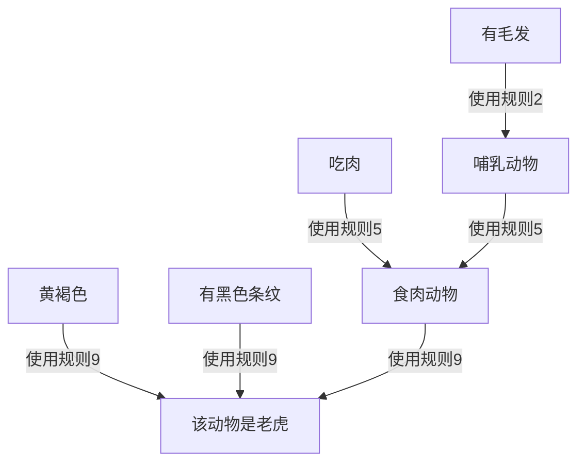
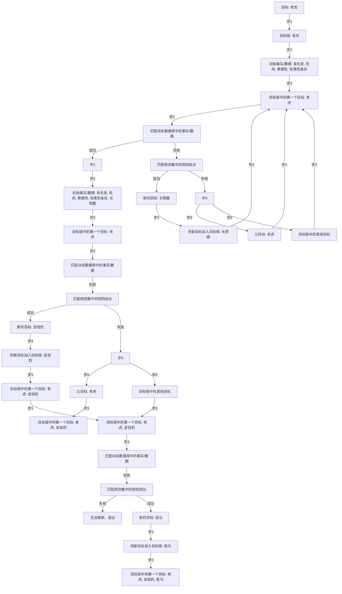

# 实验二 产生式系统

程序包括了三个python文件,分别为

+ [ProductionRule.py](ProductionRule.py)
+ [ProductionSystem.py](ProductionSystem.py)
+ [main.py](main.py)

三个python文件的作用分别如下:

## ProductionRule.py

该文件创建了一个名为$ProductionRule$的类,类中包含两个函数,分别为:

```python
class ProductionRule:
    def __init__(self, condition: dict, action: str) -> None:
        """
        构造函数,用于构造一个规则
        :param condition:规则的前提条件,即 IF 语句中的条件,类型是字典,key为条件,value为条件的真假
        :param action:规则的结论,即通过前提条件可以推导得到的东西, THEN 语句中的内容
        :return None
        """
    def evaluate(self, facts: dict) -> str or None:
        """
        该函数判断该规则是否可以与给定的事实匹配
        :param facts:给出的事实
        :return: str or None:如果该规则与给定的事实相匹配,则返回推导出的结论self.action,不然返回None
        """
```

其中,$\_\_init\_\_$为构造函数,作用为构造一个规则.输入的两个形参,其中$condition$为规则的前提条件,$action$为规则的结论

例如,我们有规则

$r_1 : IF\ 该动物有奶\qquad THEN 该动物为哺乳动物$

根据此规则,我们创建一个$ProductionRule$来描述该规则,其中$condition$为 {"有奶": True} ,$action$为 "哺乳动物"

因此,该$ProductionRule$在构造后,内容为:
$$
action = \{str\} \text{"}哺乳动物\text{"} \\
condition = \{dict\} \{\text{"}有奶\text{"},\text{"}True\text{"}\}
$$


$evaluate$函数的作用为输入一个事实$facts$,判断该规则能否与该事实相匹配.若匹配则返回推导得到的结论$self.action$,不然则返回$None$

例如,当前规则内容为:

```python
ProductionRule({"有毛发": True}, "哺乳动物")
```

此时执行函数$evaluate$,输入

```python
facts = {
    "有毛发": True,
    "吃肉": True,
    "黄褐色": True,
    "有黑色条纹": True
}
```

由于规则中的$conditon$ {"有毛发": True} 与 给出的$facts[1]$相匹配,因此函数$evaluate$返回值为 **$哺乳动物$**


## ProductionSystem.py

该函数创建了一个名为$ProductionSystem$的类,类内的函数分别为:

```py
class ProductionSystem:
    def __init__(self) -> None:
        """
        构造函数,构建一个空的产生式系统
        """
    def addRule(self, rule: ProductionRule) -> None:
        """
        该函数用于向产生式系统中增加一条规则
        :param rule: 新增的规则
        :return: None: 无返回值
        """
    def forwardChaining(self, facts: dict) -> set:
        """
        该函数用于正向推理,给定事实,然后进行正向推理,给出最终推理得到的结论
        :param facts: 给定的用于正向推理的事实,为dict类型,如同{"有奶": True, "有毛发": True},key为条件,value为真伪性
        :return: 最终返回正向推理得到的结论
        """
    def backwardChaining(self, facts: dict, goal: str) -> list or None:
        """
        该函数用于反向推理,给定事实facts,给定最终推导的目标goal来进行反向推理
        :param facts: dict,给定的事实集合,例如{"有奶": True, "有毛发": True},key为条件,value为该条件的真伪
        :param goal: str,给定的最终推导的目标
        :return: 若最终推导成功,则返回推导的路径;若推导不成功,则返回None
        """
```

$\_\_init\_\_$为构造函数,作用为产生一个空的产生式系统


$addRule$函数的作用是向该产生式系统中增加一条类型为$ProductionRule$的规则


$forwardChaining$函数的作用是正向推理,给定事实集合$facts$,然后进行正向推理,最终返回基于$facts$ 和 产生式系统中的规则库 推导得到的结论

若规则库如下:

```python
rules = [
    pr.ProductionRule({"有奶": True}, "哺乳动物"),
    pr.ProductionRule({"有毛发": True}, "哺乳动物"),
    pr.ProductionRule({"有羽毛": True}, "鸟"),
    pr.ProductionRule({"会飞": True, "生蛋": True}, "鸟"),
    pr.ProductionRule({"哺乳动物": True, "有爪": True, "有犬齿": True, "目盯前方": True}, "食肉动物"),
    pr.ProductionRule({"哺乳动物": True, "吃肉": True}, "食肉动物"),
    pr.ProductionRule({"哺乳动物": True, "有蹄": True}, "有蹄动物"),
    pr.ProductionRule({"有蹄动物": True, "反刍食物": True}, "偶蹄动物"),
    pr.ProductionRule({"食肉动物": True, "黄褐色": True, "有黑色条纹": True}, "老虎"),
    pr.ProductionRule({"食肉动物": True, "黄褐色": True, "有黑色斑点": True}, "金钱豹"),
    pr.ProductionRule({"有蹄动物": True, "长腿": True, "长脖子": True, "黄褐色": True, "有暗斑点": True}, "长颈鹿"),
    pr.ProductionRule({"有蹄动物": True, "白色": True, "有黑色条纹": True}, "斑马"),
    pr.ProductionRule({"鸟": True, "不会飞": True, "长腿": True, "长脖子": True, "黑白色": True}, "驼鸟"),
    pr.ProductionRule({"鸟": True, "不会飞": True, "会游泳": True, "黑白色": True}, "企鹅"),
    pr.ProductionRule({"鸟": True, "善飞": True, "不怕风浪": True}, "海燕"),
]
```

现在给定事实集合$facts$,$facts$中的内容为

```python
facts = {
    "有毛发": True,
    "吃肉": True,
    "黄褐色": True,
    "有黑色条纹": True
}
```

下面我们使用$forwardChaining$函数进行推理,推理的大致过程如下图所示:




通过给定的$facts$推理得到的结论有

+ 该动物是哺乳动物 $r_2$
+ 该动物是食肉动物 $r5$
+ 该动物是老虎 $r9$

因此推理得到的结论集合$conclusions = \{老虎, 食肉动物, 哺乳动物\}$


$backwardChaining$函数的作用是给定事实集合$facts$,给定最终结论$goal$

假设我们给定的$facts = \{有毛发: True,吃肉: True,黄褐色: True, 有黑色条纹: True\}$,给定的$goal = 老虎$.

那么$backwardChaining$函数的推导过程如下图所示:



最终匹配成功

## main.py

main.py的作用是创建规则库$rules$和事实库$facts$,然后进行正向推理和反向推理,并且输出结果

```python
import ProductionRule as pr
import ProductionSystem as ps

rules = [
    pr.ProductionRule({"有奶": True}, "哺乳动物"),
    pr.ProductionRule({"有毛发": True}, "哺乳动物"),
    pr.ProductionRule({"有羽毛": True}, "鸟"),
    pr.ProductionRule({"会飞": True, "生蛋": True}, "鸟"),
    pr.ProductionRule({"哺乳动物": True, "有爪": True, "有犬齿": True, "目盯前方": True}, "食肉动物"),
    pr.ProductionRule({"哺乳动物": True, "吃肉": True}, "食肉动物"),
    pr.ProductionRule({"哺乳动物": True, "有蹄": True}, "有蹄动物"),
    pr.ProductionRule({"有蹄动物": True, "反刍食物": True}, "偶蹄动物"),
    pr.ProductionRule({"食肉动物": True, "黄褐色": True, "有黑色条纹": True}, "老虎"),
    pr.ProductionRule({"食肉动物": True, "黄褐色": True, "有黑色斑点": True}, "金钱豹"),
    pr.ProductionRule({"有蹄动物": True, "长腿": True, "长脖子": True, "黄褐色": True, "有暗斑点": True}, "长颈鹿"),
    pr.ProductionRule({"有蹄动物": True, "白色": True, "有黑色条纹": True}, "斑马"),
    pr.ProductionRule({"鸟": True, "不会飞": True, "长腿": True, "长脖子": True, "黑白色": True}, "驼鸟"),
    pr.ProductionRule({"鸟": True, "不会飞": True, "会游泳": True, "黑白色": True}, "企鹅"),
    pr.ProductionRule({"鸟": True, "善飞": True, "不怕风浪": True}, "海燕"),
]

facts = {
    "有毛发": True,
    "吃肉": True,
    "黄褐色": True,
    "有黑色条纹": True
}
```

