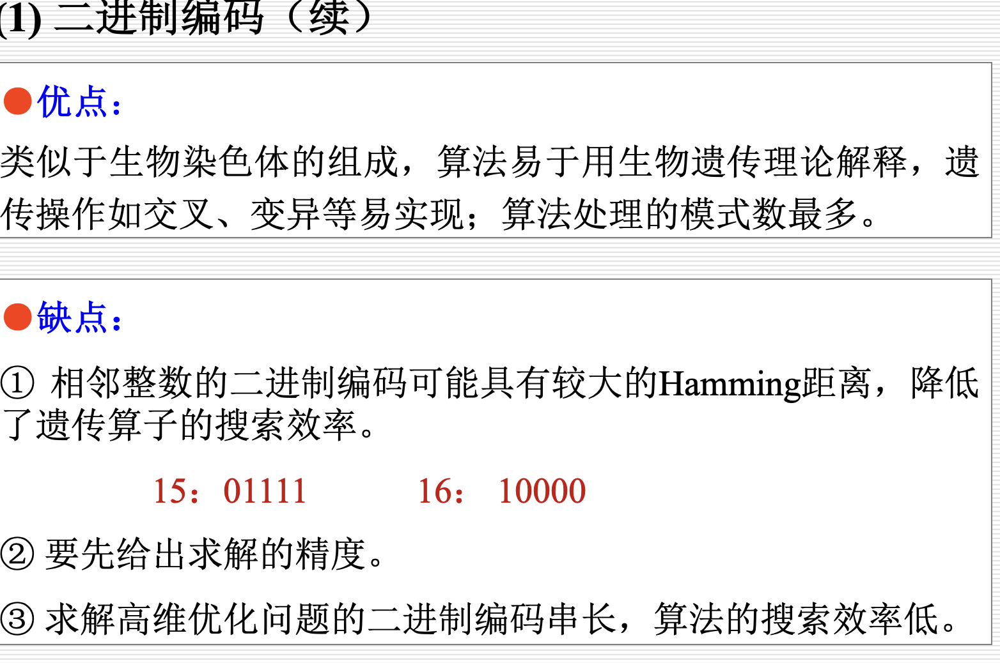

# 人工智能期末复习重点

人工智能发展史

PPT 第一章

什么是人工智能

+   知识
+   智力

## 知识

+   ==谓词公式==
+   产生式(会涉及,但是不多)
+   框架(我们希望表达结构性的知识)
+   知识图谱
+   ==状态空间==(四元组)
    +   宽度优先搜索
    +   深度优先搜索
    +   回朔策略
    +   使用状态空间解决八数码问题
+   神经网络

### 状态空间

A搜索

$A^*$搜索

## 智力

### 推理

推理的基本的概念

==谓词公式化为子句集==

+   将会通过==鲁滨逊归结原理==去考

不确定性推理

### 智能计算

什么是交叉,什么是变异
交叉:

变异:
0变成1,1变成0

二进制编码(会导致汉明距离过大),gray编码

二进制编码变为gray编码

区间$[-1, 1]$, 精度$10^{-3}$,二进制编码需要的位数:

为了确定在区间 $[−1,1]$ 内，精度为 $10^{-3}$ 的二进制编码所需的位数，我们首先需要计算该区间内有多少个不同的值可以表示。计算方法如下：

1.  计算区间宽度：这个区间 $[−1,1]$，所以宽度是 1−(−1)=2。
2.  计算该精度下的可表示值的数量：精度为 $10^{-3}$ 意味着最小的变化单位是 0.001。所以，区间 $[−1,1]$ 内可以表示的不同值的数量是区间宽度除以精度，即 2/0.001=2000。但由于这包括了区间的两端，实际上应该是 2000+1=2001 个值。
3.  计算所需的二进制位数：如果有 $N$ 个不同的值需要表示，那么所需的二进制位数 $b$可以通过解决不等式 $2^b \geq N$ 来找到。我们需要找到最小的$b$，使得 $2^b$ 至少为 2001。

在区间 $[−1,1]$ 内，以精度为 $10^{-3}$ 进行二进制编码，需要的位数是11 位。

## 三个专题:

### 神经网络

BP神经网络

如何表示隐层和输入层

### 信息检索

看上课练习题

+   正确率（Precision）的计算公式是：

$$
Precision=\frac{相关文档数}{返回文档数}=\frac{20}{100}=0.20
$$

+   召回率（Recall）的计算公式是：
$$
Recall=\frac{相关文档数}{文档库中相关文档总数}=\frac{20}{50}=0.40
$$

### 强化学习

