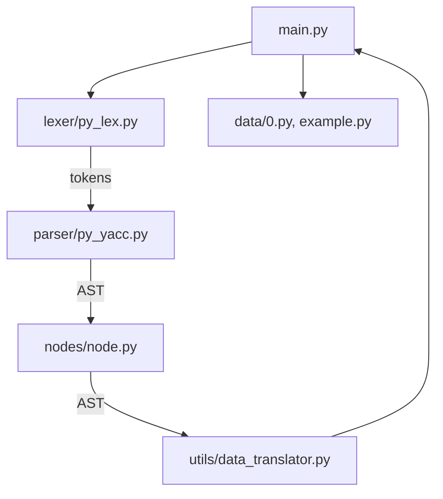

# 基于PLY的Python解析-1

## 项目结构

```
experiment10/
|
|-- data/
|   |-- 0.py
|   |-- example.py
|
|-- docs/
|   |-- 实验报告.docx
|
|-- lexer/
|   |-- __init__.py
|   |-- py_lex.py  	# 词法分析器文件，定义了解释器如何将输入文本分解成一系列标记。
|
|-- nodes/
|   |-- __init__.py
|   |-- node.py 	# 定义了节点类，用于构建抽象语法树（AST），每个节点代表源代码中的一个构造。
|
|-- parser/
|   |-- __init__.py
|   |-- parsetab.py	# Bison/Flex工具生成的文件，包含了解析表，由py_yacc.py使用。
|   |-- py_yacc.py	# 语法分析器文件，包含了解释器如何根据词法标记构建AST的规则。
|
|-- utils/
|   |-- __init__.py
|   |-- data_translator.py	# 数据转换器，可能包含了执行AST节点和执行语义动作的逻辑。
|   |-- text_utils.py		# 文本处理工具，提供文本处理相关的辅助函数。
|
|-- venv/			# 包含Python虚拟环境的相关文件，用于隔离项目依赖，确保不同项目间的依赖不会相互冲突。
|
|-- main.py			# 主执行文件，包含了启动解释器的入口代码，可能会处理命令行参数、读取文件输入等。
|-- readme.md		# 项目的README文件，通常包含项目的概述、安装指南、使用方法和其他重要信息。

```


## 依赖项


要运行此项目，需要安装以下依赖项：

```plaintext
ply~=3.11
```

您可以通过运行以下命令来安装这些依赖项：

```bash
pip install -r requirements.txt
```

## 使用方法

安装完项目依赖后,在终端执行:

```bash
python3 main.txt
```




