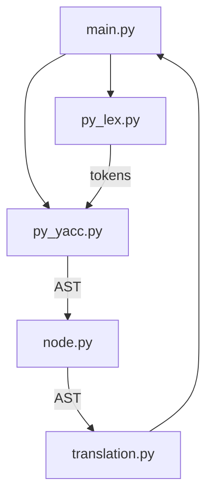

# python 解释器

## 项目结构图

```
.
├── docs
│   ├── ~$2次课实验报告.docx  
│   ├── 第12次课.docx
│   └── 第12次课实验报告.docx
├── python_parser
│   ├── main.py # 解释器的主入口文件，负责启动解释过程
│   ├── node.py # 定义AST（抽象语法树）的节点，用于构建和处理解释器的语法树。
│   ├── parser.out # PLY库生成的解析器调试文件，包含解析器的内部信息。
│   ├── parsetab.py # PLY库生成的解析器表格文件，用于存储语法分析的状态。
│   ├── py_lex.py # 词法分析器的定义，用于将源代码分解为tokens。
│   ├── py_yacc.py # 语法分析器的定义，用于根据tokens构建AST。
│   ├── quick_sort.py # 快速排序算法的Python实现，用作测试。
│   └── translation.py # 负责将AST转换为可执行代码的翻译器。
├── readme.md
└── requirements.txt # 包含项目所需Python库的列表，用于设置项目环境。


```

## 项目流程图



## 项目运行

### 1. 安装依赖

```bash
pip install -r requirements.txt
```

### 2. 运行

```bash
python main.py {需要分析的文件}
```

当需要分析的文件不存在时,程序会报错,报错内容为`不正确的用法