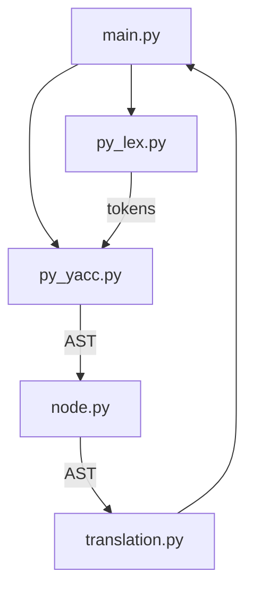

# 基于PLY的Python解析(4)

## 项目结构图
```
基于PLY的Python解析(4)
├── python_parser
│   ├── main.py # 项目的入口文件。处理命令行参数，读取Python脚本文件
│   ├── node.py #  定义了用于构建抽象语法树（AST）的节点类
│   ├── parser.out
│   ├── parsetab.py
│   ├── py_lex.py # 定义了如何将Python代码拆分成一个个的词法单元（tokens）
│   ├── py_yacc.py # 定义了Python语言的语法规则
│   ├── stu.py # 示例Python脚本，用于测试解释器
│   └── translation.py #  负责将抽象语法树转换成可执行的代码
├── readme.md
└── requirements.txt
```

## 项目流程图


## 项目运行

### 1. 安装依赖

```bash
pip install -r requirements.txt
```

### 2. 运行

```bash
python3 main.py {需要分析的文件}
```

当需要分析的文件不存在时,程序会报错,报错内容为`不正确的用法

示例用法:
```bash
python3 python_parser/main.py python_parser/stu.py
```

输出:
```plaintext
语法树： [Program [Statements [Statements [Statements [Statements [Statement [Class ID('Student') [Functions [Functions [Functions [Function ID('__init__') [Args [Args [Args [AID('self')] ID('name')] ID('age')] ID('score')] [Statements [Statements [Statements [Statement [Assignment [Variable ID('self') [.] ID('name')] [Expr [Term [Factor [Variable ID('name')]]]]]]] [Statement [Assignment [Variable ID('self') [.] ID('age')] [Expr [Term [Factor [Variable ID('age')]]]]]]] [Statement [Assignment [Variable ID('self') [.] ID('score')] [Expr [Term [Factor [Variable ID('score')]]]]]]] ]] [Function ID('add_score') [Args [Args ID('self')] ID('score')] [Statements [Statement [Assignment [Variable ID('self') [.] ID('score')] [Expr [Expr [Term [Factor [Variable ID('self') [.] ID('score')]]]] [+] [Term [Factor [Variable ID('score')]]]]]]] ]] [Function ID('print_info') [Args ID('self')] [Statements [Statement [Print [print] [Exprs [Exprs [Expr [Term [Factor [Variable ID('self') [.] ID('name')]]]]] [Expr [Term [Factor [Variable ID('self') [.] ID('age')]]]]] ]]] ]] ]]] [Statement [Assignment [Variable ID('a')] [Expr [Term [Factor [Call ID('Student') [Exprs [Exprs [Exprs [Expr [String String("xiaoming")]]] [Expr [Term [Factor Number(12)]]]] [Expr [Term [Factor Number(20)]]]] ]]]]]]] [Statement [Expr [Term [Factor [Call ID('a') [.] ID('add_score') [Exprs [Expr [Term [Factor Number(60)]]]] ]]]]]] [Statement [Expr [Term [Factor [Call ID('a') [.] ID('print_info') ]]]]]]]
运行结果：
xiaoming 12
当前变量表： {'Student': <Class object 'Student'>, 'a': <PyObject Student at 0x1030c9e50>}
```