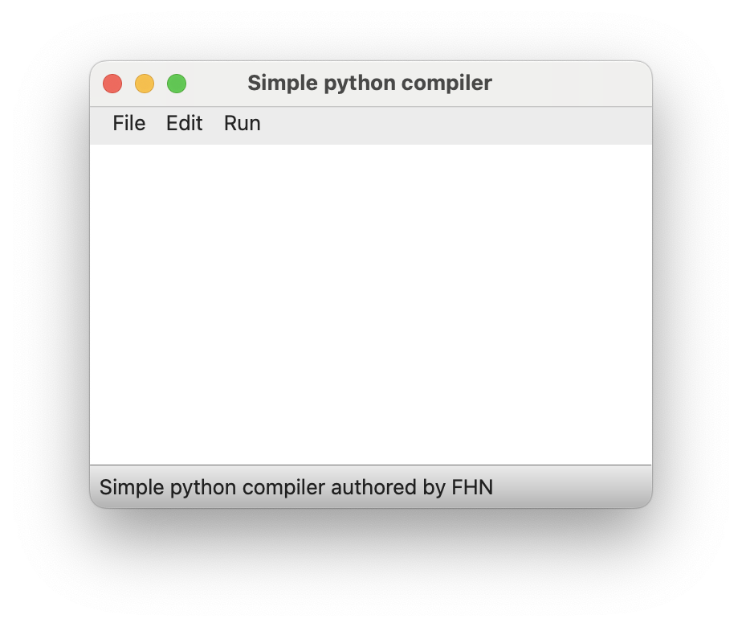
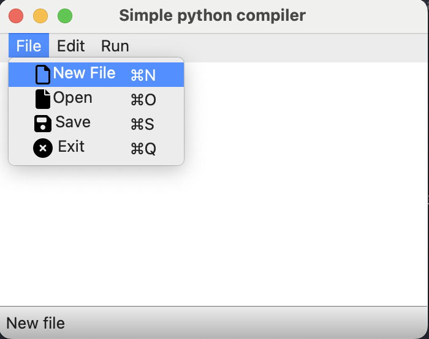
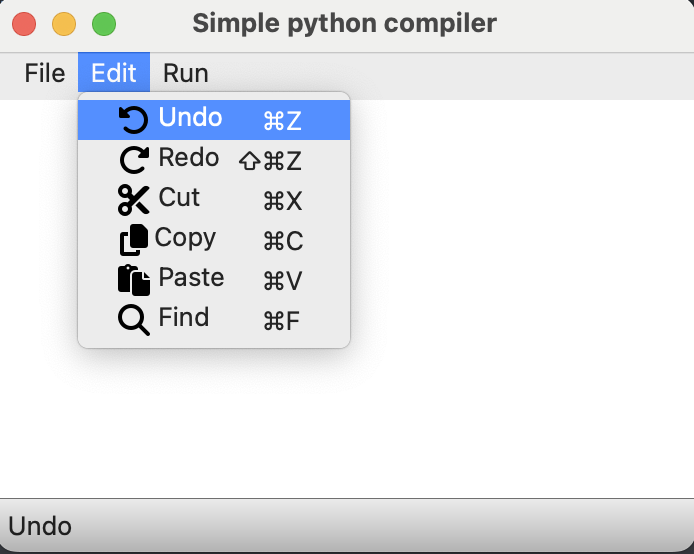
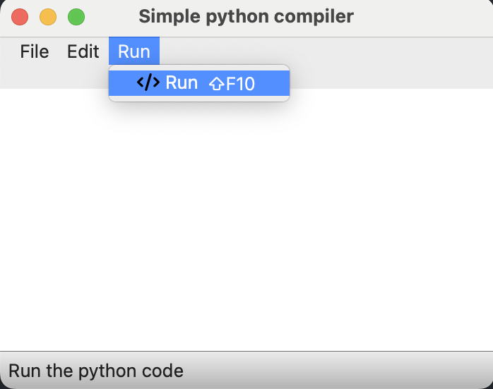
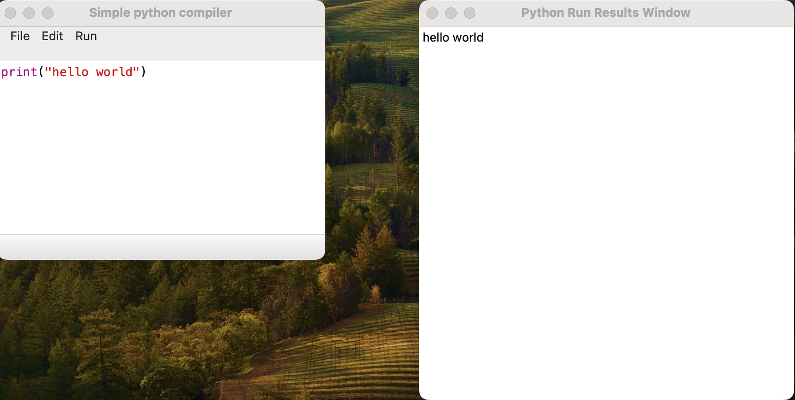
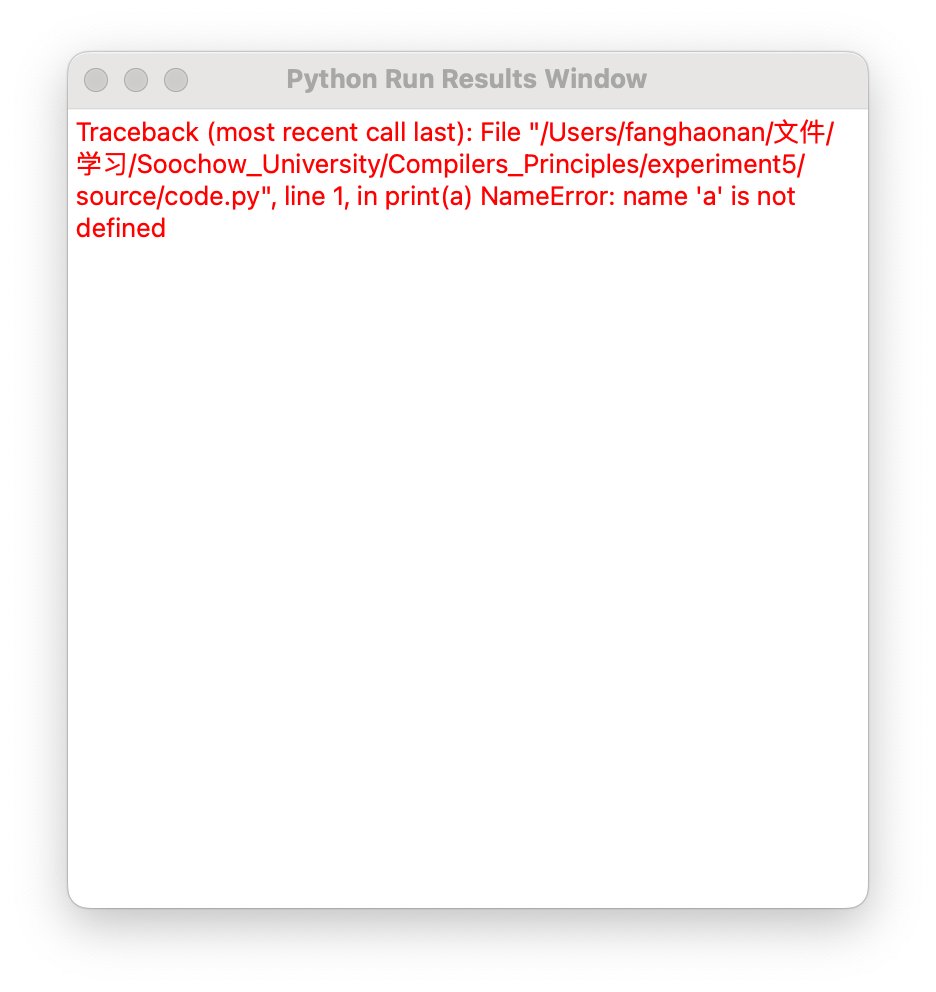
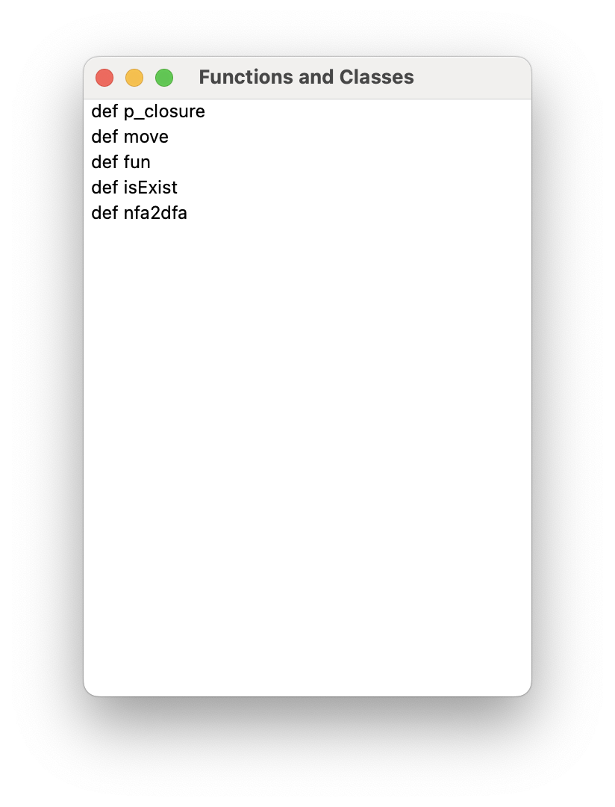

# 编译原理实验5：简易Python编译器

> 实现带界面的简易Python编译器,实验要求：
>
>  1. 带有界面IDE
>
> 
>
>  2. 支持新建文件，打开文件，保存文件等常规操作
>  3. 可运行.py文件，并在下方文本框中显示结果（需要通过线程启动python，并重定向输出）
>  4. 支持复制、剪切、粘贴、撤销、恢复等操作
>  5. 支持定位编译错误位置
> 
> 
>
>  6. 支持代码高亮、文档块自动检测等功能
>
>  
>
>  7. 支持查找，定位文件中特定函数、类等
>
>  
>
>  8. 程序设计语言不限，建议可使用：C#，QT等

# 使用[PyQt6](https://pypi.org/project/PyQt6/)实现一个简单的Python编译器

这是一个使用 PyQt6 实现的简易 Python 编译器，具备基本的代码编辑、运行和管理功能。

> 代码运行环境:
>
> 该程序在Windows 11 Insider Preview 以及macOS Sonoma 14.0上均运行成功
>
> + Python 3.12.0
> + PyQt6  6.5.2
> + PyQt6-Qt6  6.5.2
> + PyQt6-sip  13.5.2
> + Pygments  2.16.1

## 功能
1. **文件操作**
    - **新建文件** <kbd>Ctrl</kbd>+<kbd>N</kbd>: 清空文本编辑器，开始编写新的 Python 脚本。
    - **打开文件** <kbd>Ctrl</kbd>+<kbd>O</kbd>：从文件系统中选择并打开一个 Python 文件。
    - **保存文件** <kbd>Ctrl</kbd>+<kbd>S</kbd>：将当前文本编辑器中的内容保存到文件系统中。

2. **编辑操作**
    - **撤销** <kbd>Ctrl</kbd>+<kbd>Z</kbd>：撤销上一步操作。
    - **重做** <kbd>Ctrl</kbd>+<kbd>Y</kbd>：重做上一步被撤销的操作。
    - **剪切** <kbd>Ctrl</kbd>+<kbd>X</kbd>：剪切选中的文本内容。
    - **复制** <kbd>Ctrl</kbd>+<kbd>C</kbd>：复制选中的文本内容。
    - **粘贴** <kbd>Ctrl</kbd>+<kbd>V</kbd>：粘贴剪贴板中的文本内容。

3. **运行代码** <kbd>Shift</kbd>+<kbd>F10</kbd>
    - 执行文本编辑器中的 Python 代码，并在一个单独的窗口中显示输出和错误。

4. **查找函数和类** <kbd>Ctrl</kbd>+<kbd>F</kbd>
    - 列出代码中的所有函数和类，点击它们将导航到代码编辑器中的相应位置。

## 依赖:
- **PyQt6**：用于创建 GUI。你可以通过 pip 安装：
    ```bash
    pip install pyqt6
    ```
- **Pygments**: 用于实现代码高亮.你可以通过 pip 安装
    ```bash
    pip install pygments
    ```

## 使用方式

### 方式1:
Windows系统可以直接打开可执行文件:[python_compiler.exe](/source/dist/python_compiler.exe)

### 方式2:

1. 确保你的系统上已经安装了 Python，并且可以使用 pip 安装包。
2. 安装依赖：

    ```powershell
    pip3 install pyqt6
    pip3 install pygments
    ```

3. 运行脚本：

    ```powershell
    python3 python_compiler.py
    ```

## 注意事项

- 该脚本设计用于在具有图形用户界面的系统上运行，因为它创建了一个 GUI 应用程序。
- 该简易Python编译器在打开文件时,文件路径不能有中文名,不然会打开文件失败;同时,打开的文件应为UTF-8编码,不然会导致打开后乱码

## 功能实现情况:

| python编译器各个功能                                         | 编译器功能实现情况    |
| ------------------------------------------------------------ | --------------------- |
| 带有界面IDE                                                  | 实现                  |
| 支持新建文件，打开文件，保存文件等常规操作                   | 实现                  |
| 可运行.py文件，并在下方文本框中显示结果(需要通过线程启动python，并重定向输出) | Win11和macOS 14下实现 |
| 支持复制、剪切、粘贴、撤销、恢复等操作                       | 实现                  |
| 支持定位编译错误位置                                         | 未实现                |
| 支持代码高亮、文档块自动检测等功能                           | 代码高亮实现,文档库自动检测未实现   |
| 支持查找，定位文件中特定函数、类等 | 实现 |

## 程序运行示例:

1.   打开程序
      
      其中title 为 **Simply python comiler**,statusbar为**Simple python compiler authored by FHN**,持续五秒

2.   点击menuBar,以File举例:
     
     file这个fileMenu主要实现了文件操作,其中有四个QAction,分别实现了
      + 新建文件(New file)(快捷键<kbd>Ctrl</kbd>+<kbd>N</kbd>,<kbd>⌘</kbd>+<kbd>N</kbd>)
      + 打开文件(Open)(快捷键<kbd>Ctrl</kbd>+<kbd>O</kbd>,<kbd>⌘</kbd>+<kbd>O</kbd>)
      + 保存文件(Save)(快捷键<kbd>Ctrl</kbd>+<kbd>S</kbd>,<kbd>⌘</kbd>+<kbd>S</kbd>)
      + 退出程序(Exit)(快捷键<kbd>Ctrl</kbd>+<kbd>Q</kbd>,<kbd>⌘</kbd>+<kbd>Q</kbd>)

     在光标移动到每一个QAction上时,statusBar会显示当前的动作,例如,光标移动到New file(新建文件)时,状态栏会显示“New file”

     点击Edit时:
     
     Edit这个fileMenu主要实现了代码编辑操作,其中有6个QAction,分别实现了

     + 撤销操作(undo)(快捷键<kbd>Ctrl</kbd>+<kbd>Z</kbd>,<kbd>⌘</kbd>+<kbd>Z</kbd>)
     + 重做操作(redo)(快捷键<kbd>shift</kbd>+<kbd>Ctrl</kbd>+<kbd>Z</kbd>,<kbd>⇧</kbd>+<kbd>⌘</kbd>+<kbd>Z</kbd>)
     + 剪切操作(cut)(快捷键<kbd>Ctrl</kbd>+<kbd>X</kbd>,<kbd>⌘</kbd>+<kbd>X</kbd>)
     + 复制操作(copy)(快捷键<kbd>Ctrl</kbd>+<kbd>C</kbd>,<kbd>⌘</kbd>+<kbd>C</kbd>)
     + 黏贴操作(paste)(快捷键<kbd>Ctrl</kbd>+<kbd>V</kbd>,<kbd>⌘</kbd>+<kbd>V</kbd>)
     + 查找用法(find)(快捷键<kbd>Ctrl</kbd>+<kbd>F</kbd>,<kbd>⌘</kbd>+<kbd>F</kbd>)

     点击Run时:
     
     Run这个fileMenu实现了运行代码的操作,其中有一个QAction,实现了:
     + 运行代码(run)(快捷键<kbd>shift</kbd>+<kbd>F10</kbd>,<kbd>⇧</kbd>+<kbd>F10</kbd>)

3.  运行代码操作:
    输入代码或打开python文件后
    
    在原先窗口的右边出现了一个名为**Python Run Results Window**的窗口,该窗口用于展示输出结果

	若代码有误,则输出会变成
	
	可以看到窗口中输出了报错信息,颜色为红色
	
4.  查询函数和类的用法;
	打开一个python文件后,使用快捷键<kbd>Ctrl</kbd>+<kbd>F</kbd> 或 <kbd>⌘</kbd>+<kbd>F</kbd>后,显示
	
	点击其中任何一个函数或类后,Simple Python Compiler窗口中会跳转到该函数所在位置


## 代码结构

### [python_compiler.py](./source/python_compiler.py)

#### FunctionAndClassWindow 类
- 用于显示从提供的代码中提取的函数和类的列表。
- 点击列表中的函数或类名称将在主代码编辑器中导航到其位置。

#### AnswerWindow 类

- 用于显示运行 Python 代码的结果。
- 显示代码执行的输出和错误信息。

#### MainWindow 类
- 用于显示 GUI 的主界面。
- 提供代码编辑、文件管理和代码运行等功能。

### [string2html.py](./source/string2html.py)

- 用于将普通的string转为CSS以实现代码高亮


