# 计算机网络期中

## 第一章 概论

### 1 网络拓扑

+   星状拓扑(Star Topology)
+   环状拓扑(Ring Topology)
+   总线型拓扑(Bus Topology)
+   网状拓扑(Mesh Topology)
+   树状拓扑(Tree Topology)
+   混合型拓扑(Hybrid Topology)

#### 1.1 星状拓扑:

+   定义每个设备通过一个中心节点（路由器或交换机）相连接，任何两个设备间收发报文都需要经过这个中心节点进行转发

+   优点：
    +   拓扑结构简单：每个设备只需要一条传输链路和一个收发接口就可以与任何数量的其它设备建立连接
    +   健壮性好：如果一条链路失效，只有连接在该链路上的设备受到影响，其它设备不受影响
    +   便于管理：故障检测和故障隔离比较容易，通过中心节点监视链路状态就能发现定位故障

+   缺点：
    +   中心节点是整个网络可靠性的瓶颈，其故障会造成整个网络瘫痪
+   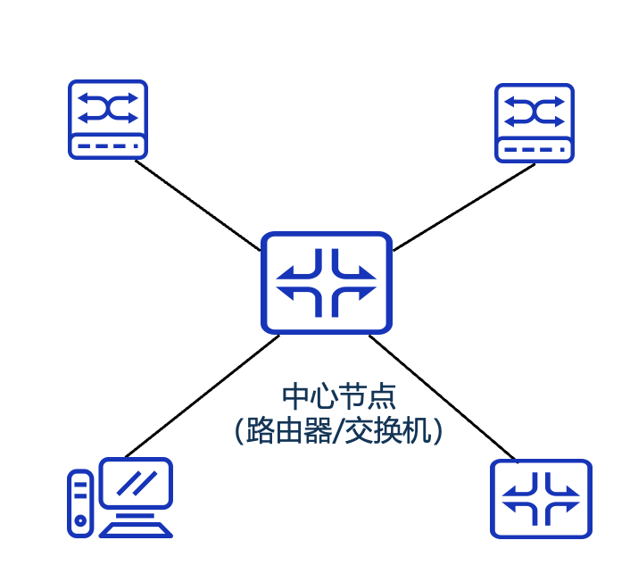

#### 1.2 环状拓扑:

+   定义:每个设备通过一个中心节点（路由器或交换机）相连接，任何两个设备间收发报文都需要经过这个中心节点进行转发
+   优点：
    +   拓扑结构简单：每个设备只需要一条传输链路和一个收发接口就可以与任何数量的其它设备建立连接
    +   健壮性好：如果一条链路失效，只有连接在该链路上的设备受到影响，其它设备不受影响
    +   便于管理：故障检测和故障隔离比较容易，通过中心节点监视链路状态就能发现定位故障
+   缺点：
    +   中心节点是整个网络可靠性的瓶颈，其故障会造成整个网络瘫痪
+   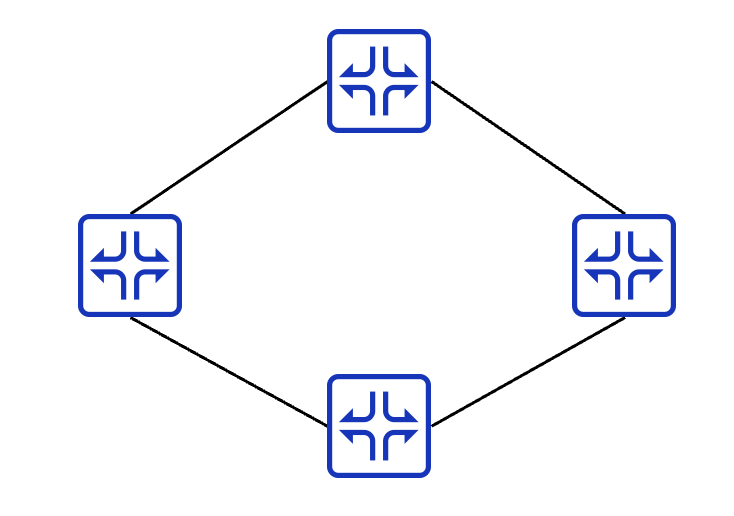

#### 1.3 总线形拓扑

目前基本不用

+   定义:
    +   由一条长电缆组成的主干和连接在上面的网络设备组成

+   优点：
    +   信息传输不存在路由和转发的问题
    +   易于安装，主干电缆可以铺设在最有效的路径上，然后将网络设备通过各种长度的引出线连接到主干电缆上

+   缺点：
    +   由于信号的衰减，总线长度和连接的设备数受到限制
    +   总线上的故障或断裂会终止所有传输

+   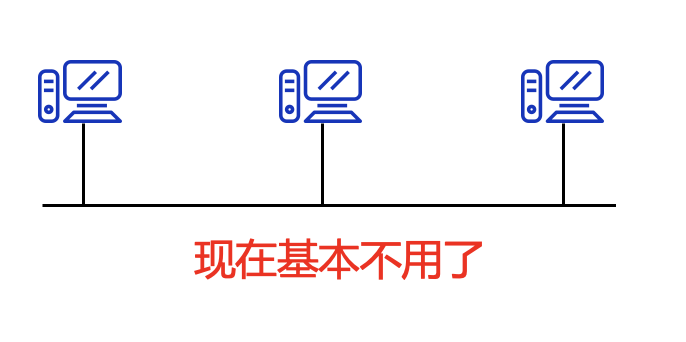

#### 1.4网状拓扑(Mesh Topology)

+   每一个设备与其它任何一个设备都有一条专线连接
+   优点：
    +   很好的健壮性：当局部链路或节点故障时，不会使整个网络瘫痪
    +   负荷分担：设备间有多条可达路径，可以负荷分担，避免网络拥塞
+   缺点：
    +   设备间两两链接，需要的通信链路数量和设备上的接口数量大，成本高
+   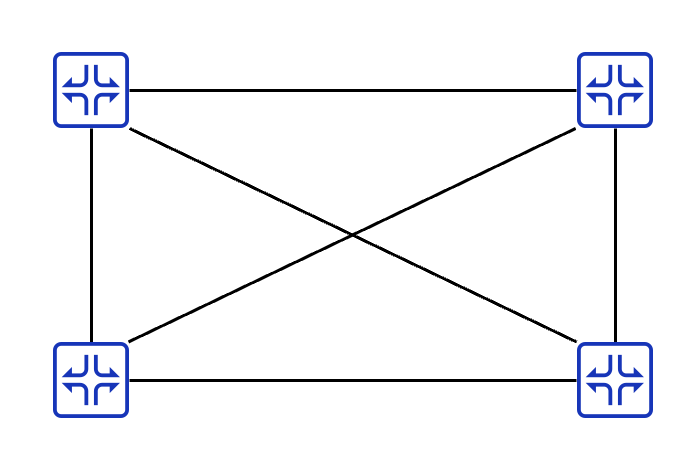

#### 1.5树状拓扑(Tree Topology)

+   定义:每一个设备与其它任何一个设备都有一条专线连接
+   优点：
    +   很好的健壮性：当局部链路或节点故障时，不会使整个网络瘫痪
    +   负荷分担：设备间有多条可达路径，可以负荷分担，避免网络拥塞
+   缺点：
    +   设备间两两链接，需要的通信链路数量和设备上的接口数量大，成本高
+   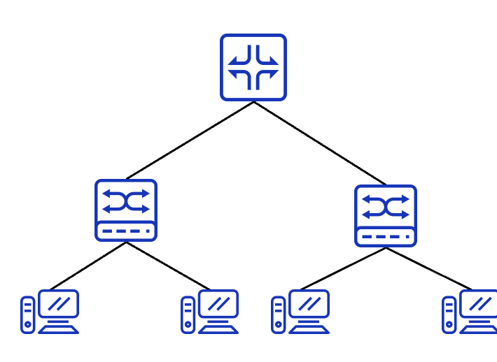

#### 1.6混合型拓扑(Hybrid Topology)

在实际使用时，会综合考虑地理位置、用户数量、业务重要程度、线路施工方便性、组网成本、运行维护的方便性等因素，按混合型拓扑来建设网络。

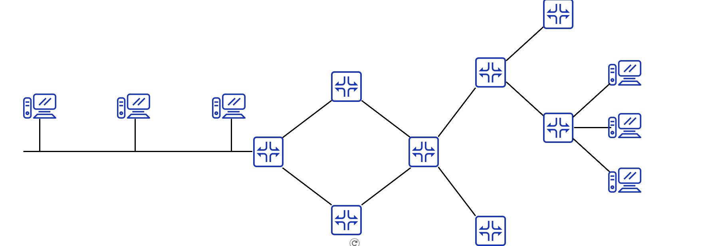

### 2 计算机网络按照网络的作用范围分类:

若中央处理机之间的距离非常近,则一般称之`多处理机系统`而不称它为计算机网络

+   个域网(PAN)
    +   10m左右
    +   个域网（Personal Area Network，PAN）
    +   围绕某个人而搭建的计算机网络，通常包含一台计算机、一个手机或者一个手持计算设备，比如掌上电脑（Personal Digital Assistant，PDA）。
    +   覆盖范围一般小于10米，可以视为一种特殊类型的局域网，支持的是一个人而不是一个小组
    +   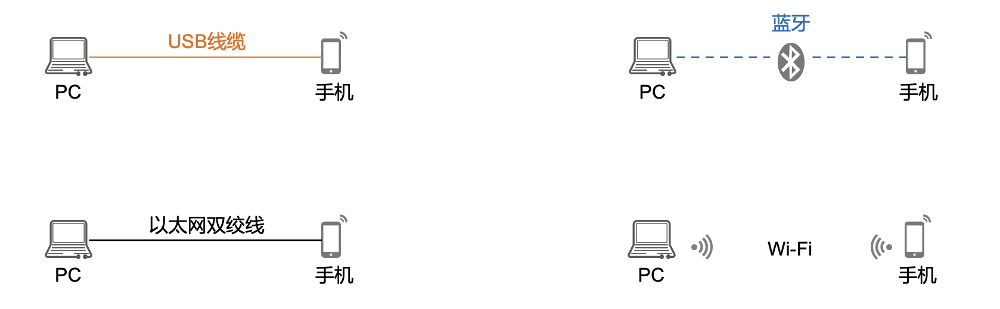
+   局域网(LAN)
    +   1km左右
    +   局域网（Local Area Network，LAN）
    +   局限于一个地点、一栋建筑或一组建筑的网络，由多种组件构成：比如台式机、打印机、服务器以及其它存储设备
    +   通常由单一的组织进行管理，局域网内的通信与数据传输速率较高。家庭中的局域网也称家庭网络，其特点是所连接的设备种类繁多，常用无线路由器连接
    +   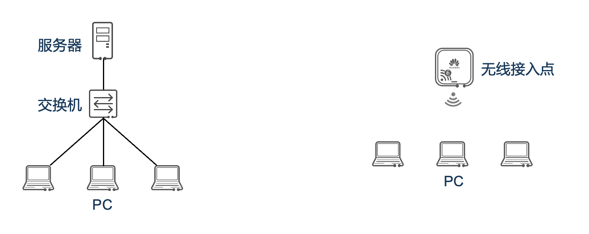
+   城域网(MAN)
    +   5-50km
    +   城域网（Metropolitan Area Network，MAN）
    +   通常是跨越一个城市或一个大型校园的大规模计算机网络，通常使用高容量的骨干网技术（如光纤链路）来互连多个局域网。
    +   覆盖整个城市。意味着它可能是一个单一的网络（如有线电视网络），也可能是将多个局域网连接起来而形成的一个更大规模的网络。城域网可能由一个公司拥有和运营，也可能由多个公司来提供服务
    +   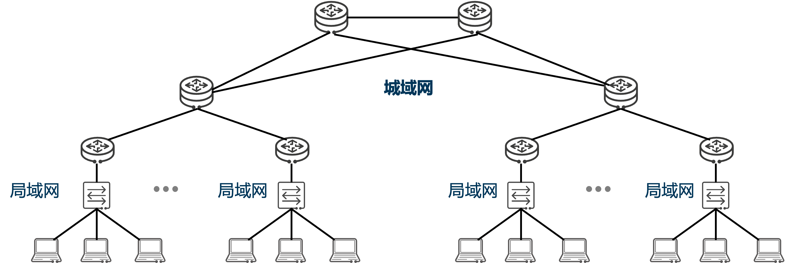
+   广域网(WAN)
    +   几十到几千公里,有时被称为远程网(long haul network)
    +   互联网的核心部分
    +   广域网（Wide Area Network，WAN）
    +   提供了数据、声音、图像以及视频信息的长距离传输服务，覆盖一个地区、国家甚至整个世界。
    +   可利用公共的、租赁的或者私有的通信设备和链路，将这些设备进行组合使用，用于跨越广袤的地理区域。互联网就是最好的例子。

### 3:OSI参考模型(名词解释)

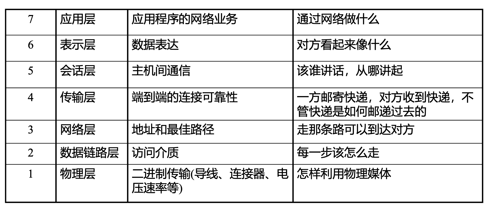

#### 3.1 物理层

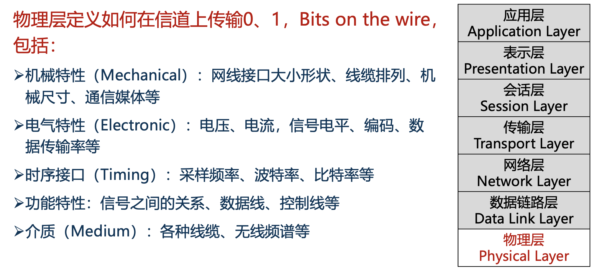

物理层上所传数据的单位是比特

#### 3.2 数据链路层

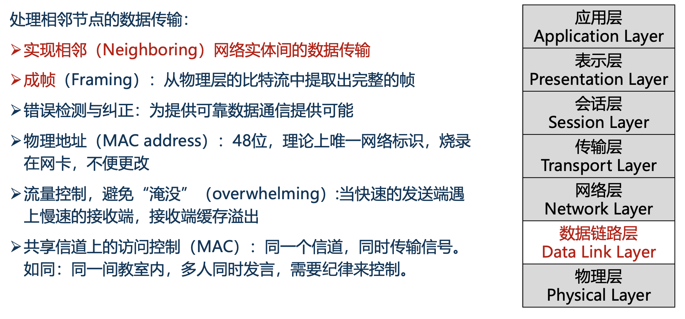

#### 3.3 网络层

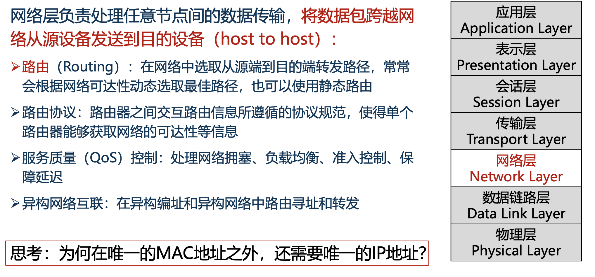

思考答案(ChatGPT):

MAC地址（Media Access Control address）和IP地址（Internet Protocol address）都是计算机网络中用于唯一标识设备的标识符，但它们在网络中的功能和使用场景是不同的。以下是它们之间的区别和为什么需要两者：

1. **层级和作用范围**：
   - MAC地址是数据链路层的地址，用于局域网中的设备间通信。
   - IP地址是网络层的地址，用于广域网，例如互联网上的设备间通信。

2. **持久性与可变性**：
   - MAC地址通常是固定的，是硬件制造时分配给网络接口卡（NIC）的，虽然某些软件允许修改它，但它通常是唯一的。
   - IP地址可以是动态的或静态的。动态IP地址可以由DHCP服务器自动分配，而静态IP地址则是手动设置的。

3. **作用和目的**：
   - MAC地址的主要目的是在同一局域网内确定设备的物理位置。
   - IP地址的主要目的是在整个网络（例如互联网）中定位设备。

4. **路由和转发**：
   - 在路由过程中，数据包的IP地址可能会改变，特别是在通过NAT（网络地址转换）时。
   - MAC地址在数据包穿越局域网时会更改，因为每个跳跃的网络设备（如路由器或交换机）都会有其自己的MAC地址。

5. **全球唯一性与局部唯一性**：
   - MAC地址应该是全球唯一的，因为它们是由硬件制造商在制造时分配的。
   - IP地址在公网上是唯一的，但在私有网络中，如家庭或公司内部，多个设备可能共享相同的私有IP地址。

简而言之，虽然MAC地址和IP地址都为设备提供了唯一标识，但由于它们在网络中的不同角色和功能，因此两者都是必要的。

#### 3.4 传输层

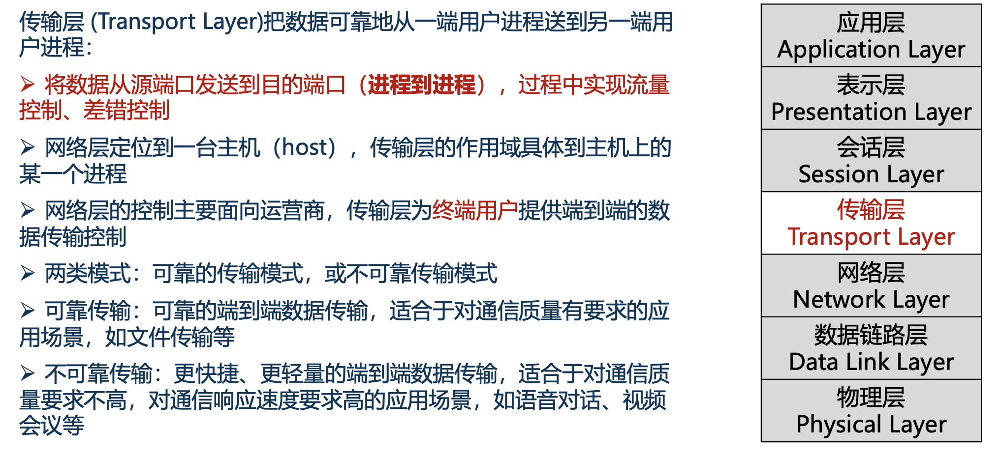

#### 3.5 会话层,表示层和应用层

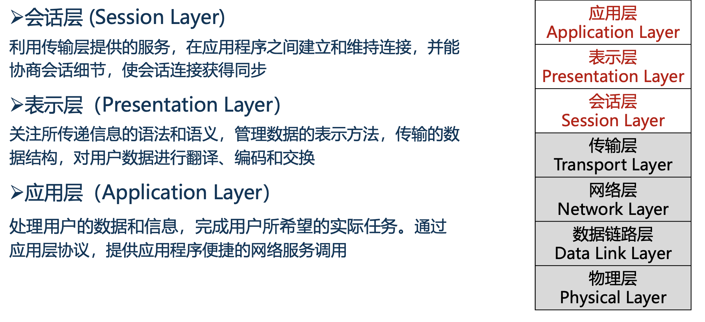

#### 补充: TCP/IP的体系结构

+   链路层
+   网际层
+   运输层
+   应用层

## 第二章 数据通信基础

### 4 数据通信系统的构成

+   源系统(发送端,发送方)
    +   信源：产生要发送数据的设备
    +   发送设备：对数据进行编码的设备
+   传输系统(传输网络)：传输线路或网络
+   目的系统(接收端,接受方)
    +   接收设备：将接收的信号变成数据
    +   信宿：目的系统

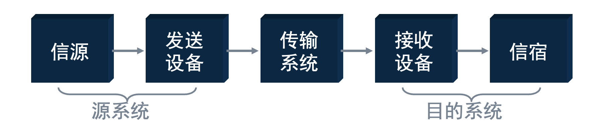

信道上的每一个数字脉冲通常被称为“位”（Bit）。在数字通信中，信息是由一系列的0和1来表示的，这些0和1就是位。每个位可以是高（通常表示为1）或低（通常表示为0）的电压脉冲，代表数字信息的基本单位。

发送信号和数据的区别:

+   数据:
    +   `数据是运送消息的实体`.根据RFC4949给出的定义,数据是使用特定方式表示的信息,通常是有意义的符号序列.这种信息的表示可用计算机或其他机器(或人)处理或产生
+   信号
    +   数据的电气或电磁的表现

### 5 通信双方信息交互

信道:向某一个方向传送消息的媒体

数据交换技术:没有物理链路直接连接的两个或多个设备之间能够通信的技术

通信双方信息交互的方式:

+   单向通信
    +   又称为单工通信，即只能有一个方向的通信而没有反方向的交互。）线电广播或有线电广播以及电视广播就属于这种类型。
+   双向交替通信又
    +   称为半双工通信，即通信的双方都可以发送信息，但不能欢同时发送（当然也就不能同时接收）。这种通信方式是一方发送另一方接收，过一段时间可以再反过来。
+   双向同时通信(计算机网络中使用最多的通信)
    +   又称为全双工通信，即通信的双方可以同时发送和接收信息。

单向通信只需要一条信道，而双向交替通信或双向同时通信则都需要两条信道（每方向各一条）。显然，双向同时通信的传输效率最高。
这里要提醒读者注意，有时人们也常用“单工”这个名词表示“双向交替通信”。如说的“单工电台”并不是只能进行单向通信。正因为如此，ITU-T 才不采用“单工”“半工”和“全双工”这些容易弄混的术语作为正式的名词。

### 6 多路复用技术(名词解释)

+   多路复用(multiplexing)
    +   利用一条链路同时传输多路信号
    +   可以最大限度地利用系统所具有的传输能力

几种多路复用技术:

+   频分多路复用技术(FDM)
+   时分多路复用技术(TDM)
    +   同步时分多路复用
    +   异步时分多路复用
+   波分多路复用技术(WDM)
+   码分多路复用技术(CDM)

### 7 数据交换技术(名词解释)(与通信双方信息交互不同)

+   交换方式有三种

    +   电路交换(Circuit Switch)

    +   分组交换(Packet Switch)

    +   报文交换(Message Switch)

+   其它交换技术

    +   ATM交换（信元交换）

    +   帧中继

#### 7.1 电路交换

电路交换是在两个设备之间创建一条临时的物理连接。可以把电路交换机看作是一个多路开关。

在通信开始之前，要在两个通信设备之间建立起一条完全被通信双方所占用的物理通路。

电路交换过程包括以下三个步骤：

+   电路建立

+   数据传输

+   电路拆除

#### 7.2 分组交换

+   较长的报文被分为较短的数据单元

+   每个数据单元被加上一些通信控制信息等内容，形成一个信息包(packet)

+   通信时以包为单位发送、存储和转发

+   包长度一般比报文短得多

    +   可以在中间站点的主存队列中存储

    +   只要包到达后就可以转发，而不必等待很长的报文全部到达

    +   缩短了信息传输过程中的延迟时间

#### 7.3 报文交换(已被淘汰)

+   报文交换又称为存储转发

+   基本原理
    +   在报文的传输过程中，由网络的中间节点将报文暂时存储起来，检查它的正确性和完整性，然后再发往下一个节点。

+   缺点
    +   在报文交换中，整个报文是作为一个整体来处理，由于报文较长，报文传输的延迟很大。

+   报文交换技术已被淘汰。

#### 7.4 电路交换和分组交换的对比

+   共享传输链路，提高使用效率

+   有流量和拥塞控制，不会发生阻塞，但会使延迟增大

+   可工作于广播和多播的方式

+   具有提供多种通信设备互连

### 8 CRC码(计算题)

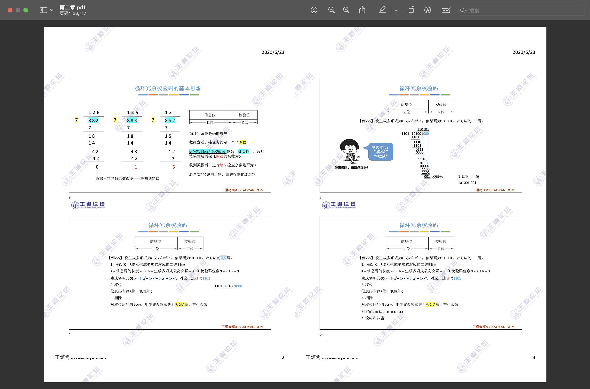

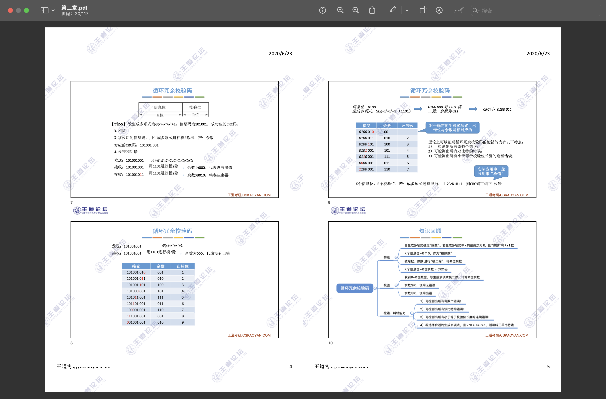

## 第三章 物理层

### 9 各种传输介质分别适合的场景、单模和多模光纤的特点适用场景

+   导引型传输媒体

    +   双绞线

    +   同轴电缆

    +   光缆

+   非导引型传输媒体

    +   自由空间

