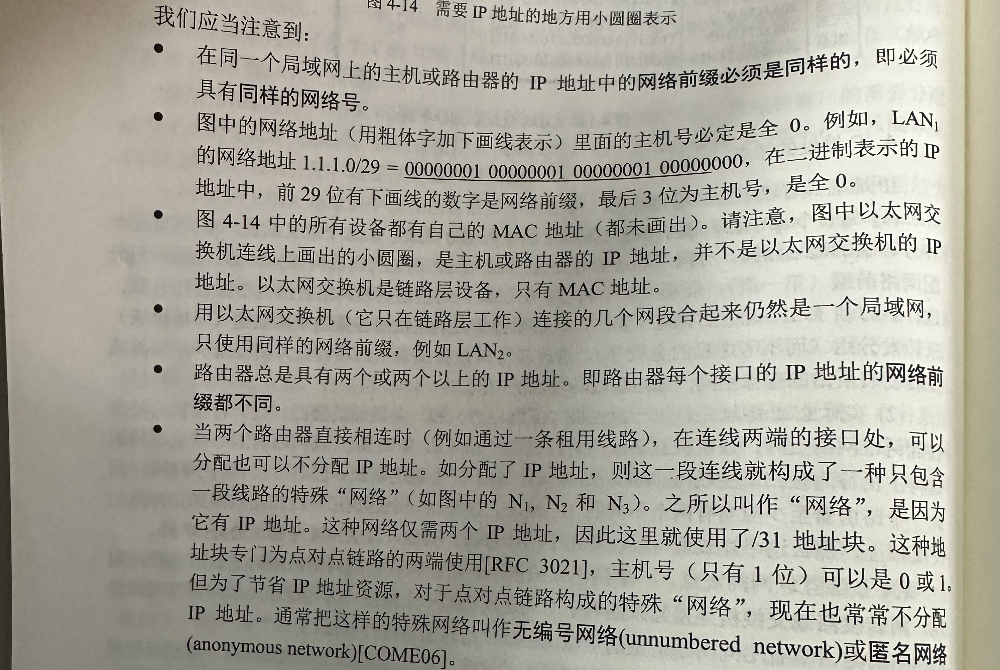
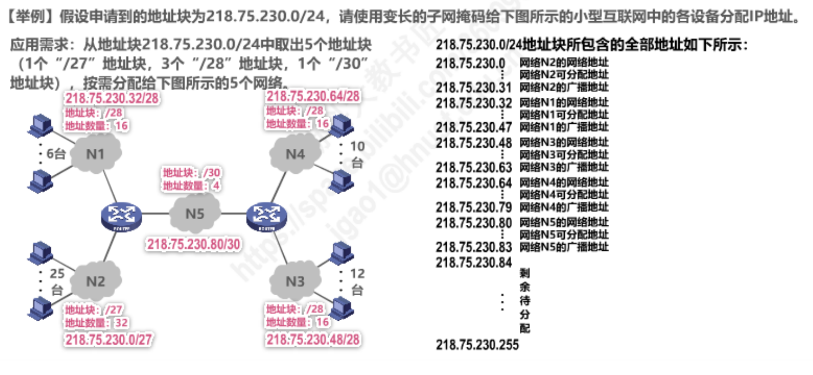

# 题型

五个题

+   单选 10题 10分
+   填空题 10空 10分
+   名词解释 5题 10分
+   简答题 5题 20分
+   计算应用问答题 5题 50分

量不少,综合题多

# A卷

## 大题:

### 1 数据分片

P137 例4-1

去年试卷第8题

在数据分片类型部分 数据分片在IP层 对应位置的变化 分完片后每个片的偏移,标志,分几片,每片长度 会从上问 难度在于自己算长度 

比如:在上层协议TCP/UDP,在不考虑拓展首部的情况下,tcp带了100/10000个字节的用户数据,请问要不要分片 需要自己算

tcp100 + tcp首部20/udp首部8 +ip首部20 = 140byte 不要分片

10000 + 20 + 20 = 10040 要分片

10000/1400 向上取整

分完片后请问每一片带了多少tcp的数据,

同时分片时会告诉以太网(数据链路层)的MTU,可能会是1440

以太网结构,IP结构,TCP结构见第三大题图片

若为TCP,携带100字节的用户数据,MTU = 1440,是否需要分片?

100 + 20 + 20 = 140 < 1440 因此不用分片

若为TCP,携带10000字节的用户数据,MTU = 1440,是否需要分片?

10000 + 20 + 20 > 1440 需要分片

分片数:

$\lceil 10000 / 1400\rceil = 8$

每个分片结构:

| IP首部20字节 | TCP首部20字节 | 携带数据1400 |
| ------------ | ------------- | ------------ |

各个分片偏移量
| 分片编号 | 每个分片偏移量        |
| -------- | --------------------- |
| 0        | $0 * 1400 / 8 = 0$    |
| 1        | $1 * 1400 / 8 = 175$  |
| 2        | $2 * 1400 / 8 = 350$  |
| 3        | $3 * 1400 / 8 = 525$  |
| 4        | $4 * 1400 / 8 = 700$  |
| 5        | $5 * 1400 / 8 = 875$  |
| 6        | $6 * 1400 / 8 = 1050$ |
| 7        | $7 * 1400 / 8 = 1225$ |

==注意:当偏移量不能取整时.若最大携带数据为X,则分片的最大长度可以取小于X且能被8整除的最大的整数==

若为UDP,携带10000字节的用户数据,MTU = 1400

分片数:

$\lceil 10000 / (1400 - 20 - 8)\rceil = 8$

此时$(1400 - 20 - 8)/8 = 171.5$,不为整数,因此==分片最大长度为小与1400的最大的能被8整除的数==

  $数据载荷 = \lfloor (1400 - 20 - 8)/8 \rfloor * 8 = 1368$ 

每个分片结构:

| IP首部20字节 | UDP首部8字节 | 携带数据1368 |
| ------------ | ------------ | ------------ |

第$i$个分片的偏移量为$171 * i$

### 2 ip地址分配

给出这样一个图,填空 图片来源书上P130

告诉这些ip地址有个共同的特点,都属于1.1.1开头

给出一段地址,根据一段地址要求

给定一个局域网,告诉里面有多少主机,给出每个局域网的后缀长度

写出每一个路由器的每个接口分配的ip地址,网络地址和他的后缀

https://www.bilibili.com/video/BV1c4411d7jb?p=47&vd_source=3c13dcce4ab0c30df5fb492ae1874ea7

例题:

#### 例一

#### 例二

### 3 原始数据帧分析

考试时复杂的结构会给出,简单的结构不给出

猜测给出IP结构图,TCP结构图,不给出以太网结构图和UDP结构图

给出原始数据帧,请分析.

从mac地址到tcp

P98 + P136 + P226

例题:

目的MAC地址:00 21 27 21 51 ee

源MAC地址:00 15 c5 c1 5e

类型:28 08

源IP地址:0a 02 80 64

目的IP地址:40 aa 62 20

假设可选字段为0,当前为TCP

源端口:04

目的端口:ff

若为UDP:

源端口:04

目的端口:ff

### 4 填充法

字节填充法和比特填充法如何填充.

给定原始用户数据/收到的数据,写出收到的数据/原始的数据

填充之前有个帧的定界符

### 5 数据传输时间

算出某一段数据在线路上传输所需要的时间

长2km的导线,传输速率100Mb,电磁波传播速率 200m/s,现在有个1000B的帧,从发送到结束需要持续时间

$发送时延 = \frac{数据帧长度(bits)}{发送速率(bits/s)} = \frac{1000 * 8}{100 * 10 ^ {6}} = 8 * 10^{-6}s$

$传输时延 = \frac{信道长度(m)}{电磁波在信道上的传播速率(m/s)} = \frac{2 * 10 ^ {3}}{200} = 10s$

$总时延 = 发送时延 + 传播时延 + 处理时延 + 排队时延 = 10.00008s$

可能问从发送开始到接受结束

相距最远的两台主机同时发送数据,何时双方才能发现 发生/发现 冲突

总线上的单程端对端传播时延记为$\tau$

设A在$t = 0$时发送数据,B在$t = \tau - \delta$时刻监测到信道空闲,此时发送数据

发生冲突:$t = \tau - \frac{\delta}{2}$时发生碰撞

发现冲突:A在$2\tau - \delta$时刻监测到碰发生,B在$\tau$时刻监测到碰撞发生

## 简答题

### 1 Internet和internet的区别

Internet和internet的区别

P38

+   internet是通用名词,泛指由多个计算机网络互联而成的网络.在这些网络之间的通信协议可以说任意的
+   Internet是专用名词,它指当前全球最大的,开放的由众多网络相互连接而成的特定计算机网络,并采用`TCP/IP`协议作为通信规则,且其前身是ARPANET

### 2 拥塞控制和流量控制

拥塞控制和流量控制的共同点和不同点

相同点:窗口控制

不同点:

P238

拥塞控制就是==防止过多的数据注入到网络中==，这样可以使网络中的路由器或链路不至于过载.拥塞控制所要做的都有一个前提，就是网络能够承受现有的网络负荷。拥塞控制是一个==全局性的过程==,涉及所有的主机、所有的路由器，以及与降低网络传输性能有关的所有因素。但TCP连接的端点只要迟迟不能收到对方的确认信息，就猜想在当前网络中的某处很可能发生了拥寨，但这时却无法知道拥塞到底发生在网络的何处，也无法知道发生拥塞的具体原因。（是访同某个服务器的通信量过大？还是在某个地区出现自然灾害？）

相反，==流量控制往往是指点对点通信量的控制==，是个端到端的问题（接收端控制发送端).流量控制要做的就是抑制发送端发送数据的速率,以便接收端来得及接受

### 3 TCP/IP和OSI模型

TCP/IP和OSI模型各自的分层,每一层的名字,各自的作用 P31

### 4 TCP建立连接和取消连接

TCP建立连接和取消连接

三报文握手

SYN为同步位,SYN = 1表示这是一个TCP连接请求报文段

seq = x 为TCP客户进程所选择的初始序号

同步位SYN = 1和确认位ACK = 1表示这是一个TCP连接请求确认报文段,seq = y表示TCP服务器选择的初始字段,ack = x + 1表示这是一个对于TCP客户进程所选择的初始序号的确认

TCP普通确认报文段表示进入连接已建立状态

四报文挥手

三次能否改四次?

可以.B发送给A的报文段也可拆成两个报文段。可以先发送一个确认报文段($ACK=1,ack=x+1$)，然后再发送一个同步报文段($SYN = 1,seq = y$)。这样的过程就变成了==四报文握手==，但效果是一样的

四次能否改三次?

不可以.

### 5 时延

物理层 时延

数据发送总时延的构成

在家百兆局域网上网慢,把无线网卡升级为千兆网卡是否会更快,或升级无线路由器为千兆路由器会不会更快,减少哪部分时延对用户体验提高最大

**排队时延**和**处理时延**是对用户体验影响最大的

## 名词解释

+   P2P:

    **对等链接**(简写为P2P)是指两台主机在通信时，并不区分哪一个是服务请求方和哪一个是服务提供方。只要两台主机都运行了对等连接软件（P2P 软件），它们就可以进行平等的对等连接通信。这时，双方都可以下载对方已经存储在硬盘中的共享文档。因此这种工作方式也称为P2P 方式。

+   多路复用

    

+   email系统

+   ARP协议

    ARP（Address Resolution Protocol，地址解析协议）是用来将IP地址解析为MAC地址的协议。主机或三层网络设备上会维护一张ARP表，用于存储IP地址和MAC地址的映射关系，一般ARP表项包括动态ARP表项和静态ARP表项。

+   端口

# B卷

## 大题目

### 1 数据分片

分片 

### 2 原始数据帧分析

原始数据帧的分析

### 3 滑动窗口流量控制

图片来源:书本P236

例题

### 4 拓扑结构和转发表

看图,图片来源书本P141

画出拓扑结构,写出右边的转发表

### 5 信道

给出信道的数据传输速率,传输时延,如果要达到信号利用率50%,告诉用tcp停等协议,数据帧应该是多少

## 简答

### 1 IPV4 -> IPV6 过度两种策略

IPV4 -> IPV6 过度两种策略

+   双协议栈
+   隧道技术

### 2 网络体系结构

为什么要用分层的思想设计网络体系结构

### 3 TCP握手

tcp握手

### 4 IP地址合法性

判断ip地址合法性

| 网络号 | 主机号             | 源地址使用 | 目的地址使用 | 代表的意思                             |
| ------ | ------------------ | ---------- | ------------ | -------------------------------------- |
| 0      | 0                  | 可以       | 不可以       | 在本网络上的本主机                     |
| 0      | X                  | 可以       | 不可以       | 在本网络上主机号为X的主机              |
| 全1    | 全1                | 不可以     | 可以         | 只在本网络上进行广播(各路由器均不转发) |
| Y      | 全1                | 不可以     | 可以         | 对网络号为Y的网络上的所有主机进行广播  |
| 127    | 非全0或全1的任何数 | 可以       | 可以         | 用于本地软件环回测试                   |

(选择填空里面会有判断域名是否合法)

ipv6地址书写规则

### 5 网络拥塞

tcp/ip采用哪些措施防止网路拥塞

+   慢开始/拥塞避免
+   快重传
+   快恢复

P243图

## 名词解释

+   tcp/ip协议栈

    

+   数据通信系统

    +   信源：产生要发送数据的设备
    +   发送设备：对数据进行编码的设备
    +   传输系统：传输线路或网络
    +   接收设备：将接收的信号变成数据
    +   信宿：目的系统

+   RIP协议

    路由信息协议,是一种分布式的==基于距离向量的路由选择协议==,是互联网的标准协议,最大优点是简单.

+   DNS系统

    域名系统（DNS，Domain Name System）是互联网重要的基础设施之一，向所有需要域名解析的应用提供服务，主要负责将可读性好的域名映射成IP地址

+   拥塞控制和流量控制

    拥塞控制就是==防止过多的数据注入到网络中==，这样可以使网络中的路由器或链路不至于过载.拥塞控制所要做的都有一个前提，就是网络能够承受现有的网络负荷。拥塞控制是一个==全局性的过程==,涉及所有的主机、所有的路由器，以及与降低网络传输性能有关的所有因素。但TCP连接的端点只要迟迟不能收到对方的确认信息，就猜想在当前网络中的某处很可能发生了拥寨，但这时却无法知道拥塞到底发生在网络的何处，也无法知道发生拥塞的具体原因。（是访同某个服务器的通信量过大？还是在某个地区出现自然灾害？）

    相反，==流量控制往往是指点对点通信量的控制==，是个端到端的问题（接收端控制发送端).流量控制要做的就是抑制发送端发送数据的速率,以便接收端来得及接受

各种机构

每一层数据传输单元,主要的网络互联设备

# 复习要点

## 1 互联网协议开发、标准制定、地址分配的国际组织名称及其主要职责

>    负责互联网协议开发、标准制定、地址分配的国际组织名称及其主要职责

## 2 报文交换、分组交换和电路交换的特点

>   报文交换、分组交换和电路交换的特点

## 3 OSI、TCP/IP模型中的每个层次

> 在OSI、TCP/IP模型中，每个层次的名称、顺序、功能、服务类型、通信模式、寻址方式是什么？各层的网络互连设备、协议数据单元的名称，以及协议数据单元的最大最小值。网络节点和主机节点各实现了哪些层次。

## 4 IP地址、Socket、域名、邮件地址、URL的命名规则，及合法性判断

> IP地址、Socket、域名、邮件地址、URL的命名规则，及合法性判断。

判断ip地址合法性

| 网络号 | 主机号             | 源地址使用 | 目的地址使用 | 代表的意思                             |
| ------ | ------------------ | ---------- | ------------ | -------------------------------------- |
| 0      | 0                  | 可以       | 不可以       | 在本网络上的本主机                     |
| 0      | X                  | 可以       | 不可以       | 在本网络上主机号为X的主机              |
| 全1    | 全1                | 不可以     | 可以         | 只在本网络上进行广播(各路由器均不转发) |
| Y      | 全1                | 不可以     | 可以         | 对网络号为Y的网络上的所有主机进行广播  |
| 127    | 非全0或全1的任何数 | 可以       | 可以         | 用于本地软件环回测试                   |

域名:

Internet的域名结构采用了层次化的树状结构的命名方法：域名的结构由若干个分量组成，各分量之间用小数点(.)隔开，总长不超过255个字符各分量分别代表不同级别的域名(每个分量域名长度≤63字符)合法域名中，点“.”的个数至少为一个通常，点“.”对应的英文单词为dot，也可以读为point,例如`… .三级域名.二级域名.顶级域名`

emal地址格式

电子邮件地址是一个字符串，格式规定为：`收件人邮箱名@邮箱所在主机的域名`。

符号“@”读作“at”，表示“在”的意思。例如电子邮件地址   `jcst @jlu.edu.cn`

## 5

> IP地址的分类、掩码、前缀、子网、超网、路由聚合的概念，特殊的地址，IPv4-v6过渡策略

IPV4 -> IPV6 过度两种策略

+   双协议栈
+   隧道技术

## 6 TCP连接

>   TCP连接的确认方式，停等协议，累计确认，选择确认的过程。

## 7 RIP、OSPF、BGP

> RIP、OSPF、BGP等路由算法的基本原理

RIP:

在距离矢量路由中，每个路由器周期性的将自己关于整个网络的信息发送给它的邻居

+   每个路由器保存关于整个网络的信息 ；
+   仅仅和邻居交换网络信息 ；
+   信息的交换是通过有规律的时间间隔来进行(例如每隔30秒发一次)，无论网络状态是否发生变化。

每个路由器依据路由表来转发数据包

OSPF:

OSPF使用cost“开销”作为路由度量值。OSPF接口cost=100M /接口带宽，其中100M为OSPF的参考带宽（reference-bandwidth），可以修改。每一个激活OSPF的接口都有一个cost值。一条OSPF路由的cost由该路由从起源一路到达本地的所有入接口cost值的总和。

+   邻居表（Peer table）：OSPF是一种可靠的路由协议，要求在路由器之间传递链路状态通告之前，需先建立OSPF邻居关系，hello报文用于发现直连链路上的其他OSPF路由器，再经过一系列的OSPF消息交互最终建立起全毗邻的邻居关系，OSPF路由器的邻居信息显示在邻居表中。
+   链路状态数据库（Link-state database，简称LSDB）：OSPF用LSA（link state Advertisement，链路状态通告）来描述网络拓扑信息，然后OSPF路由器用LSDB来存储网络的这些LSA。OSPF将自己产生的以及邻居通告的LSA搜集并存储在LSDB中。
+   OSPF路由表（Routing table）：基于LSDB进行SPF（Dijkstra算法）计算，而得出的OSPF路由表。

## 8
> 各层常见的协议号和端口号的取值

UDP数据报, 端口号为53

## 9 IP、TCP、UDP格式

> IP、TCP、UDP协议的首部长度（固定、可变、总长度）、格式、字段的含义和内容解析

IP:首部20字节

TCP:首部20字节

UDP:首部8字节

## 10 DNS

> DNS的作用、查询过程、域名树，域名长度和命名规则

作用:

计算机之间通信是基于IP地址的，但IP地址很抽象，无语义，不易记忆。给计算机取一个有语义的名字，容易记忆。但通信时，仍然需要用IP地址来通信。DNS域名系统就是用来解决上述矛盾，即解决==“将域名映射成IP地址”==的问题

查询过程:

域名查询有递归查询(recursive query)和迭代查询(或循环查询，iterative query)两种方式

+   主机向本地域名字服务器的查询一般采用递归查询本地域名字
+   服务器向根服务器可以采用递归查询，但一般优先采用迭代查询

域名树:

域名长度和命名规则:

DNS规定，域名中的标号都由英文字母和数字组成，==每一个标号不超过63个字符==（但为了记忆方便，最好不要超过12个字符），也==不区分大小写字母==（例如，CCTV或cctv 在域名中是等效的）。标号中==除连字符（-）外不能使用其他的标点符号==。级别最低的域名写在最左边，而级别最高的顶级域名则写在最右边。由多个标号组成的完整域名总共不超过255个字符。DNS既不规定一个域名需要包含多少个下级域名，也不规定每一级的域名代表什么意思。各级域名由其上一级的域名管理机构管理，而最高的顶级域名则由 ICANN 进行管理。用这种方法可使每一个域名在整个互联网范围内是唯一的，并且也容易设计出一种查找域名的机制。

## 11 网络协议三要素

> 网络协议三要素的名称和作用

## 12 TCP流量控制和拥塞控制

> TCP流量控制和拥塞控制的基本原理、窗口的概念、具体实现过程（阶段）、异同点

拥塞控制和流量控制的共同点和不同点

相同点:窗口控制

不同点:

P238

拥塞控制就是==防止过多的数据注入到网络中==，这样可以使网络中的路由器或链路不至于过载.拥塞控制所要做的都有一个前提，就是网络能够承受现有的网络负荷。拥塞控制是一个==全局性的过程==,涉及所有的主机、所有的路由器，以及与降低网络传输性能有关的所有因素。但TCP连接的端点只要迟迟不能收到对方的确认信息，就猜想在当前网络中的某处很可能发生了拥寨，但这时却无法知道拥塞到底发生在网络的何处，也无法知道发生拥塞的具体原因。（是访同某个服务器的通信量过大？还是在某个地区出现自然灾害？）

相反，==流量控制往往是指点对点通信量的控制==，是个端到端的问题（接收端控制发送端).流量控制要做的就是抑制发送端发送数据的速率,以便接收端来得及接受

窗口的概念:

在任意时刻，发送方都维持一组连续的允许发送的帧的序号，称为==发送窗口==；同时接收方也维持一组连续的允许接收帧的序号，称为==接收窗口==

流量控制具体实现过程:

拥塞控制具体实现过程:

## 13 以太网争用期

> 以太网争用期的概念和计算方法

设A在$t = 0$时发送数据,B在$t = \tau - \delta$时刻监测到信道空闲,此时发送数据

发生冲突:$t = \tau - \frac{\delta}{2}$时发生碰撞

发现冲突:A在$2\tau - \delta$时刻监测到碰发生,B在$\tau$时刻监测到碰撞发生

## 14

> 常用传输介质的命名方式和特点

## 15

> VLAN的帧格式、长度

## 16 CRC的计算方法

> CRC的计算方法

## 17

> 数据通信系统的组成部分、主要作用

## 18
> C/S、B/S和P2P模式的特点、区别和主要应用

## 19 多路复用技术

> 频分、时分、波分等多路复用技术的概念

频分复用FDM:

FDM (Frequency-Division Multiplexing)通过分割线路的带宽来实现，适用于模拟信号。用户在分配到一定的频带后，在通信过程中自始至终都占用这个频带。频分复用的所有用户在同样的时间占用不同的带宽资源“带宽”是频率带宽，不是数据的发送速率  

时分复用TDM:

每一个用户所占用的时隙是周期性地出现

+   周期：TDM帧的长度

所有用户在不同的时间占用同样的频带宽度

TDM两种实现方式

+ 同步时分多路复用

+ 异步时分多路复用

波分多路复用WDM:

光的频分复用

利用多个激光器在单条光纤上同时发送多束不同波长激光的技术。

它在一定的带宽上将输入的光信号调制到特定的频率上，然后将调制后的信号复用到一根光纤上。

## 20

> 应用层主要协议的作用

## 21

> Email系统的构成和主要协议

## 22 ARP协议

> ARP协议的作用

## 23 端口

> 端口的概要和作用

## 24 分层思想的原因

> 网络协议采用分层思想的原因

1.   各层之间是独立的。某一层并不需要知道它的下一层是如何实现的，而仅仅需要知道该层通过层间的接口（即界面）所提供的服务。由于每一层只实现一种相对独立的功能，因而可将一个难以处理的复杂问题分解为若干个较容易处理的更小一些的问题。这样，整个问题的复杂程度就下降了。
2.   灵活性好。当任何一层发生变化时（例如由于技术的变化），只要层间接口关系保持不变，那么在这层以上或以下各层均不受影响。此外，对某一层提供的服务还可进行修改，当不再需要某层提供的服务时，甚至可以将这层取消。
3.   结构上可分割开。各层都可以采用最合适的技术来实现。
4.   易于实现和维护。这种结构使得实现和调试一个庞大而又复杂的系统变得更加容易，因为整个系统已被分解若干个相对独立的子系统。
5.   能促进标准化工作。因为每一层的功能及其所提供的服务都已有了精确的说明。

分层时应注意使每一层的功能非常明确。若层数太少，就会使每一层的协议太复杂；但层数太多又会在描述和综合各层功能的系统工程任务时遇到较多的困难。通常各层所要完成的功能主要有以下一些（可以只包括一种，也可以包括多种）：

1.   差错控制:使相应层次对等方的通信更加可靠。
2.   流量控制:发送端的发送速率必须使接收端来得及接收，不要太快。
3.   分段和重装:发送端将要发送的数据块划分为更小的单位，在接收端将其还原。
4.   复用和分用:发送端几个高层会话复用一条低层的连接，在接收端再进行分用。
5.   连接建立和释放:交换数据前先建立一条逻辑连接，数据传送结束后释放连接

## 25 TCP建立连接和释放连接

> TCP建立连接和释放链接的过程

TCP建立连接和取消连接

三报文握手

四报文挥手

三次能否改四次?

可以.B发送给A的报文段也可拆成两个报文段。可以先发送一个确认报文段($ACK=1,ack=x+1$)，然后再发送一个同步报文段($SYN = 1,seq = y$)。这样的过程就变成了==四报文握手==，但效果是一样的

四次能否改三次?

不可以.

## 26

> 简述internet与Internet的区别

+   internet是通用名词,泛指由多个计算机网络互联而成的网络.在这些网络之间的通信协议可以说任意的
+   Internet是专用名词,它指当前全球最大的,开放的由众多网络相互连接而成的特定计算机网络,并采用`TCP/IP`协议作为通信规则,且其前身是ARPANET

## 27 拥塞控制和流量控制

> 比较拥塞控制和流量控制的相同点与不同点

拥塞控制和流量控制的共同点和不同点

相同点:窗口控制

不同点:

P238

拥塞控制就是==防止过多的数据注入到网络中==，这样可以使网络中的路由器或链路不至于过载.拥塞控制所要做的都有一个前提，就是网络能够承受现有的网络负荷。拥塞控制是一个==全局性的过程==,涉及所有的主机、所有的路由器，以及与降低网络传输性能有关的所有因素。但TCP连接的端点只要迟迟不能收到对方的确认信息，就猜想在当前网络中的某处很可能发生了拥寨，但这时却无法知道拥塞到底发生在网络的何处，也无法知道发生拥塞的具体原因。（是访同某个服务器的通信量过大？还是在某个地区出现自然灾害？）

相反，==流量控制往往是指点对点通信量的控制==，是个端到端的问题（接收端控制发送端).流量控制要做的就是抑制发送端发送数据的速率,以便接收端来得及接受

## 28 网络传输时延

> 网络传输时延的主要构成，计算方法

## 29 IP分片、片偏移、标志位

> IP分片、片偏移、标志位之间的关系

见第一张卷子第一大题和去年试卷第8题

## 30 补齐图中TCP连接双方的数据传递过程

> 根据提示，补齐图中TCP连接双方的数据传递过程。

## 31

> 根据网络拓扑，完成路由器路由表

## 32

> 根据网络拓扑，完成IP地址分配方案的设计

## 33 比特填充法和字节填充法

> 比特填充法和字节填充法的具体实现过程

比特填充法:

字符填充法:

字符填充法使用特定字符来定界一帧的开始和结束,==控制字符SOH放在帧的最前面==，表示帧的首部开始，==控制字符EOT 表示帧的结束==。为了使信息位中出现的特殊字符不被误判为帧的首尾定界符，可在特字符前面填充一个转义字符（ESC）来加以区分（注意，转义字符是 ASCII码中的控制字符，是一个字符，而非“E”“S”“C”三个字符的组合），以实现数据的透明传输。接收方收到转义字符后，就知道其后面紧跟的是数据信息，而不是控制信息。

如图所示的字符帧，帧的数据段中出现 EOT 或SOH 字符，==发送方在每个 EOT或SOH字符前再插入一个 ESC 字符==［，接收方收到数据后会自己删除这个插入的ESC 字符，结果仍得到原来的数据［。这也正是字符填充法名称的由来。如果转义字符 ESC也出现在数据中，那么解决方法仍是在转义字符前插入一个转义字符。

# 去年试卷

## 1 internet与Internet的区别

>    阐述一下internet与Internet的区别

+   internet是通用名词,泛指由多个计算机网络互联而成的网络.在这些网络之间的通信协议可以说任意的
+   Internet是专用名词,它指当前全球最大的,开放的由众多网络相互连接而成的特定计算机网络,并采用`TCP/IP`协议作为通信规则,且其前身是ARPANET

## 2 互联网五层结构

>   用于课程教学的计算机网络体系结构结合OSI和TCP/IP两种体系结构将网络分为五层，详细说明一下各层的作用。

 

## 3 TCP四次挥手

>    画图并详细描述一下TCP连接的拆除过程

 

## 4 拥塞控制和流量控制

>   阐述一下拥塞控制和流量控制各自的作用和实现方法，并比较两者的异同点

 见复习要点12

## 5 网络时延组成部分

>    网络时延的组成部分有哪些？在100M的WLAN中，先把主机的100M无线NIC升级为1000M对减少时延有什么帮助？再把路由器升级为1000M对减少时延有什么帮助？

 $发送时延 = \frac{数据帧长度(bits)}{发送速率(bits/s)} = \frac{1000 * 8}{100 * 10 ^ {6}} = 8 * 10^{-6}s$

$传输时延 = \frac{信道长度(m)}{电磁波在信道上的传播速率(m/s)} = \frac{2 * 10 ^ {3}}{200} = 10s$

$总时延 = 发送时延 + 传播时延 + 处理时延 + 排队时延 = 10.00008s$

## 6 数据传输时间和冲突

>   长2km、数据传输率为10Mbps的基带总线LAN，信号传播速度为200m/μs，试计算1000比特的帧从发送开始到接收结束的最大时间是多少？若相距最远的主机同时发送数据，则经过多长时间会发现冲突？（写出详细的计算过程，并说明每一步的计算公示和依据）

具体公式见A卷大题第5题

 最大时间:
$$
发送时间 = \frac{帧大小}{数据传输率} = \frac{1000 \ bits}{10 * 10 ^ 6 \ bits/second} = 10 ^ {-4} s \\ \nonumber
传播时间 = \frac{距离}{信号传输速度} = \frac{2000\ m}{2000\ m/us} = 10 ^ {-3}s \\ \nonumber
总时长 = 发送时间 + 传播时间 = 1.1 * 10 ^ {-3}s
$$

冲突发现时间:

总线上的单程端对端传播时延$\tau = 10 ^{-3}s$

设A在$t_{A主机发送数据} = 0$时发送数据,B在$t_{B主机发送数据} = \tau - \delta$时刻监测到信道空闲,此时发送数据.由于这道题中两台主机同时发送数据,因此$\tau - \delta = 0$

$t_{B主机发送数据} = \tau - \delta = 0 \Rightarrow \delta = 10 ^ {-3}s$

冲突发生时间$t_{冲突发生} = \tau - \frac{\delta}{2} = 0.5 * 10 ^ {-3}s$

两台主机监测到冲突时间$t = 2\tau - \delta = \tau = 10 ^{-3}s$

## 7 比特填充

>   使用比特填充的起止标记法组帧时，帧边界是怎样的比特序列？若接收方从链路上收到的比特序列为：1101011111010111110010111110110，给出去掉填充比特之后的原始比特序列。

 每个frame的边界:`0111110`

1101==0111110==10111110010111110110:这个末尾的0是发送方添加的,需要丢弃

110101111101==0111110==010111110110:这个末尾的0是发送方添加的,需要丢弃

110101111101011111001==0111110==110:这个末尾的0是发送方添加的,需要丢弃

1101011111101111101011111110

## 8 UDP数据分片

>   一个UDP用户数据报的数据字段为8192字节，要使用以太网来传送。问应当划分为几个数据分片？计算每一个数据分片的数据字段长度和片偏移字段的值（写出详细计算过程）

 MTU 1500,IP首部20字节,UDP首部8字节,总长度8192 + 20 + 8 = 8220 > 1500 

每个分片的数据部分长度最大为 1500 - 20 - 8 = 1472字节

(8192)/1472 = 5.5

分6片

此时$1472 \ mod\  8 = 0$,偏移量为整数,因此可以使用这种分片方式

每个分片结构:

| IP首部20字节 | UDP首部8字节 | 携带数据1472 |
| ------------ | ------------ | ------------ |

第$i$片的偏移字段是$\frac{1472}{8} * i = 184i$

==注意偏移量不为整数时需要进行的操作(见第一章卷子大题1中的UDP部分)==

## 9 CRC计算

>    在循环冗余校验中，如果发送端需要发送的数据为1000101001，而生成多项式P(x)= x4+x+1，则在线路上传输的码字是什么？写出详细计算过程。

 $D(x) = 1000101001$

$P(x) = 10010$

$P(x)$是4阶,在原始数据后添加4个0,拓展后的数据:$10001010010000$

除法后余数:0010

最终结果:$10001010010010$

## 10 ip地址分配

>    某单位获得了206.0.64.0/22的地址块，网络的拓扑结构如图所示，三个局域网（LAN1～LAN3）通过三个路由器（R1～R3）互连，其中LAN1有20台主机，LAN2有100台主机，LAN3有500台主机，请根据要求给LAN1～LAN3，N1～N3分配网络地址和前缀，以及给路由器R1～R3的每个接口（IF1～IF3）分配IP地址。
>
>   （1）最小的IP地址和网络地址分配给路由器R1～R3及N1～N3
>
>   （2）按照局域网内主机数从从小到大分配网络地址及前缀
>
>   （3）每个局域网分配到的网络地址浪费最小

IP:

==11001110.00000000.010000==00.00000000:网络号

十个地址用来表示子网号和主机号.

ip地址需求:主机地址+路由器接口地址+网络地址+广播地址

N1 206.0.64.0/31

IF1 206.0.64.0

IF2 206.0.64.1

N2 206.0.64.2/31

IF1 206.0.64.2

IF2 206.0.64.3

N2 206.0.64.4/31 

IF1 206.0.64.4

IF2 206.0.64.5

LAN1 ip地址需求:23,前缀/27 ($2^{32 - 27} = 32$),

分配206.0.64.32/27,网络地址206.0.64.32，广播地址206.0.64.63

IF3 206.0.64.24

LAN2 ip地址需求:103,前缀/25 ($2^{32 - 25} = 128$)

分配206.0.64.128/25,网络地址206.0.64.128,广播地址206.0.64.255

IF3 206.0.64.232

LAN3 ip地址需求:503,前缀/23 ($2^{32 - 23} = 512$)

分配206.0.65.0/23,网络地址206.0.65.0,广播地址206.0.66.255

IF3 206.0.66.248

R1：IF1___________________；IF2___________________；IF3___________________；

R2：IF1___________________；IF2___________________；IF3___________________；

R3：IF1___________________；IF2___________________；IF3___________________；

N1：_________________________/_______；

N2：_________________________/_______；

N3：_________________________/_______；

LAN1：_________________________/_______；

LAN2：_________________________/_______；

LAN3：_________________________/_______；
