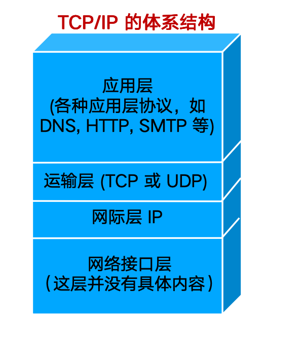

# 一张卷子

## 题型

五个题

+   单选 10题 10分
+   填空题 10空 10分
+   名词解释 5题 10分
+   简答题 5题 20分
+   计算应用问答题 5题 50分

量不少,综合题多

## 大题:

### 1

P137 例4-1

在数据分片类型部分 数据分片在IP层 对应位置的变化 分完片后每个片的偏移,标志,分几片,每片长度 会从上问 难度在与自己算长度 

比如:在上层协议TCP/UDP,在不考虑拓展首部的情况下,tcp带了100/10000个字节的用户数据,请问要不要分片 需要自己算

tcp100 + tcp首部20/udp首部8 +ip首部20 = 140byte 不要分片

10000 + 20 + 20 = 10040 要分片

10040/1440 向上取整

分完片后请问每一片带了多少tcp的数据,

同时分片时会告诉以太网(数据链路层)的MTU,可能会是1440

### 2

给出这样一个图,填空

告诉这些ip地址有个共同的特点,都属于1.1.1.1开头

给出一段地址,根据一段地址要求

给定一个局域网,告诉里面有多少主机,给出每个局域网的后缀长度

写出每一个路由器的每个接口分配的ip地址,网络地址和他的后缀

### 3

给出原始数据帧,请分析.

从mac地址到tcp

P98 + P136 + P226

例题:

目的MAC地址:00 21 27 21 51 ee

源MAC地址:00 15 c5 c1 5e

类型:28 08

源IP地址:0a 02 80 64

目的IP地址:40 aa 62 20

假设可选字段为0,当前为TCP

源端口:04

目的端口:ff

### 4

字节填充法和比特填充法如何填充.

给定原始用户数据/收到的数据,写出收到的数据/原始的数据

填充之前有个帧的定界符

### 5

算出某一段数据在线路上传输所需要的时间

长2km的导线,传输速率100MB,电磁波传播速率 200m/s,现在有个1000Byte的帧,从发送到结束需要持续时间

可能问从发送开始到接受结束

相距最远的两台主机同时发送数据,何时双方才能发现 发生/发现 冲突

发生冲突:在中间

发现冲突:

## 简答题

### 1

Internet和internet的区别

P38

+   internet是通用名词,泛指由多个计算机网络互联而成的网络.在这些网络之间的通信协议可以说任意的
+   Internet是专用名词,它指当前全球最大的,开放的由众多网络相互连接而成的特定计算机网络,并采用`TCP/IP`协议作为通信规则,且其前身是ARPANET

### 2

拥塞控制和流量控制的共同点和不同点

相同点:窗口控制

不同点:

P238

拥塞控制就是==防止过多的数据注入到网络中==，这样可以使网络中的路由器或链路不至于过载.拥塞控制所要做的都有一个前提，就是网络能够承受现有的网络负荷。拥塞控制是一个==全局性的过程==,涉及所有的主机、所有的路由器，以及与降低网络传输性能有关的所有因素。但TCP连接的端点只要迟迟不能收到对方的确认信息，就猜想在当前网络中的某处很可能发生了拥寨，但这时却无法知道拥塞到底发生在网络的何处，也无法知道发生拥塞的具体原因。（是访同某个服务器的通信量过大？还是在某个地区出现自然灾害？）

相反，==流量控制往往是指点对点通信量的控制==，是个端到端的问题（接收端控制发送端).流量控制要做的就是抑制发送端发送数据的速率,以便接收端来得及接受

### 3

TCP/IP和OSI模型各自的分层,每一层的名字,各自的作用 P31

### 4

TCP建立连接和取消连接

三报文握手

四报文挥手

三次能否改四次?

可以.B发送给A的报文段也可拆成两个报文段。可以先发送一个确认报文段($ACK=1,ack=x+1$)，然后再发送一个同步报文段($SYN = 1,seq = y$)。这样的过程就变成了==四报文握手==，但效果是一样的

四次能否改三次?

不可以.

### 5

物理层 时延

数据发送总时延的构成

在家百兆局域网上网慢,把无线网卡升级为千兆网卡是否会更快,或升级无线路由器为千兆路由器会不会更快,减少哪部分时延对用户体验提高最大

**排队时延**和**处理时延**是对用户体验影响最大的

## 名词解释

+   P2P:

    **对等链接**(简写为P2P)是指两台主机在通信时，并不区分哪一个是服务请求方和哪一个是服务提供方。只要两台主机都运行了对等连接软件（P2P 软件），它们就可以进行平等的对等连接通信。这时，双方都可以下载对方已经存储在硬盘中的共享文档。因此这种工作方式也称为P2P 方式。

+   多路复用

    

+   email系统

+   ARP协议

    ARP（Address Resolution Protocol，地址解析协议）是用来将IP地址解析为MAC地址的协议。主机或三层网络设备上会维护一张ARP表，用于存储IP地址和MAC地址的映射关系，一般ARP表项包括动态ARP表项和静态ARP表项。

    

端口

# 另一张卷子

## 大题目

### 1

分片

### 2

原始数据帧的分析

### 3

看图

### 4

看图

画出拓扑结构,写出右边的转发表

### 5

给出信道的数据传输速率,传输时延,如果要达到信号利用率50%,告诉用tcp停等协议,数据帧应该是多少

## 简答

### 1

IPV4 -> IPV6 过度两种策略

### 2

为什么要用分层的思想设计网络体系结构

### 3

tcp握手

### 4

判断ip地址合法性

(选择填空里面会有判断域名是否合法)

ipv6地址书写规则

### 5

tcp/ip采用哪些措施防止网路拥塞

+   慢开始/拥塞避免
+   快重传
+   快恢复

P243图

## 名词解释

+   tcp/ip协议栈

    

+   数据通信系统

    +   信源：产生要发送数据的设备
    +   发送设备：对数据进行编码的设备
    +   传输系统：传输线路或网络
    +   接收设备：将接收的信号变成数据
    +   信宿：目的系统

+   RIP协议

    

+   DNS系统

    域名系统（DNS，Domain Name System）是互联网重要的基础设施之一，向所有需要域名解析的应用提供服务，主要负责将可读性好的域名映射成IP地址

+   拥塞控制和流量控制

    拥塞控制就是==防止过多的数据注入到网络中==，这样可以使网络中的路由器或链路不至于过载.拥塞控制所要做的都有一个前提，就是网络能够承受现有的网络负荷。拥塞控制是一个==全局性的过程==,涉及所有的主机、所有的路由器，以及与降低网络传输性能有关的所有因素。但TCP连接的端点只要迟迟不能收到对方的确认信息，就猜想在当前网络中的某处很可能发生了拥寨，但这时却无法知道拥塞到底发生在网络的何处，也无法知道发生拥塞的具体原因。（是访同某个服务器的通信量过大？还是在某个地区出现自然灾害？）

    相反，==流量控制往往是指点对点通信量的控制==，是个端到端的问题（接收端控制发送端).流量控制要做的就是抑制发送端发送数据的速率,以便接收端来得及接受

各种机构

每一层数据传输单元,主要的网络互联设备

