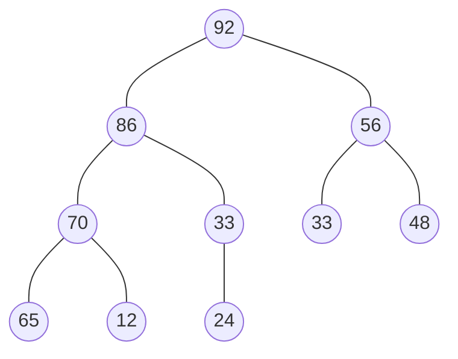
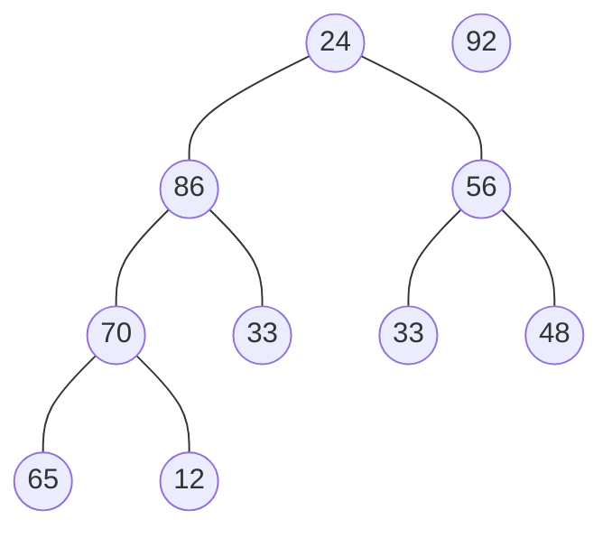
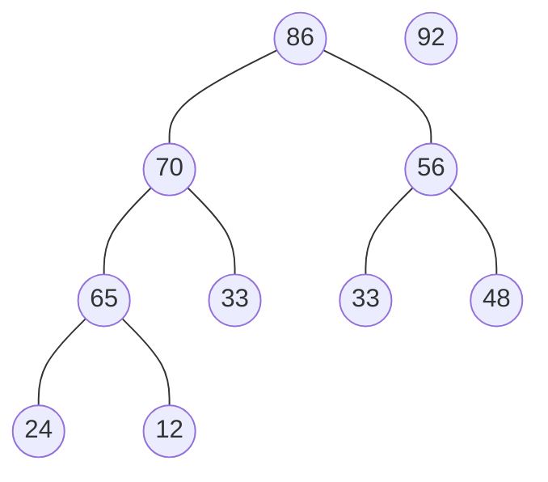
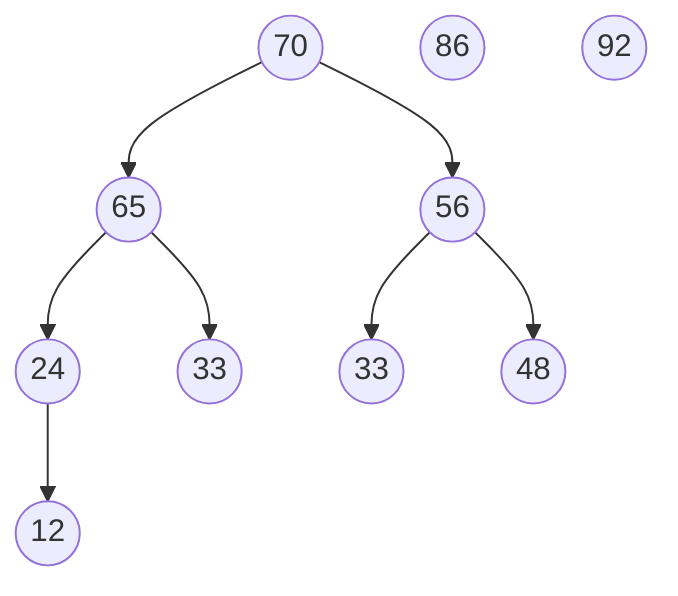
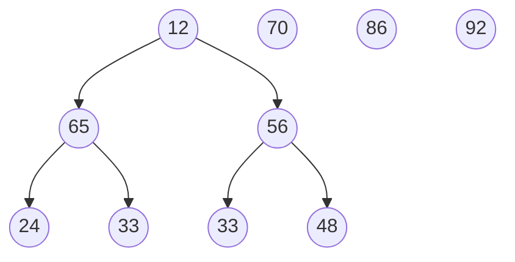

BuildHeap之前:(12, 70, 33, 65, 24, 56, 48, 92, 86, 33)
BuildHeap之后:(92,86,56,70,33,33,48,65,12,24 )

堆的形状:

首先将第0号节点与第9号节点交换，交换后令数组长度减一，令92作为最大的元素被输出

然后对第0号节点进行MaxHeapify(MaxHeapify为维护最大堆的性质),令0号节点下沉(Sink)，此时堆仍为最大堆，下沉后的堆为:

然后令0号节点和第8号节点交换，交换后令数组长度减一，令86作为第二大的元素被输出

然后对第0号节点调用MaxHeapify，令0号节点下沉，此时堆仍为最大堆，下沉后的堆为:

然后将第0号节点与第7号节点交换，交换后令数组长度减一，令70作为第三大的元素输出
