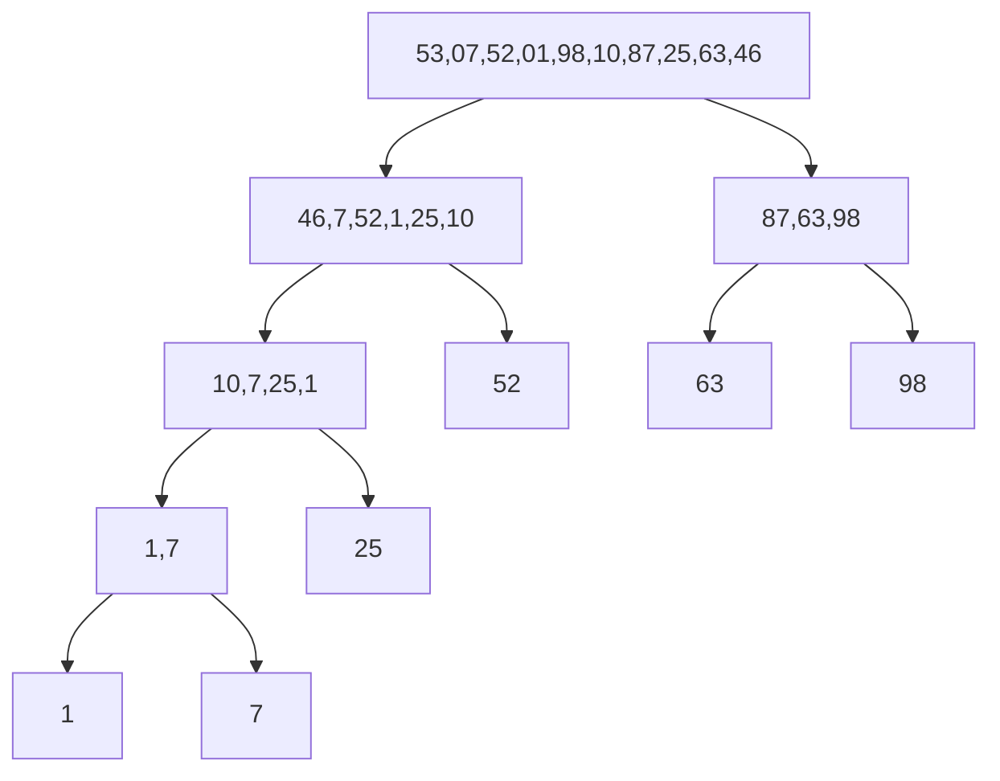

```mermaid
graph TB

A[53,07,52,01,98,10,87,25,63,46]
B[46,7,52,1,25,10]
C[87,63,98]
D[10,7,25,1]
E[52]
F[1,7]
G[25]
H[1]
I[7]
J[63]
K[98]

A-->B
A-->C
B-->D
B-->E
D-->F
D-->G
F-->H
F-->I
C-->J
C-->K
```