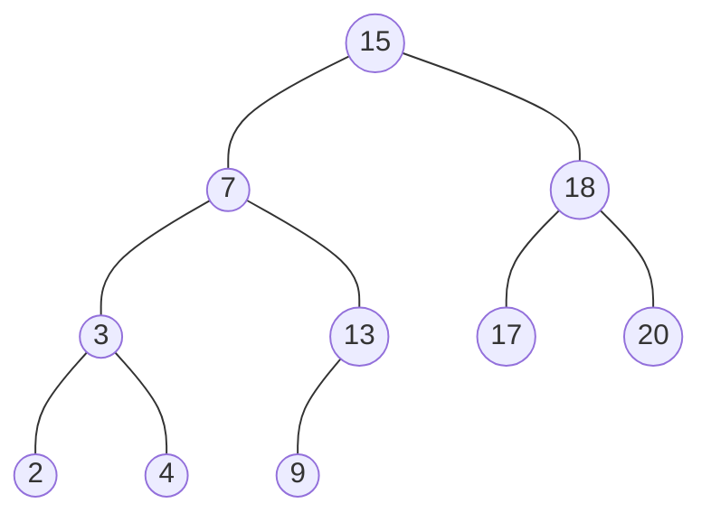

删除节点之前的BST
```mermaid
graph TD

A((15))
B((6))
C((3))
D((2))
E((4))
F((7))
G(( ))
style G fill:#f100,stroke-width:0px %% 设置L属性为填充为白色，边框宽度为0
I((18))
J((17))
K((20))
L((13))
M((9))
N(( ))
style N fill:#f100,stroke-width:0px %% 设置M属性为填充为白色，边框宽度为0

A---B
B---C
C---D
C---E
B---F
F---G
F---L
A---I
I---J
I---K
L---M
L---N

linkStyle 5 stroke:#0ff,stroke-width:0px %%将第6条连接线的宽度设为0,就看不见这条线了
linkStyle 11 stroke:#0ff,stroke-width:0px %%将第6条连接线的宽度设为0,就看不见这条线了
```

删除节点之后的BST


