# 汇编期中

## ASCII码表:


## 冯诺依曼结构框图

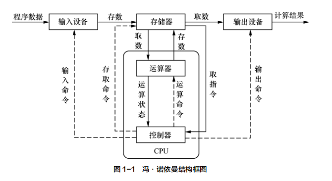

## 指令执行过程

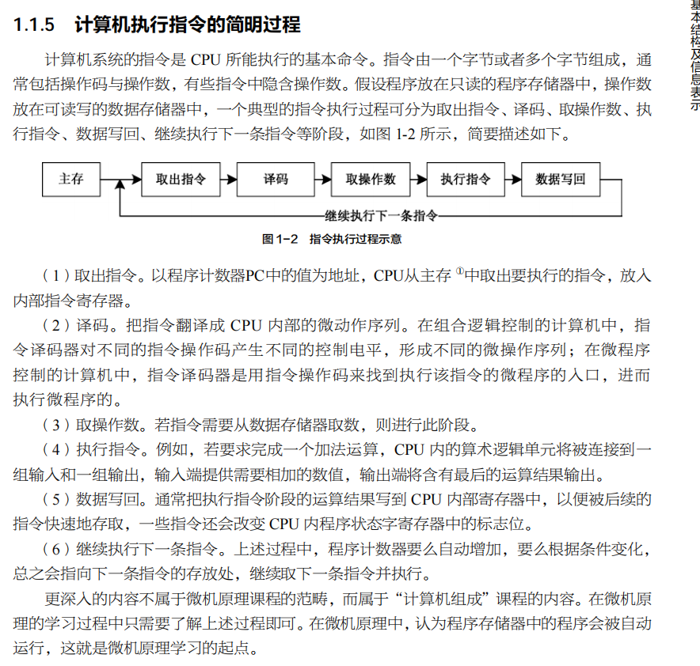

## GB2312(区位码)

前2字节表示区号,后2字节表示位号,两者结合再加上0x2020为国标码,再加上0x8080为机器码

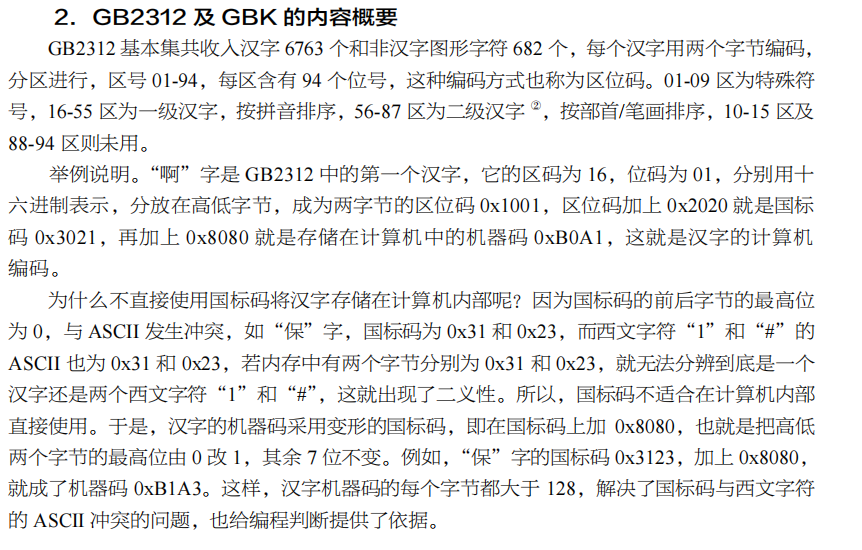

## 程序状态寄存器:

1.  **N (Negative flag)**: 负标志位
    +   当结果为负数时，该标志被设置为1。具体来说，这通常指的是最高位（即符号位）被设置为1的情况。
2.  **Z (Zero flag)**: 零标志位
    +   如果指令执行的结果为零，则该标志被设置为1。这用于检测运算结果是否为零。
3.  **C (Carry flag)**: 进位标志位
    +   在无符号算术运算中，如果最高位产生了进位或借位，此标志位被设置为1。它也用于某些位操作命令，如位移指令，来表示最后移出的位。
4.  **V (Overflow flag)**: 溢出标志位
    +   在有符号运算中，如果结果溢出则该标志被设置为1。溢出指的是结果超出了数据类型所能表示的范围，比如两个正数相加错误地得到一个负数。
5.  **Q (Saturation flag)**: 饱和标志位
    +   这个标志位在DSP（数字信号处理）扩展指令中使用，用来指示是否发生了饱和运算。饱和运算通常发生在算术运算结果超过数据类型可表示的最大或最小值时，而不是简单地截断这些值，结果会被设定在最大或最小值。


## 指令:

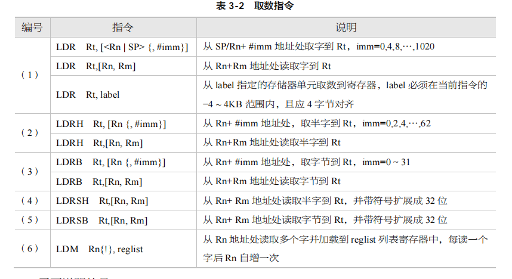

### Load

#### 1. **LDR (Load Register)**

加载一个完整的字（32位）到寄存器中。
- **基本语法**：
  ```
  LDR Rd, [Rn{, offset}]
  ```
  - `Rd` 是目标寄存器，用于存储加载的数据。
  - `Rn` 是基址寄存器，其内容表示内存中要加载数据的起始地址。
  - `offset` 是可选的，用于计算从基址开始的实际地址。

#### 2. **LDRH (Load Register Half-word)**

加载一个半字（16位）到寄存器中，并将高位填充为0。
- **基本语法**：
  ```
  LDRH Rd, [Rn{, offset}]
  ```
  - `Rd` 是目标寄存器。
  - `Rn` 是基址寄存器。
  - `offset` 是可选的偏移量。

#### 3. **LDRB (Load Register Byte)**

加载一个字节（8位）到寄存器中，并将高位填充为0。
- **基本语法**：
  ```
  LDRB Rd, [Rn{, offset}]
  ```
  - `Rd` 是目标寄存器。
  - `Rn` 是基址寄存器。
  - `offset` 是可选的偏移量。

#### 4. **LDRSB (Load Register Signed Byte)**

加载一个字节（8位）到寄存器中，并进行符号扩展。
- **基本语法**：
  ```
  LDRSB Rd, [Rn{, offset}]
  ```
  - `Rd` 是目标寄存器。
  - `Rn` 是基址寄存器。
  - `offset` 是可选的，指定额外的地址偏移量。

#### 5. **LDRSH (Load Register Signed Half-word)**

加载一个半字（16位）到寄存器中，并进行符号扩展。
- **基本语法**：
  ```
  LDRSH Rd, [Rn{, offset}]
  ```
  - `Rd` 是目标寄存器。
  - `Rn` 是基址寄存器。
  - `offset` 是可选的偏移量。

### Store

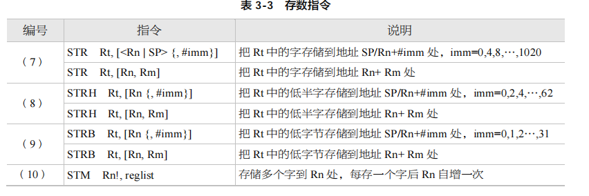

#### 1. **STR (Store Register)**

存储一个完整的字（32位）从寄存器到内存。
- **基本语法**：
  ```
  STR Rd, [Rn{, offset}]
  ```
  - `Rd` 是源寄存器，其内容将被存储到内存中。
  - `Rn` 是基址寄存器，其内容表示内存中要存储数据的起始地址。
  - `offset` 是可选的，用于计算从基址开始的实际地址。

#### 2. **STRH (Store Register Half-word)**

存储一个半字（16位）从寄存器到内存。
- **基本语法**：
  ```
  STRH Rd, [Rn{, offset}]
  ```
  - `Rd` 是源寄存器。
  - `Rn` 是基址寄存器。
  - `offset` 是可选的偏移量。

#### 3. **STRB (Store Register Byte)**

存储一个字节（8位）从寄存器到内存。
- **基本语法**：
  ```
  STRB Rd, [Rn{, offset}]
  ```
  - `Rd` 是源寄存器。
  - `Rn` 是基址寄存器。
  - `offset` 是可选的偏移量。

### MOV

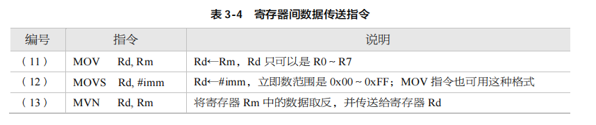

#### 1. **MOV (Move)**

`MOV` 指令用于将一个值移动到寄存器。这个值可以是立即数，也可以是另一个寄存器的值。

- **基本语法**：
  ```
  MOV Rd, Operand2
  ```
  - `Rd` 是目标寄存器，即接收值的寄存器。
  - `Operand2` 可以是立即数或另一个寄存器的值，也可以是通过逻辑或算术操作生成的值。

#### 2. **MOVS (Move with Status)**

`MOVS` 指令与 `MOV` 类似，但它会影响条件码（或称状态标志）。这意味着执行此指令后，它会根据结果更新状态寄存器中的零标志、负标志等。

- **基本语法**：
  ```
  MOVS Rd, Operand2
  ```
  - `Rd` 是目标寄存器。
  - `Operand2` 同上，可以是立即数、寄存器值或表达式。
  - 执行后，会根据 `Rd` 的结果更新状态寄存器的标志位。

#### 3. **MVN (Move Not)**

`MVN` 指令用于将操作数取反后移动到寄存器。这实际上是对 `Operand2` 进行按位非操作（bitwise NOT）后存入 `Rd`。

- **基本语法**：
  ```
  MVN Rd, Operand2
  ```
  - `Rd` 是目标寄存器。
  - `Operand2` 可以是立即数或另一个寄存器的值，这个值将被按位取反后存入 `Rd`。

### 算术运算

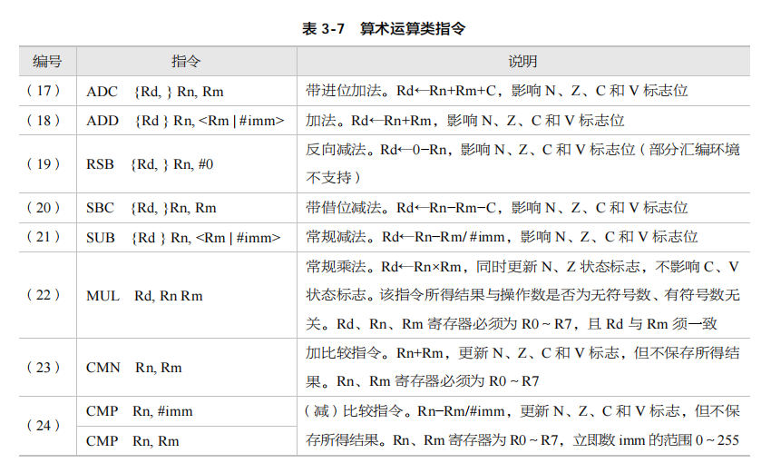

### 逻辑运算

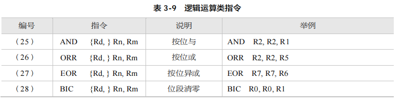

### 跳转控制

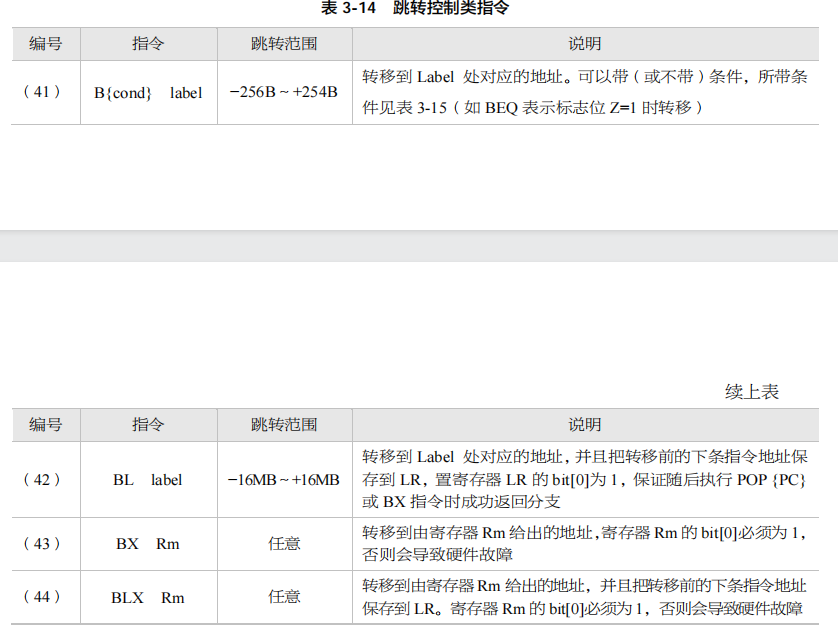

### 1. **B (Branch)**

`B`指令用于无条件跳转到指定的标签或地址。相当于C语言中的`GOTO`

- **基本语法**：
  ```
  B label
  ```
  - `label` 是跳转目标的标签名，它指向程序中的另一个位置。

### 2. **BL (Branch with Link)**
`BL`指令用于调用函数，它在跳转的同时将返回地址（当前指令地址的下一条指令地址）保存到链接寄存器（LR, R14）中。相当于C语言中调用函数

- **基本语法**：
  ```
  BL label
  ```
  - `label` 是函数的入口点。执行此指令后，程序跳转到该标签处执行，并将返回地址保存在 `LR` 寄存器中。

### 3. **BX (Branch and Exchange)**
`BX`指令用于跳转到存储在寄存器中的地址，并且可以根据地址的最低位切换到Thumb状态（如果支持Thumb指令集）。

- **基本语法**：
  ```
  BX Rn
  ```
  - `Rn` 是包含目标地址的寄存器。如果目标地址的最低位为1，则CPU切换到Thumb模式；如果为0，则继续在ARM模式下执行。

### 4. **BLX (Branch with Link and Exchange)**
`BLX`指令结合了`BL`和`BX`的功能，用于调用地址在寄存器中的函数，同时可以切换指令集状态，并保存返回地址到LR。

- **基本语法**：
  ```
  BLX Rn
  ```
  或者
  ```
  BLX label
  ```
  - `Rn` 是包含目标函数地址的寄存器。如果使用寄存器版本，根据地址最低位可能切换到Thumb模式。
  - `label` 用于直接标记函数的入口，与 `BL` 类似，但允许指令集状态的切换。

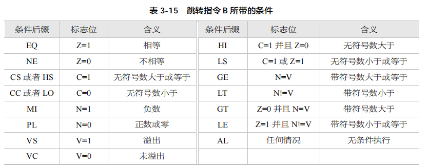

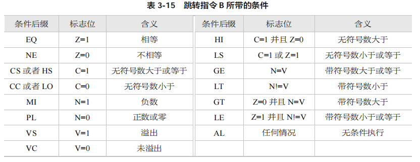

## 程序

注意点:

所有程序最终都是以死循环结束,也就是程序的结束必定为

```assembly
b main_loop
```

其中`main_loop`中为死循环


程序的输出方式为`printf`

为了能将提示信息（字符串）、变量值、常量值等内容打印出来，帮助读者更加直观、更好地理解程序的运行，我们设计了 printf 函数，它具有类 PC 的调试功能。对于字符串的输出，只须将待显示字符串的首地址作为参数存入 r0，然后再通过 bl 指令调用 printf 函数，就可以显示提示信息了；对于需要显示的数值或地址值，则须将数据显示格式控制符%d（十进制格式）或%x（十六进制格式）作为第一个参数存入 r0，把待显示的数值或地址值作为第二个参数存入 r1，然后再通过 bl 指令调用 printf 函数，就可以显示值了。


汇编中函数调用时对参数有如下规定：当参数个数小于或等于 4 时，通过寄存器 r0～r3 来传递参数（r0 对应第 1 个参数，r1 对应第 2 个参数，r2 对应第 3 个参数，r3 对应第 4 个参数）；当参数个数超过 4 时，超过的参数可以使用堆栈来传递参数，但入栈的顺序要与参数的顺序相反


### 两数相加(15 + 24):

```assembly
main_loop:
	mov r0, #15
    mov r1, #24
    add r0, r0, r1
    mov r1, r0
    ldr r0,= data_format
    bl printf
    b main_loop
```

相当于

```c
int a = 15;
int b = 24;
a = a + b;
printf(data_format, a)
```

### 两数的差的绝对值($|15 - 24|$):

```assembly
data_format:	
	.ascii "Result : %d\n\0" //printf 使用的数据格式控制符
string_first_1: 
	.string "Serial port information start!\n" 
string_control_1: 
	.string "%d>%d,Result is:%d\n" //输出原数字符串信息
string_control_2: 
	.string "%d<%d,Result is:%d\n"

main_loop:
	mov r2,= #15
	mov r3,= #24
	mov r1,r2
	cmp r2,r3
	bls low
	sub r4, r2, r3
	mov r2, r3
	mov r3, r4
	ldr r0, =string_control_1
	bl printf
	
low:
	sub r4, r3, r2
	mov r2,r3
	mov r3,r4
	ldr r0, =string_control_2
	bl printf
	b main_loop
```

相当于:
```c
Negetive, 

unsigned r2 = 15;
unsigned r3 = 24;
unsigned r1 = r2;
unsigned cmp = r2 - r3;
if(cmp <= 0){
    GOTO low;
}
int r4 = r2 - r3;
r2 = r3;
r3 = r4;
char[] r0 = "%d>%d,Result is:%d\n"
printf(r0, r1, r2, r3)

label: low;
int r4 = r3 - r2;
r2 = r3;
r3 = r4;
char[] r0 = "%d<%d,Result is:%d\n"
printf(r0, r1, r2, r3)
```

### sum = 1 + 2 + ... + 100

```assembly
string_loop:
	.string "sum:%d\n"
string_first_1: 
	.string "Serial port information start!\n" 
string_control_1: 
	.string "%d>%d,Result is:%d\n" 
string_control_2: 
	.string "%d<%d,Result is:%d\n"
	
main_loop:
	ldr r0, =string_first_1
	bl printf
	
	mov r0, #1
	mov r1, r0
	bl loop

loop:
	add r0, r0, #1
	add r1, r1, r0
	mov r2, #100
	cmp r0, r2
	bne loop
	ldr r0, =string_loop
	bl printf
	b main_loop
```

相当于

```c
char[] r0 = "Serial port information start!\n";
printf(r0);

int r0 = 1;
int r1 = r0;
goto loop;

label: loop;
r0 = r0 + 1;
r1 = r1 + r0;
int r2 = 100;
int cmp = r0 - r2;
if(r0 != r2){
    goto loop;
}
char[] r0 = "sum:%d\n";
printf(r0, r1);
```

