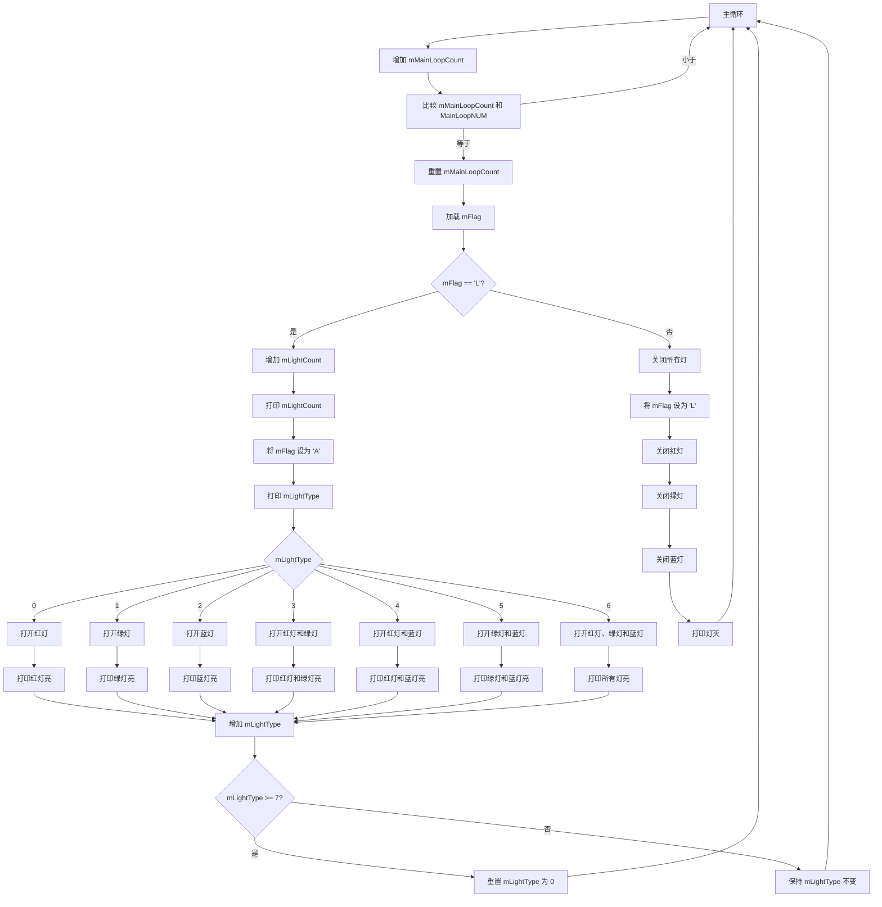
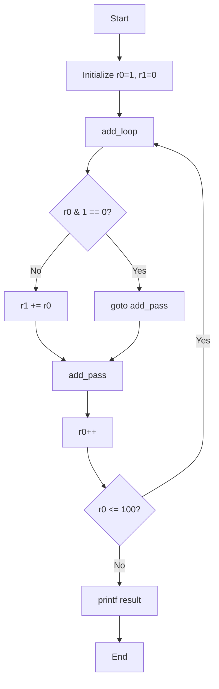
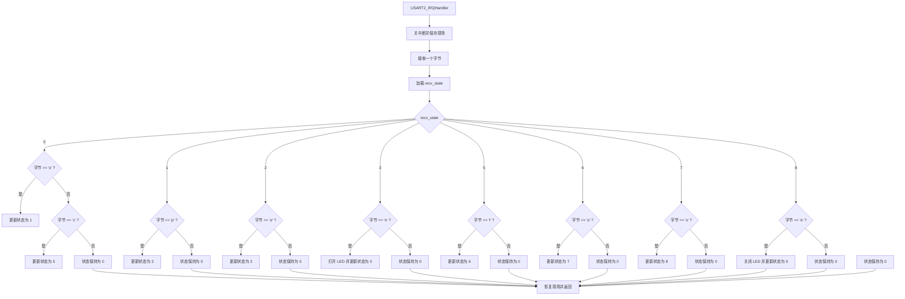

# 微机期末

## 缩写解释

| 缩写 | 英文全称                        | 中文翻译       |
| ---- | ------------------------------- | -------------- |
| SCM  | Single Chip Computer            | 单片微型计算机 |
| PC   | Personal Computer               | 个人计算机     |
| MIPS | Million Instructions Per Second | 每秒百万条指令 |
| ARM  | Advanced RISC Machines          |                |
| CPU  | Central Processing Unit         | 中央处理器     |
| PC   | Program Counter                 | 程序计数器     |
| AB   | Address Bus                     | 地址总线       |
| DB   | Data Bus                        | 数据总线       |
|CB	|Control Bus|控制总线|
|GEC|	General Embedded Computer|通用嵌入式计算机|
|IDE|	Integrated Development Environment|集成开发环境|
|IEEE|Institute of Electrical and Electronics Engineers|电气和电子工程师协会|
|ASCII|American Standard Code for Information Interchange|美国信息交换标准代码|
|ISO|International Organization for Standardlization|国际标准化组织|
|RAM|Random Access Memory|随机访问存储器|
|SAM|Sequential Access Memory|顺序访问存储器|
|ROM|Read Only Memory|只读存储器|
|BIOS|Basic Input/Output System|基本输入/输出系统|
|USL|Unix System Laboratories|UNIX系统实验室|
|TTL|Transistor-Transistor Logic|	晶体管-晶体管逻辑|
|MOS|Metal-Oxide-Semiconmductor|金属-氧化物-半导体|
|SAM|Sequential Access Memory|顺序访问存储器|
|UART|Universal Asynchornous Receive-Transmitters|通用异步收发器|
|SCI|Serial Communication Interfave|串行通信接口|
|DMA|Direct Memory Access|直接存储器存取|

# 实验代码

## 第四章 GPIO

初始化红绿蓝LED灯的模块

```assembly
//（1.5）用户外设模块初始化
	//初始化红灯, r0、r1、r2是gpio_init的入口参数（使用寄存器传递）
	ldr r0,=LIGHT_RED     //r0指明端口和引脚(端口号|(引脚号))（用=,因常量>=256,需用ldr）【立即数寻址】
	mov r1,#GPIO_OUTPUT    //r1指明引脚方向为输出
	mov r2,#LIGHT_OFF      //r2指明引脚的初始状态为暗
	bl  gpio_init          //调用gpio初始化函数（gpio.s）
	//汇编语言中函数调用的参数传递是通过通用寄存器（R0-R12，常用低位寄存器R0-R7）完成的
	//初始化绿灯, r0、r1、r2是gpio_init的入口参数（使用寄存器传递）
	ldr r0,=LIGHT_GREEN     //r0指明端口和引脚(端口号|(引脚号))（用=,因常量>=256,需用ldr）【立即数寻址】
	mov r1,#GPIO_OUTPUT    //r1指明引脚方向为输出
	mov r2,#LIGHT_OFF      //r2指明引脚的初始状态为暗
	bl  gpio_init          //调用gpio初始化函数（gpio.s）
	//初始化蓝灯, r0、r1、r2是gpio_init的入口参数（使用寄存器传递）
	ldr r0,=LIGHT_BLUE     //r0指明端口和引脚(端口号|(引脚号))（用=,因常量>=256,需用ldr）【立即数寻址】
	mov r1,#GPIO_OUTPUT    //r1指明引脚方向为输出
	mov r2,#LIGHT_OFF      //r2指明引脚的初始状态为暗
	bl  gpio_init          //调用gpio初始化函数（gpio.s）
```

`gpio_init(&port_pin, &dir, &state) -> void`


小灯闪烁部分:

```assembly
//（2）======主循环部分（开头）=====================================
	main_loop:                      //主循环标签（开头）
//（2.1）主循环次数变量mMainLoopCount+1
		ldr r2,=mMainLoopCount   //r2←mMainLoopCount的地址（mMainLoopCount是地址）
		ldr r1, [r2]             //将r2保存的地址中存储的值存到r1中
		add r1,#1                //r1=r1+1
		str r1,[r2]	            //将r1中的值存到r2保存的地址中去
//（2.2）未达到主循环次数设定值，继续循环
        ldr r2,=MainLoopNUM   //从MainLoopNUM所在的地址中取数据至r2（MainLoopNUM是常量）
		cmp r1,r2             //比较r1和r2
		blO  main_loop       //未达到，继续循环（lo：无符号数小于）
		//bne  main_loop     //未达到，继续循环（ne：不等于）
// 2.1和2.2实现的功能是：反复空循环执行MainLoopNUM次才继续执行，起延时作用，从而达到灯亮灭交替的效果
// 等价于高级语言中的： for (mMainLoopCount=0; mMainLoopCount<MainLoopNUM; mMainLoopCount++);
//（2.3）达到主循环次数设定值，执行下列语句，进行灯的亮暗处理
//（2.3.1）清除循环次数变量 mMainLoopCount=0
		ldr r2,=mMainLoopCount     //r2←mMainLoopCount的地址
		mov r1,#0                  //若达到循环次数，将循环变量的值清零
		str r1,[r2]	               //将r1中的值存到r2所在的内存地址中
//（2.3.2）如灯状态标志mFlag为'L'，灯的闪烁次数+1并显示，改变灯状态及标志，根据灯的类型亮相应的灯，修改灯的类型
		//判断灯的状态标志
		ldr r2,=mFlag		   
		ldr r6,[r2]
		cmp r6,#'L'			
		bne main_light_off	   //mFlag不等于'L'转关灯
		//mFlag等于'L'情况：开灯
		ldr r3,=mLightCount	   //灯的闪烁次数mLightCount+1
		ldr r1,[r3]
		add r1,#1				
		str r1,[r3]
		ldr r0,=light_show_count  //显示灯的闪烁次数值
		ldr r2,=mLightCount
		ldr r1,[r2]
		bl  printf	
		ldr r2,=mFlag           //灯的状态标志改为'A'（下一步是灭灯）
		mov r7,#'A'
		str r7,[r2]             
		//根据mLightType亮不同颜色的灯
		ldr r0,=light_show_type  //显示灯的类型mLightType
		ldr r2,=mLightType
		ldr r1,[r2]
		bl  printf
	case_type_0:
		ldr r2,=mLightType		//读取灯的类型mLightType
		ldr r1,[r2]
		cmp r1,#0
		bne case_type_1			//不等于0转判断1
		//等于0的情况:红灯
		ldr r0,=LIGHT_RED      //亮红灯
		ldr r1,=LIGHT_ON
		bl  gpio_set
		ldr r0, =light_show_red_on    //显示红灯亮提示
		bl  printf
		b end_case_type			//break
	case_type_1:
		ldr r2,=mLightType		//读取灯的类型mLightType
		ldr r1,[r2]
		cmp r1,#1
		bne case_type_2			//不等于1转判断2
		//等于1的情况:绿灯
		ldr r0,=LIGHT_GREEN      //亮绿灯
		ldr r1,=LIGHT_ON
		bl  gpio_set
		ldr r0, =light_show_green_on    //显示绿灯亮提示
		bl  printf
		b end_case_type			//break
	case_type_2:
		ldr r2,=mLightType		//读取灯的类型mLightType
		ldr r1,[r2]
		cmp r1,#2
		bne case_type_3			//不等于2转判断3
		//等于2的情况:蓝灯
		ldr r0,=LIGHT_BLUE      //亮蓝灯
		ldr r1,=LIGHT_ON
		bl  gpio_set
		ldr r0, =light_show_blue_on    //显示蓝灯亮提示
		bl  printf
		b end_case_type			//break
	case_type_3:
		ldr r2,=mLightType		//读取灯的类型mLightType
		ldr r1,[r2]
		cmp r1,#3
		bne case_type_4			//不等于3转判断4
		//等于3的情况:红灯+绿灯=黄
		ldr r0,=LIGHT_RED      //亮红灯
		ldr r1,=LIGHT_ON
		bl  gpio_set
		ldr r0, =light_show_red_on    //显示红灯亮提示
		bl  printf
		ldr r0,=LIGHT_GREEN      //亮绿灯
		ldr r1,=LIGHT_ON
		bl  gpio_set
		ldr r0, =light_show_green_on    //显示绿灯亮提示
		bl  printf
		b end_case_type			//break
	case_type_4:
		ldr r2,=mLightType		//读取灯的类型mLightType
		ldr r1,[r2]
		cmp r1,#4
		bne case_type_5			//不等于4转判断5
		//等于4的情况:红灯+蓝灯=紫
		ldr r0,=LIGHT_RED      //亮红灯
		ldr r1,=LIGHT_ON
		bl  gpio_set
		ldr r0, =light_show_red_on    //显示红灯亮提示
		bl  printf
		ldr r0,=LIGHT_BLUE      //亮蓝灯
		ldr r1,=LIGHT_ON
		bl  gpio_set
		ldr r0, =light_show_blue_on    //显示蓝灯亮提示
		bl  printf
		b end_case_type			//break
	case_type_5:
		ldr r2,=mLightType		//读取灯的类型mLightType
		ldr r1,[r2]
		cmp r1,#5
		bne case_type_6			//不等于5转6
		//等于5的情况:绿灯+蓝灯=青
		ldr r0,=LIGHT_GREEN      //亮绿灯
		ldr r1,=LIGHT_ON
		bl  gpio_set
		ldr r0, =light_show_green_on    //显示绿灯亮提示
		bl  printf
		ldr r0,=LIGHT_BLUE      //亮蓝灯
		ldr r1,=LIGHT_ON
		bl  gpio_set
		ldr r0, =light_show_blue_on    //显示蓝灯亮提示
		bl  printf
		b end_case_type			//break
	case_type_6:
		//等于6的情况:红灯+绿灯+蓝灯=白
		ldr r0,=LIGHT_RED      //亮红灯
		ldr r1,=LIGHT_ON
		bl  gpio_set
		ldr r0, =light_show_red_on    //显示红灯亮提示
		bl  printf
		ldr r0,=LIGHT_GREEN      //亮绿灯
		ldr r1,=LIGHT_ON
		bl  gpio_set
		ldr r0, =light_show_green_on    //显示绿灯亮提示
		bl  printf
		ldr r0,=LIGHT_BLUE      //亮蓝灯
		ldr r1,=LIGHT_ON
		bl  gpio_set          
		ldr r0, =light_show_blue_on    //显示蓝灯亮提示
		bl  printf	
	end_case_type:
		//修改灯的类型mLightType+1，若mLightType>=7，mLightType=0
		ldr r3,=mLightType		//灯的类型mLightType
		ldr r1,[r3]
		add r1,#1				//mLightType++
		cmp r1,#7
		blo type_not_to_zero    //若mLightType>=7，mLightType=0
		mov r1,#0
	type_not_to_zero:  				//若mLightType<7，mLightType++后不改变
		str r1,[r3]
		//mFlag等于'L'情况处理完毕，转
		b main_exit  
//（2.3.3）如灯状态标志mFlag为'A'，改变灯状态及标志，灭所有的灯
	main_light_off:
        ldr r2,=mFlag		   //灯的状态标志改为'L'（下一步是亮灯）
		mov r7,#'L'
		str r7,[r2]   
		ldr r0,=LIGHT_RED      //灭红灯
		ldr r1,=LIGHT_OFF
		bl  gpio_set
		ldr r0,=LIGHT_GREEN      //灭绿灯
		ldr r1,=LIGHT_OFF
		bl  gpio_set
		ldr r0,=LIGHT_BLUE      //灭蓝灯
		ldr r1,=LIGHT_OFF
		bl  gpio_set
		ldr r0, =light_show_off    //显示灯灭提示
		bl  printf	
	main_exit:
		b main_loop                 //继续循环
//（2）======主循环部分（结尾）=====================================
.end     //整个程序结束标志（结尾）
```



代码的详细分析:

几个变量:

`mLightCount`:用来统计小灯闪烁次数

`mFlag`:用来统计小灯的状况.L(亮)即表示小灯应该亮,A(暗)即表示小灯应该暗

`mLightType`:用0-6七个数分别表示了小灯闪烁的七种颜色

几个寄存器:

`r1`:始终存放小灯闪烁次数,即`mLightCount`的值

`r0`:在`printf`函数需要调用时,存放格式化字符串,在`gpio_set`需要调用时,存放引脚的端口号,即哪个灯需要亮


由于asm代码无switch-case语法,因此每次判断小灯亮暗情况时需要一次对`mLightType`与0-6互相比较,导致代码看起来很抽象


下面举小灯闪烁的几个例子:

每一个`case`中做了两件事:

1.判断`mLightType`是否是当前`case`,如果不是则跳转到下一个`case`

2.如果`mLightType`是当前`case`,则通过调用 `gpio_set` 令当前`case`应该发光的LED灯发光


我们以`case_type_0`为例:

```assembly
case_type_0:
    ldr r2,=mLightType		//读取灯的类型mLightType
    ldr r1,[r2]
    cmp r1,#0
    bne case_type_1			//不等于0转判断1
    
    //--------------------上面的是当前小灯不应该闪烁红灯的情况,下面的是当前小灯应该闪烁红灯的情况
    
    //等于0的情况:红灯
    ldr r0,=LIGHT_RED      //亮红灯
    ldr r1,=LIGHT_ON
    bl  gpio_set
    ldr r0, =light_show_red_on    //显示红灯亮提示
    bl  printf
    b end_case_type			//break
    
```

首先

```assembly
ldr r2,=mLightType		//读取灯的类型mLightType
ldr r1,[r2]
cmp r1,#0
bne case_type_1			//不等于0转判断1
```

这一部分判断当前小灯是否应该亮红灯,如果不为红灯,则去判断是否为下一个情况,对于`case_type_0`,下一个情况为`case_type_1`,因此跳转到`case_type_1`,不执行下面的代码

然后

```assembly
//等于0的情况:红灯
ldr r0,=LIGHT_RED      //亮红灯
ldr r1,=LIGHT_ON
bl  gpio_set
ldr r0, =light_show_red_on    //显示红灯亮提示
bl  printf
b end_case_type			//break
```

如果当前小灯应该闪烁红灯,则调用`gpio_set`,令小灯发红光

在发红光后,调用`printf`,将小灯情况打印


每次小灯发光后,需要改变`mLightType`的值,这一部分内容在`end_case_type`中

```assembly
end_case_type:
    //修改灯的类型mLightType+1，若mLightType>=7，mLightType=0
    ldr r3,=mLightType		//灯的类型mLightType
    ldr r1,[r3]
    add r1,#1				//mLightType++
    cmp r1,#7
    blo type_not_to_zero    //若mLightType>=7，mLightType=0
    mov r1,#0
type_not_to_zero:  				//若mLightType<7，mLightType++后不改变
    str r1,[r3]
    //mFlag等于'L'情况处理完毕，转
    b main_exit  
```


## 第五章 汇编程序设计

### 100以内的奇数相加

```assembly
//求100以内的奇数之和
    mov r0,#1	          	      //r0为1...100
    mov r1,#0	          	      //r1为sum
add_loop:
	and r2,r0,#1	              //r2=r0&1=r1%2
	cmp r2,#0	          	      //r2等于0（r0是偶数）不加
	beq add_pass
	add r1,r1,r0	              //r1+=r0
add_pass:
    add r0,r0,#1	              //r0++
    cmp r0,#100	          	      //r0不达到100继续循环
    bne add_loop
    ldr r0,=string_add	          //输出结果
    bl printf
```

该程序用到的常量:

```assembly
string_add:
.string "\nsum:%d\n"      //输出100以内的奇数之和
```


等价的c语言程序::

```c
#include <stdio.h>

int main() {
    int r0 = 1;  // 相当于汇编中的 r0，初始值为1,每次循环++,最终加到100
    int r1 = 0;  // 相当于汇编中的 r1，初始值为0,用来存放最终结果
    int r2;      // 用于存储临时值,用来判断r0是否为奇数

    add_loop:
        r2 = r0 & 1;    // r2 = r0 & 1，相当于 r0 % 2
        if (r2 == 0) goto add_pass;  // 如果 r0 是偶数，则跳转到 add_pass
        r1 += r0;       // r1 += r0，如果 r0 是奇数，则加到 r1

    add_pass:
        r0++;           // r0++
        if (r0 <= 100) goto add_loop;  // 如果 r0 小于等于100，则继续循环

    printf("\nsum:%d\n", r1);  // 输出结果
    
    return 0;
}
```





### Bubble Sort


### Select Sort


## 第六章 Flash

实验:

实验代码用到的常量

```assembly
.equ addr,0x8020000	   //64扇区首地址

number:
  .word  0x800
  
flash_Content:
	.string "Welcome to Soochow University!\r\n"    //即将要写入Flash的内容
	
flash_ContentDetail:
	.string "!!!!!!!!!!!!!!!!!!!!!!!!!!!!!!!\r\n"   //存储从Flash中读出的数据,反正要被覆盖本来是什么也无所谓
	
type_str:
    .string "Flash操作结果提示：64扇区前32字节内容为： %s" // 格式化字符串
```


下列代码均忽视了UART驱动构件,由于UART驱动构件的内容均为第七章的,因此UART驱动构件的具体内容在第七章中具体分析


擦除64扇区内容

```assembly
//擦除该扇区的内容
mov r0, #64
bl flash_erase			//flash_erase(64)
```

`flash_erase(sect) -> void`:擦除sect扇区的内容


判断扇区内容是否为空

```assembly
//判空
ldr r0, =addr
ldr r1, =number
ldr r1, [r1]
bl flash_isempty		//flash_isempty(addr, number)
cmp r0, #1				//若为空（r0=1）则转跳【成功擦除】
beq flash_empty
```

`flash_isempty(addr, number) -> bool`:判断 addr 到 addr + number 的范围的地址是否为空,为空则返回1(bool的True),否则返回0(bool的False)


如果flash扇区为空,向该扇区写入内容:

```assembly
flash_empty:     //为空，写入内容
	//flash_write(64, 0, 32, &flash_Content);
	mov r0, #64
	mov r1, #0
	mov r2, #32
	ldr r3, =flash_Content
	bl flash_write
```

`flash_write(sect, offset, N, &buff) -> bool`:

| 参数 | | 类型 |
| ------ | ------------ | ------ |
|sect|扇区号| int |
| offset | 偏移量       | int |
| N      | 写入数据长度 | int |
| buff   | 写入数组     | pointer |

返回值:

bool:是否写成功


然后读取扇区内容

```assembly
//读取64扇区内容
ldr r0, =flash_ContentDetail
ldr r1, =addr
mov r2, #0x20
bl flash_read_physical	//flash_read_physical(&flash_ContentDetail, addr, 0x20)
```

`flash_read_physical(&dest, addr, N) -> void`:

参数:

| *dest | 存放读出数据 | int  |
| ----- | ------------ | ---- |
| addr  | 目标地址     | int  |
| N     | 读出数据长度 | Int  |

返回值:

bool:是否读成功


输出该扇区内容:

```assembly
ldr r0, =type_str		//使用printf输出
ldr r1, =flash_ContentDetail
bl  printf	//printf(*type_str, *flash_ContentDetail)
```

`printf(char *format, ...) -> void`:

参数:

| format   | 格式化字符串 | char |
| -------- | ------------ | ---- |
| 可变形参 |              | char |


## 第七章 串行通信 UART驱动构件

### 组帧

帧格式:

2 字节帧头+1 至 2 字节有效数据长度（与数据长度大小有关）+有效数据+2 字节帧尾。此处将帧头简单地设置为两个美元符号“$$”，将帧尾设置为两个井号“##”。

代码见书本P148


### 通过输入open和close控制小灯亮暗




首先实现了一个DFA来判断输入的字符(其实这个DFA相当简单)

DFA中的关键点:

DFA只是一步步判断当前状态

有O -> P -> E -> N和C -> L -> O -> S -> E两条路线,其中只要有一条路线中的一步出错,则回到初始状态


DFA中的关键状态:

接受完open后打开小灯

```assembly
state3:
	cmp r0,#'n'       //n->openLED
	bne state3_other
	//LED ON
	bl led_on_caller
```

打开小灯的部分:

```assembly
led_on_caller:
	push {r0-r7,lr}
	ldr r0,=LIGHT_BLUE	//暗灯
	ldr r1,=LIGHT_ON
	bl  gpio_set
	mov r0,#UARTA		//Light on
	ldr r1,=light_on_string
	bl uart_send_string
	pop {r0-r7,pc}
```


接受完close后关闭小灯:

```assembly
state8:
	cmp r0,#'e'       //e->closeLED
	bne state8_other
	//LED OFF
	bl led_off_caller
```

关闭小灯的部分:

```assembly
led_off_caller:
	push {r0-r7,lr}
	ldr r0,=LIGHT_BLUE	//暗灯
	ldr r1,=LIGHT_OFF
	bl  gpio_set
	mov r0,#UARTA		//Light off
	ldr r1,=light_off_string
	bl uart_send_string
	pop {r0-r7,pc}
```


```assembly
//======================================================================
//程序名称：UARTA_Handler（UARTA接收中断处理程序）
//触发条件：收到一个字节触发
//程序功能：回发接收到的字节
//======================================================================
USART2_IRQHandler:
//（1）屏蔽中断，并且保存现场
	cpsid  i          //关可屏蔽中断
	push {r7,lr}      //r7,lr进栈保护（r7后续申请空间用，lr中为进入中断前pc的值）
	//uint_8 flag
	sub sp,#4         //通过移动sp指针获取地址
	mov r7,sp         //将获取到的地址赋给r7
//（2）接收字节
	mov r1,r7         //r1=r7 作为接收一个字节的地址
	mov r0,#UARTA		//r0指明串口号
	bl  uart_re1      //调用接收一个字节子函数
	//处理接受到的信息  
	ldr r3,=recv_state
	ldr r2,[r3]
	cmp r2,#0         //State 0: o->1, c->5, other->0
	beq state0
	cmp r2,#1         //State 1: open, p->2, other->0
	beq state1
	cmp r2,#2         //State 2: open, e->3, other->0
	beq state2
	cmp r2,#3         //State 3: open, n->openLED->0
	beq state3
	cmp r2,#5         //State 5: close, l->6, other->0
	beq state5
	cmp r2,#6         //State 5: close, o->7, other->0
	beq state6
	cmp r2,#7         //State 6: close, s->8, other->0
	beq state7
	cmp r2,#8         //State 7: close, e->closeLED->0
	beq state8
```

这一段代码很关键,这段代码中将`r7`和`lr`压入栈中,这样在

```assembly
USART2_IRQHandler_exit:
	cpsie   i         //解除屏蔽中断
	add r7,#4         //还原r7
	mov sp,r7         //还原sp
	pop {r7,pc}       //r7,pc出栈，还原r7的值；pc←lr,即返回中断前程序继续执行
```

这段代码中,当将栈中的内容弹出到`r7`,`pc`中时,`pc`中存储了`lr`的值,因此会回到`USART2_IRQHandler`中的`push {r7,lr}`这一句随在的位置


相当于DFA结束一个state的判断后,都会调用`USART2_IRQHandler`,然后返回到`USART2_IRQHandler`的

```assembly
push {r7,lr} 
```

语句所在的位置继续执行


在每次将`lr`的值压入栈后,`USART2_IRQHandler`执行了下面的操作

1.

首先调用了`uart_re1(uartNo, *fp) -> bool`这一函数.

```assembly
//（2）接收字节
	mov r1,r7         //r1=r7 作为接收一个字节的地址
	mov r0,#UARTA		//r0指明串口号
	bl  uart_re1      //调用接收一个字节子函数
```

这一函数从`#UARTA`串口接受串口号,然后接收一个字节

2.

判断当前处于哪个状态

这里用到了一个变量`revc_state`来表示接收的状态,默认为`0`,该变量的定义如下:

```assembly
recv_state:			//接收状态 0-7
	.word 0
```

然后将`revc_state`的值与0-8依次比较,判断当前处于的状态,然后跳转到不同的`state`,其中`state`后的数字的表明当前已经接收了的字符数

```assembly
//处理接受到的信息  
ldr r3,=recv_state
ldr r2,[r3]
cmp r2,#0         //State 0: o->1, c->5, other->0
beq state0
cmp r2,#1         //State 1: open, p->2, other->0
beq state1
cmp r2,#2         //State 2: open, e->3, other->0
beq state2
cmp r2,#3         //State 3: open, n->openLED->0
beq state3
cmp r2,#5         //State 5: close, l->6, other->0
beq state5
cmp r2,#6         //State 5: close, o->7, other->0
beq state6
cmp r2,#7         //State 6: close, s->8, other->0
beq state7
cmp r2,#8         //State 7: close, e->closeLED->0
beq state8
```

每个`state`有三种形态

我们以`state0`为例

```assembly
state0:
	cmp r0,#'o'		//o->1
	bne state0_c
	mov r2,#1
	str r2,[r3]
	bl USART2_IRQHandler_exit
state0_c:
	cmp r0,#'c'		//c->5
	bne state0_other
	mov r2,#5
	str r2,[r3]
	bl USART2_IRQHandler_exit
state0_other:
	mov r2,#0		//other->0
	str r2,[r3]
	bl USART2_IRQHandler_exit
```

其中`state0`表示当前字符为`o`,那么可能接收的字符串为`open`

`state0_c`表示当前字符为`c`,那么可能接收的字符串为`close`

`state0_other`表示当前字符不为`o`,也不为`c`,那么DFA需要回到初始状态

### 进阶实验

该实验为进阶实验,但是代码逻辑相较于设计性实验更加简单,难点在于C#程序的设计,而不是汇编程序的设计


实验用到的常量:

```assembly
.equ UART_BAUD,115200           //串口波特率

.equ UART_User,   UARTA         //TX引脚：GEC_10；RX引脚：GEC_8

//串口宏定义
.equ UARTA, 2                   //TX引脚： GEC_10；RX引脚： GEC_8(板上标识uart0)
.equ UARTB, 1					//未引出（请勿使用）
.equ UARTC, 3                   //TX引脚： GEC_14；RX引脚： GEC_13(板上标识uart2),用于程序更新User中无法使能接收中断
```


首先初始化:

```assembly
//（1.5）用户外设模块初始化
//  初始化LED灯, r0、r1、r2是gpio_init的入口参数
	ldr r0,=LIGHT_BLUE     //r0指明端口和引脚（用=，是因为常量>=256，且要用ldr指令）
	mov r1,#GPIO_OUTPUT    //r1指明引脚方向为输出
	mov r2,#LIGHT_ON       //r2指明引脚的初始状态为亮
	bl  gpio_init          //调用gpio初始化函数
	ldr r0,=LIGHT_RED     //r0指明端口和引脚（用=，是因为常量>=256，且要用ldr指令）
	mov r1,#GPIO_OUTPUT    //r1指明引脚方向为输出
	mov r2,#LIGHT_ON       //r2指明引脚的初始状态为亮
	bl  gpio_init          //调用gpio初始化函数
	ldr r0,=LIGHT_GREEN     //r0指明端口和引脚（用=，是因为常量>=256，且要用ldr指令）
	mov r1,#GPIO_OUTPUT    //r1指明引脚方向为输出
	mov r2,#LIGHT_ON       //r2指明引脚的初始状态为亮
	bl  gpio_init          //调用gpio初始化函数
//  初始化串口UARTA
	mov r0,#UARTA               //r0=更新串口
    ldr r1,=UART_BAUD
    bl  uart_init
//（1.6）使能模块中断
	mov r0,#UARTA               //r0指明串口号
    bl  uart_enable_re_int     //调用串口中断使能函数
//（1.7）【不变】开总中断
	cpsie  i  
	ldr r0,=instruction
	bl printf
```

首先使用UART接收字符串:

```assembly
USART2_IRQHandler:
	//屏蔽中断，并且保存现场
	cpsid  i          //关可屏蔽中断
	push  {r0-r7,lr}   //r7,lr进栈保护（r7后续申请空间用，lr中为进入中断前pc的值）
	//uint_8 flag
	sub sp,#4         //通过移动sp指针获取地址
	mov r7,sp         //将获取到的地址赋给r7
	//接收字节
	mov r1,r7         //r1=r7 作为接收一个字节的地址
 	mov r0,#UART_User		//串口号
 	bl  uart_re1      	//调用接收一个字节子函数
 	ldr r1,=0x20003000  //接收到数据部分的存入地址
	bl  emuart_frame  //调用帧解析函数,r0=数据部分长度
	cmp r0,#0			//若成功解析帧格式，跳转协议解析
	bne USART2_IRQHandler_success_revc
	//否则直接退出
	bl  USART2_IRQHandler_exit    //break
```

这段写得挺清楚的,就不多解释,关键点就在于使用`uart_re1`来读取第一个字节,而在规定的握手协议中,第一个字节为`11`,即握手协议的长度,因此调用该函数后`r0`寄存器中存储的值为需要读取的字符串的长度

```c++
//===========================================================================
//函数名称：emuart_frame
//功能概要：组帧，将待组帧的数据加入帧中。本函数应被放置于中断处理程序中。
//参数说明：ch：串口接收到一个字节数据；数组data：存放接收到的数据。
//函数返回：0：未组帧成功；非0：组帧成功，且返回值为接收到的数据长度
//备注：十六进制数据帧格式
//      帧头       + 数据长度         + 有效数据   +CRC校验码 +  帧尾
//      emuartFrameHead(2字节)
//      len(2字节)
//      有效数据(N字节 N=len[0]*256+len[1])
//      CRC校验(2字节)
//      emuartFrameTail(2字节)
//===========================================================================
```


建立握手协议

用到的常量:

```assembly
handshake_check_str:
	.string "auart?"
	
handshake_send_str:
	.string "I am an uart"
```


规定协议为`{11, a, u, r, t, ?}`

其中11为长度

```assembly
USART2_IRQHandler_success_revc:
	//握手协议: (byte)11, (byte)'a', (byte)'u', (byte)'a', (byte)'r', (byte)'t', (byte)'?'
	ldr r0,=0x20003000
	ldrb r0,[r0]		//读取数据部分第一位->r0
	cmp r0,#11		//判断握手协议
	bne USART2_IRQHandler_next
	ldr r0,=handshake_check_str	//string1
	ldr r1,=0x20003000
	add r1,#1			//string2
	mov r2,#6			//字符串长度
	bl cmp_string
	cmp r0,#0
	bne USART2_IRQHandler_next	//不是握手协议
	//与上位机握手，确立通信关系
	mov r0,#UARTA
	ldr r1,=handshake_send_str
	bl  uart_send_string
	//亮蓝灯，约1s后熄灭
	bl Light_Connected
	bl USART2_IRQHandler_exit    //break
USART2_IRQHandler_next:
	ldr r0,=0x20003000
	ldrb r0,[r0]		//读取数据部分第一位（指令）->r0
 	cmp r0,#7			//大于7，指令无效
 	bhi USART2_IRQHandler_exit
	ldr r1,=mLightCommand
	str r0,[r1]			//指令保存至mLightCommand变量
	//调用Light_Control
	bl  Light_Control
	ldr r1,=success_command_string		//r1指明字符串
 	mov r0,#UART_User        //串口号
	bl  uart_send_string    //向原串口回发
```

其中`cmp_string`用于判断两个string是否相等

然后控制亮哪个灯

```assembly
//======================================================================
//程序名称：Light_Control
//参数说明：无
//返回值说明：无
//程序功能：根据灯指令（mLightCommand），对LED灯进行操作
//  1=》红灯亮  2=》蓝灯亮  3=》绿灯亮  4=》青灯亮(蓝,绿)
//  5=》紫灯亮(蓝,红)  6=》黄灯亮(红,绿)  7=》白灯亮(红,蓝,绿)  0=》所有灯灭
//======================================================================
Light_Control:
	push {r0-r7,lr}
	//首先关掉所有的灯
	ldr r0,=LIGHT_RED //灭红灯
	ldr r1,=LIGHT_OFF
	bl  gpio_set
	ldr r0,=LIGHT_GREEN //灭绿灯
	ldr r1,=LIGHT_OFF
	bl  gpio_set
	ldr r0,=LIGHT_BLUE //灭蓝灯
	ldr r1,=LIGHT_OFF
	bl  gpio_set
	//读取灯指令保存至r0
	ldr r0,=mLightCommand
	ldr r0,[r0]
	//判断r0是不是0
	cmp r0,#0
	bne Light_Control_case_1	//不为0，判断并亮灯
	//若为0直接结束
	ldr r1,=light_off_string		//r1指明字符串
 	mov r0,#UART_User        //串口号
	bl  uart_send_string    //向原串口回发
	bl  Light_Control_exit
Light_Control_case_1:
	ldr r0,=mLightCommand
	ldr r0,[r0]
	cmp r0,#1
	bne Light_Control_case_2			//不等于1转判断2
	//等于1的情况:RED
	ldr r0,=LIGHT_RED
	ldr r1,=LIGHT_ON
	bl  gpio_set
	ldr r1,=light_red_on_string		//r1指明字符串
 	mov r0,#UART_User        //串口号
	bl  uart_send_string    //向原串口回发
	b Light_Control_exit			//break
Light_Control_case_2:
	ldr r0,=mLightCommand
	ldr r0,[r0]
	cmp r0,#2
	bne Light_Control_case_3			//不等于2转判断3
	//等于2的情况:BLUE
	ldr r0,=LIGHT_BLUE
	ldr r1,=LIGHT_ON
	bl  gpio_set
	ldr r1,=light_blue_on_string		//r1指明字符串
 	mov r0,#UART_User        //串口号
	bl  uart_send_string    //向原串口回发
	b Light_Control_exit			//break
Light_Control_case_3:
	ldr r0,=mLightCommand
	ldr r0,[r0]
	cmp r0,#3
	bne Light_Control_case_4			//不等于3转判断4
	//等于5的情况:GREEN
	ldr r0,=LIGHT_GREEN
	ldr r1,=LIGHT_ON
	bl  gpio_set
	ldr r1,=light_green_on_string		//r1指明字符串
 	mov r0,#UART_User        //串口号
	bl  uart_send_string    //向原串口回发
	b Light_Control_exit			//break
Light_Control_case_4:
	ldr r0,=mLightCommand
	ldr r0,[r0]
	cmp r0,#4
	bne Light_Control_case_5			//不等于4转判断5
	//等于4的情况:BLUE+GREEN
	ldr r0,=LIGHT_BLUE
	ldr r1,=LIGHT_ON
	bl  gpio_set
	ldr r0,=LIGHT_GREEN
	ldr r1,=LIGHT_ON
	bl  gpio_set
	ldr r1,=light_cyan_on_string		//r1指明字符串
 	mov r0,#UART_User        //串口号
	bl  uart_send_string    //向原串口回发
	b Light_Control_exit			//break
Light_Control_case_5:
	ldr r0,=mLightCommand
	ldr r0,[r0]
	cmp r0,#5
	bne Light_Control_case_6			//不等于5转判断6
	//等于5的情况:RED+BLUE
	ldr r0,=LIGHT_RED
	ldr r1,=LIGHT_ON
	bl  gpio_set
	ldr r0,=LIGHT_BLUE
	ldr r1,=LIGHT_ON
	bl  gpio_set
	ldr r1,=light_purple_on_string		//r1指明字符串
 	mov r0,#UART_User        //串口号
	bl  uart_send_string    //向原串口回发
	b Light_Control_exit			//break
Light_Control_case_6:
	ldr r0,=mLightCommand
	ldr r0,[r0]
	cmp r0,#6
	bne Light_Control_case_7			//不等于6转判断7
	//等于6的情况:RED+GREEN
	ldr r0,=LIGHT_RED
	ldr r1,=LIGHT_ON
	bl  gpio_set
	ldr r0,=LIGHT_GREEN
	ldr r1,=LIGHT_ON
	bl  gpio_set
	ldr r1,=light_yellow_on_string		//r1指明字符串
 	mov r0,#UART_User        //串口号
	bl  uart_send_string    //向原串口回发
	b Light_Control_exit			//break
Light_Control_case_7:
	ldr r0,=mLightCommand
	ldr r0,[r0]
	cmp r0,#7
	bne Light_Control_exit			//不等于1转判断2
	//等于7的情况:RED+BLUE+GREEN
	ldr r0,=LIGHT_RED
	ldr r1,=LIGHT_ON
	bl  gpio_set
	ldr r0,=LIGHT_BLUE
	ldr r1,=LIGHT_ON
	bl  gpio_set
	ldr r0,=LIGHT_GREEN
	ldr r1,=LIGHT_ON
	bl  gpio_set
	ldr r1,=light_white_on_string		//r1指明字符串
 	mov r0,#UART_User        //串口号
	bl  uart_send_string    //向原串口回发
Light_Control_exit:	
	pop  {r0-r7,pc}
```

经过前面的代码,这里的代码应该是很好理解,就不多解释

核心依旧是依次判断`mLightCommand`的情况,然后每次判断成功后调用`gpio_set`使小灯发光,然后调用`uart_send_string`来向远川口发回小灯亮的消息

其中格式化字符串如下:

```assembly
light_red_on_string:
	.string "[RED LED ON] "
light_blue_on_string:
	.string "[BLUE LED ON] "
light_green_on_string:
	.string "[GREEN LED ON] "
light_cyan_on_string:
	.string "[CYAN LED ON] "
light_purple_on_string:
	.string "[PURPLE LED ON] "
light_yellow_on_string:
	.string "[YELLOW LED ON] "
light_white_on_string:
	.string "[WHITE LED ON] "
light_off_string:
	.string "[LED OFF] "
```


# 概念

## 第六章

Cache:


