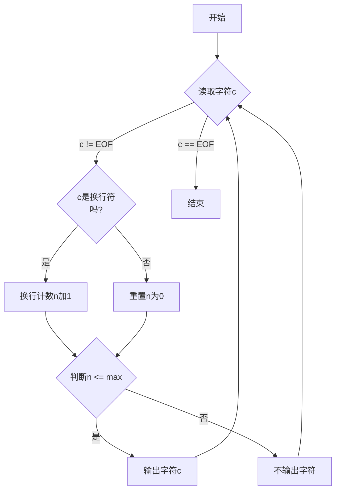

```mermaid
graph TD;
    A[开始] --> B{读取字符c}
    B -->|c != EOF| C{c是换行符\n吗?}
    B -->|c == EOF| Z[结束]
    C -->|是| D[换行计数n加1]
    C -->|否| E[重置n为0]
    D --> F{判断n <= max}
    E --> F
    F -->|是| G[输出字符c]
    F -->|否| H[不输出字符]
    G --> B
    H --> B

```

