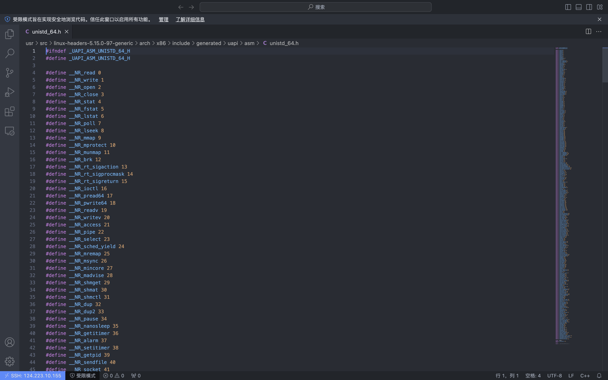
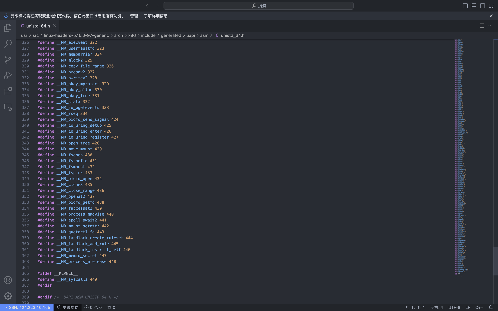
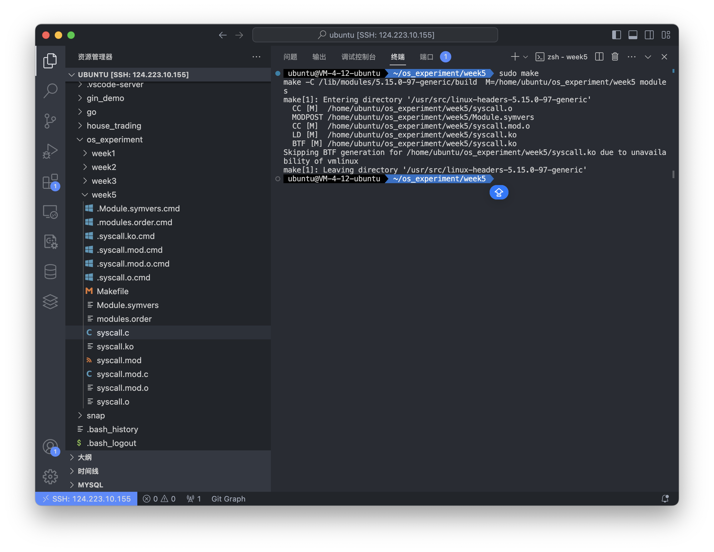
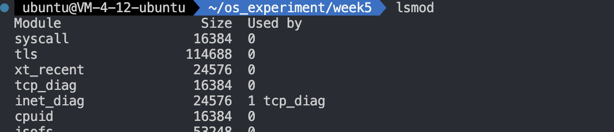
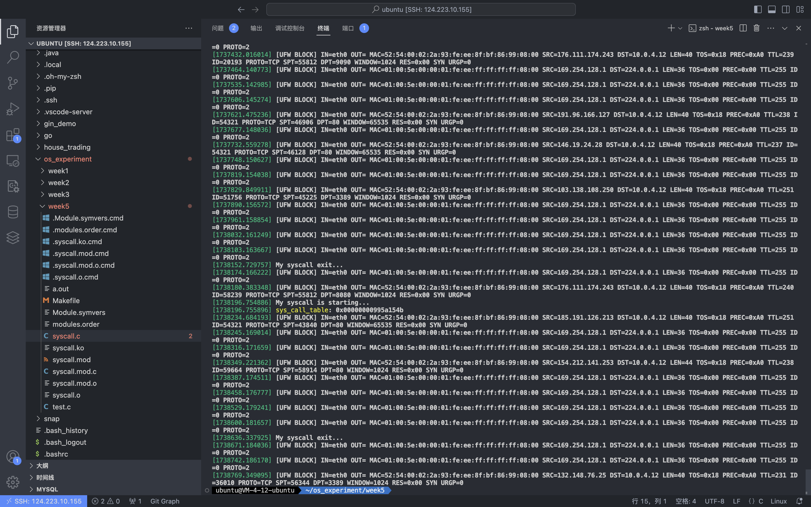
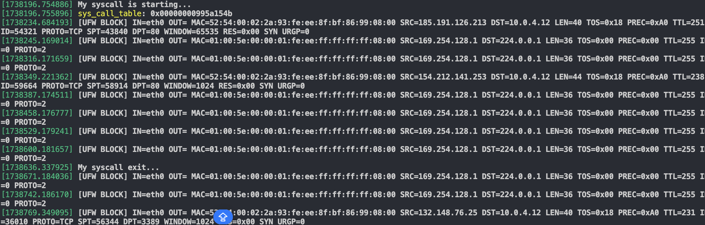

# 内核模块法

## 1 查看系统调用号

使用

```bash
uname -r
```

查看当前的内核版本


输入

```bash
sudo find / -name unistd_64.h
```

结果为

```shell
ubuntu@VM-4-12-ubuntu  ~/os_experiment/week5  sudo find / -name unistd_64.h
/usr/src/linux-headers-5.15.0-101-generic/arch/x86/include/generated/uapi/asm/unistd_64.h
/usr/src/linux-headers-5.15.0-97-generic/arch/x86/include/generated/uapi/asm/unistd_64.h
/usr/include/x86_64-linux-gnu/asm/unistd_64.h
```

选取系统内核版本对应的unistd_64.h

例如,我的系统内核版本为`5.15.0-97-generic`,则选取`/usr/src/linux-headers-5.15.0-97-generic/arch/x86/include/generated/uapi/asm/unistd_64.h`


使用vscode打开刚刚的文件

```bash
code /usr/src/linux-headers-5.15.0-97-generic/arch/x86/include/generated/uapi/asm/unistd_64.h
```


查看其中空闲的系统调用号



发现系统调用后截止到449,因此选择449之后的,例如`500`

或者编写如下的c代码

```c
#define _GNU_SOURCE
#include <unistd.h>
#include <sys/syscall.h>
#include <errno.h>
#include <stdio.h>
#include <string.h>

const int sys_call_number = 500; //该数字为希望使用的系统调用号

int main() {
    long res = syscall(sys_call_number);
    if (res == -1 && errno == ENOSYS) {
        printf("系统调用号%d未被使用。\n", sys_call_number);
    } else {
        printf("系统调用号%d可能已被使用。\n", sys_call_number);
    }
    return 0;
}

```

将该文件命名为test.c

然后执行下面的代码

```bash
gcc test.c
./a.out
```

根据输出来查看该系统调用号是否被使用

选择使用500作为系统调用号

## 2 查找sys_call_table地址

执行

```bash
sudo cat /proc/kallsyms | grep sys_call_table
```

显示

```bash
ubuntu@VM-4-12-ubuntu  ~/os_experiment/week5  sudo cat /proc/kallsyms | grep sys_call_table
ffffffffa0800320 D sys_call_table
ffffffffa0801440 D ia32_sys_call_table
ffffffffa0802260 D x32_sys_call_table
ffffffffc0937380 b sys_call_table       [syscall]
 ubuntu@VM-4-12-ubuntu  ~/os_experiment/week5  
```

查看`sys_call_table`的地址

发现是ffffffffa0800320


## 3 代码

syscall.c

其中`__NR_syscall`为空闲的系统调用号

`SYS_CALL_TABLE_ADDRESS`需要为 0x + 上面查询到的sys_call_table的地址 + ULL

```c
#include <linux/module.h>
#include <linux/kernel.h>
#include <linux/init.h>
#include <linux/unistd.h>
#include <linux/time.h>
#include <asm/uaccess.h>
#include <linux/sched.h>
#include <linux/kallsyms.h>
#include <linux/types.h>

#define __NR_syscall 500 //空白的系统调用号
#define SYS_CALL_TABLE_ADDRESS 0xffffffffa0802260ULL //sys_call_table地址

unsigned long *sys_call_table;

unsigned int clear_and_return_cr0(void);
void setback_cr0(unsigned int val);
static int sys_mycall(void);

int orig_cr0;   /* 用来存储cr0寄存器原来的值 */
static int (*anything_saved)(void);  /* 定义一个函数指针，用来保存一个系统调用 */

unsigned int clear_and_return_cr0(void) {
    unsigned int cr0 = 0;
    unsigned int ret;
    asm volatile ("movq %%cr0, %%rax" : "=a"(cr0));
    ret = cr0;
    cr0 &= 0xfffeffff; // 将cr0变量值中的第17位清0
    asm volatile ("movq %%rax, %%cr0" :: "a"(cr0));
    return ret;
}

void setback_cr0(unsigned int val) {
    asm volatile ("movq %%rax, %%cr0" :: "a"(val));
}

static int sys_mycall(void) {
    printk("My syscall is successful!\n");
    return 12345;
}

static int __init init_addsyscall(void) {
    printk("My syscall is starting...\n");
    sys_call_table = (unsigned long*)SYS_CALL_TABLE_ADDRESS; // 使用类型转换
    printk("sys_call_table: 0x%p\n", sys_call_table);
    anything_saved = (int(*)(void))(sys_call_table[__NR_syscall]); // 保存原始系统调用
    orig_cr0 = clear_and_return_cr0(); // 设置cr0可更改
    sys_call_table[__NR_syscall] = (unsigned long)&sys_mycall; // 更改原始的系统调用服务地址
    setback_cr0(orig_cr0); // 恢复原始的只读cr0
    return 0;
}

static void __exit exit_addsyscall(void) {
    orig_cr0 = clear_and_return_cr0(); // 设置cr0中对sys_call_table的更改权限
    sys_call_table[__NR_syscall] = (unsigned long)anything_saved; // 恢复原有的系统调用
    setback_cr0(orig_cr0); // 恢复原有的cr0值
    printk("My syscall exit...\n");
}

module_init(init_addsyscall);
module_exit(exit_addsyscall);
MODULE_LICENSE("GPL");

```

Makefile

```makefile
obj-m:=syscall.o
PWD:= $(shell pwd)
KERNELDIR:= /lib/modules/$(shell uname -r)/build
EXTRA_CFLAGS= -O0

all:
	make -C $(KERNELDIR)  M=$(PWD) modules
clean:
	make -C $(KERNELDIR) M=$(PWD) clean
```


终端使用

```bash
sudo make
```



然后执行

```bash
sudo insmod syscall.ko
```


编写测试程序

```c
#include <unistd.h>      
#include <sys/syscall.h> 
#include <stdio.h>

int main(void)
{
    printf("%ld\n", syscall(500));
    return 0;
}

```

执行测试程序

## 4 查看syscall是否被加载



发现syscall被加载


## 5 查看系统日志

```bash
sudo dmesg
```



发现



其中有

```bash
[1738196.754886] My syscall is starting...
[1738196.755896] sys_call_table: 0x00000000995a154b
[1738636.337925] My syscall exit..
```

证明系统调用被成功加载
