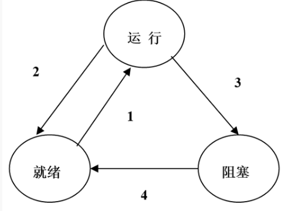

# 习题三

## 1

>  为什么进程需要有自己的PCB？请举例谈谈PCB 在进程运行过程中的作用。

进程的并发执行需要PCB保存和恢复现场

PCB作用:PCB包含同进程有关的信息，包括:进程状态,进程号,程序计数器,CPU寄存器,CPU调度信息 ,内存管理信息,计账信息,I/O状态信息

## 2

> 请从进程创建和进程终止角度谈谈父进程和子进程的关系。

父进程创建子进程，如此轮流创建进程下去，构成一棵进程树.

父进程和子进程的资源共享有三种可能:

+ 父进程子进程共享所有的资源;

+ 子进程共享父进程资源的子集;

+ 父进程和子进程无资源共享.

父进程和子进程的执行有两种可能:

+ 父进程和子进程并发执行;

+ 父进程等待，直到子进程终止.

**fork**系统调用创建新进程，创建时子进程完全复制父进程的空间，这种机制允许子进程和父进程方便的进行通讯.

父进程可中止子进程的执行(abort),父进程可以等子进程结束

## 3

> 某系统的进程状态转换图，请说明：
>
> 
>
> 1. 引起各种状态转换的典型事件有哪些？
> 2. 当我们观察系统中某些进程时，能够看到某一进程产生的一次状态转换能引起另一进程作一次状态转换。在什么情况下，转换3 的发生能立即引起转换 1 的发生？
> 3.  试说明是否会发生下述因果转换：
> 	+ 转换2 是否会引起转换 1
> 	+ 转换3 是否会引起转换 2
> 	+ 转换4 是否会引起转换 1

### 1.引起各种状态转换的典型事件

1. 就绪态$\rightarrow$运行态：处于就绪态的进程被调度后，获得处理机资源（分派处理机时间片），于是进程由就绪态转换为运行态。
2. 运行态$\rightarrow$就绪态：处于运行态的进程在时间片用完后，不得不让出处理机，从而进程由运行态转换为就绪态。此外，在可剥夺的操作系统中，当有更高优先级的进程就绪时，调度程序将正在执行的进程转换为就绪态，让更高优先级的进程执行。
3. 运行态$\rightarrow$阻塞态：进程请求某一资源（如外设）的使用和分配或等待某一事件的发生（如IO操作的完成）时，它就从运行态转换为阻塞态。进程以系统调用的形式请求操作系统提供服务，这是一种特殊的、由运行用户态程序调用操作系统内核过程的形式。
4. 阳塞态$\rightarrow$就绪态：进程等待的事件到来时，如I/O操作结束或中断结束时，中断处理程序必须把相应进程的状态由阻塞态转换为就绪态。

### 2.在什么情况下，转换3 的发生能立即引起转换 1 的发生？

如果就绪队列非空，则一个进程的转换3会立刻引起另一个进程的转换1

### 3.试说明是否会发生下述因果转换

1.   $转换2 \rightarrow 转换1$ 会发生.因为当发生转换2时，正在执行的进程从执行状态转变为就绪状态，这时处理机空闲，进程调度程序一定会从就绪队列中选取一个进程投入运行
2.   $转换3 \rightarrow 转换2$ 不会发生.因为当前执行进程不可能既从执行状态变为阻塞状态，又从执行状态变为就绪状态。
3.   $转换4 \rightarrow 转换1$ 会发生，当处理机空闲且就绪队列为空时，某一进程的转换4会引起该进程的转换1，因为此时该进程从阻塞状态变为就绪状态，调度程度就会将就绪队列中的这一进程投入运行。

## 4

> 描述内核在两个进程间进行上下文切换的过程。

1. **中断或系统调用触发：** 上下文切换通常由硬件中断或进程发起的系统调用触发。这些事件表明当前进程需要暂停执行，而内核需要决定下一个应该运行的进程。

2. **保存当前进程上下文：** 当一个中断或系统调用触发时，内核会保存当前正在执行的进程的上下文信息。上下文信息包括程序计数器（PC）、寄存器值、栈指针（SP）等。这些信息需要被保存，以便稍后重新恢复该进程的执行。

3. **选择下一个进程：** 内核会根据调度算法选择下一个要执行的进程。调度算法可以是先来先服务（FCFS）、轮转调度（Round Robin）、优先级调度等。

4. **加载下一个进程上下文：** 一旦内核选择了下一个要执行的进程，它会加载该进程的保存上下文信息，包括程序计数器、寄存器值和栈指针。这个过程被称为上下文切换，因为它切换了CPU的执行上下文，从当前进程切换到了下一个进程。

5. **开始执行下一个进程：** 一旦新进程的上下文被加载，CPU开始执行新进程的代码，恢复其执行状态。这使得新进程能够继续其执行，就好像没有中断一样。

6. **执行新进程：** 内核会监视新进程的执行，直到再次触发上下文切换事件（如时间片用尽或等待I/O完成）。当这种事件发生时，内核会重复上述步骤，保存当前进程的上下文，选择下一个进程，并加载其上下文。

7. **维护进程状态：** 内核会不断维护各个进程的状态，包括就绪、运行和阻塞状态，以确保它们按照调度算法得到适当的执行时间。

## 5

> 什么是直接通信？什么是间接通信？请各举一个例子并讨论他们各自的优缺点。

### 1.直接通信的特点:

进程必须显式的命名接受者和发送者:
+ **send**(P,message)–向进程P发消息
+ **receive**(Q,message)–从进程Q收消息

通信连接的特性
+ 连接自动建立
+ 连接精确地与一对通信进程相关
+ 在每一对通信进程间存在一个连接
+ 连接可单向，但通常双向

### 2.间接通信的特点:

消息导向至信箱并从信箱接收
+ 每一个信箱有一个唯一的id
+ 仅当共享一个信箱时进程才能通信

通信连接的特性:
+ 仅当进程共有一个信箱时连接才能建立 ! 连接可同多个进程相关
+ 每一对进程可共享多个通信连接
+ 连接可是单向或双向的

### 3.举例说明优缺点

**例子1：直接通信的优点 - 多线程文件复制**

例如一个文件复制程序，目的是从一个位置复制文件到另一个位置。在这种情况下，直接通信可以提供一些优点：

* 优点：
   - **高效性：** 在多线程文件复制中，线程之间可以直接共享内存，这允许它们在不同的部分之间传递数据，而无需进行额外的数据复制或通过中间缓冲区传递数据。
   - **低延迟：** 直接通信减少了线程之间数据传输的延迟，因为它们可以直接访问和修改共享的内存，而不需要额外的同步和等待操作。
   - **高性能：** 在高性能计算需求较高的情况下，直接通信能够提供更高的数据传输速率，从而加速文件复制操作。

**例子2：间接通信的优点 - 网络通信**

考虑一个网络通信系统，用于在不同计算机之间传输数据，如Web浏览器请求和服务器响应。在这种情况下，间接通信有一些优点：

* 优点：
   - **安全性：** 通过网络通信，数据可以通过安全的协议进行加密传输，以防止未经授权的访问或数据泄漏。
   - **可靠性：** 通过网络通信，数据可以通过路由器和中间设备进行传输，以确保在不同计算机之间可靠传递。
   - **跨平台兼容性：** 通过网络通信，不同操作系统和计算机之间可以进行通信，使其具有更广泛的可用性。

