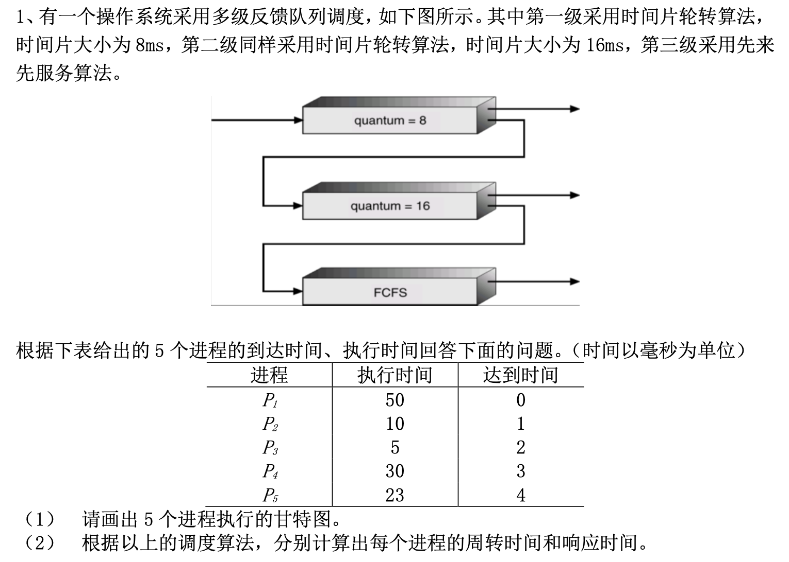
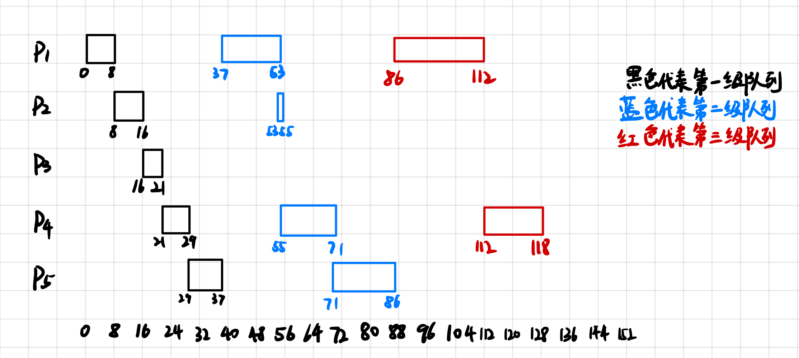
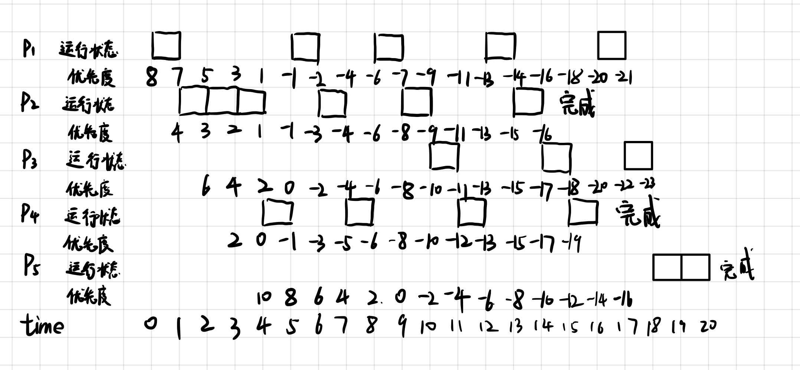

# 习题5

## 1

>   

### 第一问

### 第二问

周转时间:

$P_1:112ms - 0 = 112ms$

$P_2:55ms - 1ms = 54ms$

$P_3:21ms - 2ms = 19ms$

$P_4:118ms - 3ms = 115ms$

$P_5:86ms - 4ms = 82ms$

响应时间:

$P_1:0ms$

$P_2:8ms - 1ms = 7ms$

$P_3:16ms - 2ms = 14ms$

$P_4:21ms - 3ms = 18ms$

$P_5:29ms - 4ms = 25ms$

## 2

>   什么是抢占式调度？什么是非抢占式调度？各适用什么场合？

+   抢占式调度:

    +   定义:又称剥夺方式.当一个进程正在处理机上执行时,如果有一个更重要或更紧迫的进程需要使用处理机，则立即暂停正在执行的进程,将处理机分配给更重要紧迫的那个进程。
    +   适用场景:分时操作系统,实时操作系统
+   非抢占式调度:

    +   定义:又称非剥夺方式.只允许进程主动放弃处理机。在运行过程中即便有更紧迫的任务到达，当前进程依然会继续使用处理机，直到该进程终止或主动要求进入阻塞态。
    +   适用场景:早期的批处理系统

## 3

>   考虑以下的一个基于优先级（优先数高优先级低）的调度算法，此算法采用根据等待时间和运行时间对优先数进行动态老化算法，具体算法如下：
>   + (a)处于就绪队列中的进程的优先数 p 每等待1毫秒减2；
>   + (b)处于运行状态的进程的优先数 p每运行1毫秒减1；
>   + (c)如果 2个进程的优先级相同，先进入就绪队列的优先；
>   + (d) 采用抢占式调度策略。
>
>   根据下表给出的 5 个进程的到达时间、执行时间回答下面的问题。（时间以毫秒为单位）
>
>   | 进程  | 执行时间 | 到达时间 | 优先级P |
>   | :-----: | :--------: | :--------: |:-------: |
>   | $P_1$ | 5        | 0        | 8       |
>   | $P_2$ | 6        | 1        | 4     |
>   | $P_3$ | 3        | 2        | 6    |
>   | $P_4$ | 4        | 3        | 2       |
>   | $P_5$ | 2        | 4        | 10      |
>
>   +   （1） 请画出5 个进程执行的甘特图。
>   +   （2） 根据以上的调度算法，分别计算出每个进程的周转时间和响应时间。

周转时间:

$P_1:17ms - 0ms = 17ms$

$P_2:14ms - 1ms = 13ms$

$P_3:18ms - 2ms = 16ms$

$P_4:16ms - 3ms = 13ms$

$P_5:20ms - 4ms = 16ms$

响应时间:

$P_1:0ms$

$P_2:0ms$

$P_3:8ms$

$P_4:1ms$

$P_5:14ms$

## 4

>   试比较进程调度与作业调度的不同点

作业是从用户角度出发的,它由用户提交,以用户任务为单位

进程是从操作系统出发的,由系统生成,是操作系统的资源分配和独立运行的基本单位

## 5

> 考虑下面基于动态优先权的可抢占式调度算法，大优先数表示代表高优先权。当一个进
>
> 程在等待 CPU 时（在就绪队列中，但未执行），优先数以$\alpha$速率变化；当它运行时，优先数
>
> 以速率$\beta$变化。所有进程程在进入就绪队列时被给定优先数为0。请问：
>
> +   (a) $\beta > \alpha > 0$时是什么算法？为什么？
> +   (b) $\alpha < \beta < 0$时是什么算法？为什么？

假设就绪队列中有n个进程,为$P_1$到$P_n$,假设每个进程的运行时间均为$t$,假设$P_1$最先进入等待队列,其次为$P_2,P_3$,最后为$P_n$进入等待队列.

### 1.$\beta > \alpha > 0$

**先到先服务(First-Come First-Served)调度算法**

原因:

假设当前运行的进程$P_n$等待时间为$t_w$,运行了的时间为$t_r$,因此$P_n$的优先数为$\alpha * t_w + \beta * t_r$,

此时$P_{n+1}$进程仍在等待,$P_{n+1}$的优先数为$\alpha * (t_w + t_r)$

由于$\beta > \alpha > 0$

因此$\alpha * t_w + \beta * t_r > \alpha * (t_w + t_r)$ 

所以在$P_n$进程运行时,到达时间在$P_n$进程后的进程的优先数均小于$P_n$进程的优先数

因此满足先到达的进程先被服务

因此为`先到先服务`调度算法

### 2.$\alpha < \beta < 0$

**后到先服务(Last-Come First-Served)调度算法**

原因:

假设当前运行的进程$P_n$等待时间为$t_w$,运行了的时间为$t_r$,因此$P_n$的优先数为$\alpha * t_w + \beta * t_r$,

此时$P_{n+1}$进程仍在等待,$P_{n+1}$的优先数为$\alpha * (t_w + t_r)$

由于$\alpha < \beta < 0$

因此$\alpha * t_w + \beta * t_r < \alpha * (t_w + t_r)$ 

因此$P_n$进程一旦开始运行,优先数就会小于$P_{n+1}$进程的优先数,导致后达到的进程的优先数均大于先到达的进程的优先数

因此满足后到达的进程先被服务

因此为`后到先服务`调度算法