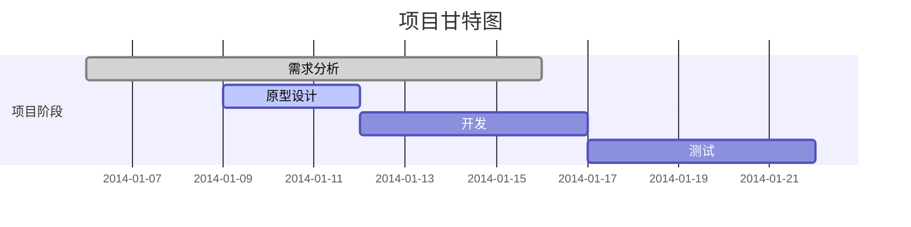

```mermaid
gantt
    title 一个多级反馈队列调度的甘特图
    dateFormat  S

    section 第一级队列 (8ms 时间片)
    P1 :a1, 0, 8s
    P2 :a2, 8s, 8s
    P3 :a3, 16s, 5s
    P4 :a4, 21s, 8s
    P5 :a5, 29s, 8s
    P1 :after a5, 8s
    P2 :a6, 45s, 2s
    P4 :after a6, 8s
    P5 :after a7, 8s
    P1 :after a8, 8s
    P4 :after a9, 8s
    P5 :a9, 79s, 7s
    P1 :after a9, 8s
    P4 :a10, 94s, 6s
    P1 :after a10, 8s
    P1 :a11, 116s, 6s
