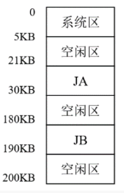

# 习题八

## 1

>   什么是重定位？重定位有哪些类型？

重定位定义:在运行时调整程序和数据的地址以适应内存地址的过程。

内存的装入模块在装入内存时，同样有以下三种方式：

1.    绝对装入

绝对装入方式只适用于单道程序环境。在编译时，若知道程序将驻留在内存的某个位置，则编译程序将产生绝对地址的目标代码。绝对装入程序按照装入模块中的地址，将程序和数据裝入内存。由于程序中的逻辑地址与实际内存地址完全相同，因此不需对程序和数据的地址进行修改。

另外，程序中所用的绝对地址，可在编译或汇编时给出，也可由程序员直接赋予。而通常情况下在程序中采用的是符号地址，编译或汇编时再转换为绝对地址。

2. 可重定位装入

在多道程序环境下，多个目标模块的起始地址通常都从0开始，程序中的其他地址都是相对于起始地址的，此时应采用可重定位装入方式。根据内存的当前情况，将装入模块装入内存的适当位置。在装入时对目标程序中指令和数据地址的修改过程称为重定位，又因为地址变换通常是在进程装入时一次完成的，故称为静态重定位.

当一个作业装入内存时，必须给它分配要求的全部内存空间，若没有足够的内存，则无法装入。此外，作业一旦进入内存，整个运行期间就不能在内存中移动，也不能再申请内存空间。

3. 动态运行时装入

也称动态重定位。程序在内存中若发生移动，则需要采用动态的装入方式。装入程序把装入模块装入内存后，并不立即把装入模块中的相对地址转换为绝对地址，而是把这种地址转换推迟到程序真正要执行时才进行。因此，装入内存后的所有地址均为相对地址。这种方式循要一个重定位寄存器的支持

动态重定位的优点：可以将程序分配到不连续的存储区：在程序运行之前可以只装入部分代码即可投入运行，然后在程序运行期间，根据需要动态申请分配内存：便于程序段的共享。

## 2

>   在页式存储管理中，假设作业的地址为 16 位，页长为 4KB，作业的第 0,1,2 逻辑页分别放在内存的第 5,10,11物理块中，试计算作业中逻辑地址 2F6AH,0E3CH,526CH（十六进制数）相对应的内存物理地址，说明转换过程、写出转换结果
>   

$4KB = 4 * 2^{10} Byte = 2^{12} Byte$

$\frac{2^{16}}{2^{12}} = 4位$

因此,地址中,前4位表示页号P,后12位表示页内地址W

| 15 ... 4 |   3 ... 0   |
| :------: | :---------: |
|  页号P   | 页内偏移量W |

页号和对应的物理块号映射：$0 \rightarrow 5, 1 \rightarrow 10, 2 \rightarrow 11$

1. 逻辑地址 $2F6A_{16}$：
   + 页号：$2_{16} \rightarrow B_{16}$
   + 页内偏移：$F6A_{16}$
   + 物理地址：$BF6A_{16}$

2. 逻辑地址 $0E3C_{16}$：
   + 页号：$0_{16} \rightarrow 5_{16}$
   + 页内偏移：$E3C_{16}$
   + 物理地址：$5E3C_{16}$

3. 逻辑地址 $526C_{16}$：
   + 页号：$5_{16}$
   + 页内偏移：$26C_{16}$
   + 物理地址：无效地址

## 3

>   假设有下面的段表：
>
>   | 段 | 基地址 | 长度
>   | :---: | :---: | :---: |
>   |0|219|600|
>   |1|2300|14|
>   |2|90|100|
>   |3|1327|580|
>   |4|1952|96|
>
>   下面的逻辑地址的物理地址是多少？
>
>   a. 0, 430
>
>   b. 1,10
>
>   c. 2, 500
>
>   d. 3,400
>
>   e. 4,122

1. 逻辑地址 (0, 430)
   - 段 0 的基地址是 219，长度是 600。
   - 段内偏移 430 在长度范围内（小于 600）。
   - 物理地址 = 基地址 + 偏移 = 219 + 430 = 649。

2. 逻辑地址 (1, 10)
   - 段 1 的基地址是 2300，长度是 14。
   - 段内偏移 10 在长度范围内（小于 14）。
   - 物理地址 = 基地址 + 偏移 = 2300 + 10 = 2310。

3. 逻辑地址 (2, 500)
   - 段 2 的基地址是 90，长度是 100。
   - 段内偏移 500 超出了长度范围（大于 100），所以地址无效。

4. 逻辑地址 (3, 400)
   - 段 3 的基地址是 1327，长度是 580。
   - 段内偏移 400 在长度范围内（小于 580）。
   - 物理地址 = 基地址 + 偏移 = 1327 + 400 = 1727。

5. 逻辑地址 (4, 122)
   - 段 4 的基地址是 1952，长度是 96。
   - 段内偏移 122 超出了长度范围（大于 96），所以地址无效。

## 4

>   某系统采用可变分区方式管理主存储器，在主存分配情况如图所示时，有 4个作业要求装入主存，它们各自所需的主存空间为：J1：8KB, J2：15KB, J3：30KB, J4：115KB，系统不允许移动。请回答下列问题：
>   
> 
>   1. 采用首次适应分配算法分配主存，应按怎样的次序才能将 4 个作业同时全部装入主存？写出所有可能的装入次序。
>   2. 从上述作业装入次序中选择一种，描述作业装入内存后的情况。
>   
>   3. 在采用首次适应算法回收内存时，可能出现哪几种情况？怎样处理这些情况？
>   
>   4. 请比较连续分配、分页和分段三种存储分配机制的优缺点？
>

### 4.1

首次适应算法 (First Fit)

1.  $J2 \rightarrow J3 \rightarrow J4 \rightarrow J1$
2.  $J2 \rightarrow J4 \rightarrow J3 \rightarrow J1$
3.  $J3 \rightarrow J2 \rightarrow J4 \rightarrow J1$
4.  $J3 \rightarrow J4 \rightarrow J2 \rightarrow J1$
5.  $J4 \rightarrow J2 \rightarrow J3 \rightarrow J1$
6.  $J4 \rightarrow J3 \rightarrow J2 \rightarrow J1$

### 4.2

1.  **J2** 被分配到第一个足够大的空闲区域，即从 5KB 开始的空闲区。J2 需要 15KB，因此它会被放置在 5KB 到 20KB 的范围内。这会留下一个 1KB 的小空闲块（从 20KB 到 21KB）。
2.  **J3** 接下来被分配。它需要 30KB，不能放在前面剩下的 1KB 空闲区，所以会被放置在下一个大空闲区，即从 30KB 到 180KB。J3 占用后，该空闲区域将从 30KB 到 60KB，剩余空闲区域为 60KB 到 180KB。
3.  **J4** 然后被分配。由于它需要 115KB 的空间，它会接着 J3 被放置在 60KB 到 175KB 的位置。这样，从 175KB 到 180KB 会留下一个 5KB 的小空闲块。
4.  最后，**J1** 需要 8KB 的空间。它将被分配到最后一个空闲区，即 190KB 到 200KB 的区域。J1 占用后，该空闲区域将从 190KB 到 198KB，剩余一个 2KB 的空闲块（从 198KB 到 200KB）。

| 内存范围      | 内容   |
| ------------- | ------ |
| 0KB - 5KB     | 系统区 |
| 5KB - 20KB    | J2     |
| 20KB - 21KB   | 空闲区 |
| 21KB - 30KB   | JA     |
| 30KB - 60KB   | J3     |
| 60KB - 175KB  | J4     |
| 175KB - 180KB | 空闲区 |
| 180KB - 190KB | JB     |
| 190KB - 198KB | J1     |
| 198KB - 200KB | 空闲区 |

### 4.3

四种情况:

1.   回收区与插入点的前一空闲分区相邻，将这两个分区合并，并修改前一分区表项的大小为两者之和
2.   回收区与插入点的后一空闲分区相邻，将这两个分区合并，来准改后一分区表项的始址和大小
3.   回收区同时与插入点的前、后两个分区相邻，此时将这三个外区合并，修改前一分区表项的大小为三者之和，取消后一分区表项
4.   回收区没有相邻的空肉分区，此时应为回收区新建一个表项，填写始址和大小，并插入空闲分区链。

### 4.4

### 连续分配

**优点**:

+   **简单易懂**：连续分配的算法通常比较直观，容易实现。
+   **无需特殊硬件**：不需要页表或段表等复杂的硬件支持。

**缺点**:

+   **内存碎片**：容易产生外部碎片，需要定期进行碎片整理。
+   **内存利用率低**：可能因为没有足够的连续空间而无法分配大的内存块，即使有足够的总空闲内存。
+   **分配和回收开销大**：可能需要搜索整个内存空间来找到合适的空闲区域。

### 分页存储分配

**优点**:

+   **消除外部碎片**：每个页面都是固定大小，易于管理，不会产生外部碎片。
+   **提高内存利用率**：可以将任何空闲的物理页分配给任何进程，从而提高内存利用率。
+   **灵活且易于扩展**：进程可以分散在物理内存的不同部分，便于实现虚拟内存系统。

**缺点**:

+   **内部碎片**：每个页面的最后可能会有未使用的空间，尤其是当进程大小不是页面大小的整数倍时。
+   **需要额外的硬件和开销**：需要内存管理单元（MMU）来管理页表，且页表本身也占用内存空间。
+   **页表可能很大**：对于大的地址空间，页表本身可能会非常大，需要特殊技术如分层页表或倒排页表来管理。

### 分段存储分配

**优点**:

+   **支持模块化编程**：每个段通常对应于程序的一个逻辑单位，如函数或数据结构，这支持模块化编程。
+   **动态增长**：段可以动态增长，适合实现动态数据结构和栈。
+   **有利于保护和共享**：可以为不同的段设置不同的访问权限，便于实现共享和保护。

**缺点**:

+   **可能产生外部碎片**：随着段的动态增长和删除，内存中可能出现不连续的空闲区域。
+   **管理复杂度高**：分段系统的内存管理比分页系统更为复杂，需要维护一个段表。
+   **段表大小**：段表的大小取决于程序的结构，可能会非常大。

## 5

>   一个分页存储系统，页表存放在内存：
>
>   （1） 如果直接访问一次内存单元需要 200ns，则在分页系统中（单级页表）访问一个地址中的数据需要多少时间？
>
>   （2） 如果系统采用三级页表，则通过三级页表访问一个内存单元需要多少时间？
>
>   （3） 如果单级页表系统引入联想寄存器，90％的页表项可以在快表中命中，则访问一个地址中的数据需要多少时间？（假设访问一次快表需要10ns）

###  5.1
首先访问页表,然后根据页表去内存中寻找物理地址
$t = 200ns + 200ns = 400ns$

### 5.2
$t = 4 * 200ns = 800ns$

### 5.3
两种可能

1.   若快慢表不是同时查找:

$t = 0.9 * (10 + 200) + 0.1 * (10 + 200 + 200) = 230ns$

2.   若快慢表同时查找:

$t = 0.9 * (10 + 200) + 0.1 * (200 + 200) = 229ns$

## 6

>   假定某采用分页式存储管理的系统中，主存容量为 1M，被分成 256 块，块号为 0，1，2，……，255。某作业的地址空间占 4 页，其页号为 0，1，2，3，被分配到主存的第2，4，1，5 块中。回答：
>
>   1.   主存地址应该用多少位来表示？
>
>   2.   作业每一页的长度是多少？逻辑地址中的页内偏移应用多少位来表示？
>
>   3.    写出作业中的每一页在主存块中的起始地址。

### 6.1

$1MB = 2^{20} B$,因此需要二十位

### 6.2

$每一页的大小 = \frac{2^{20}}{256} = 2^{12}B = 4096B$

每一页的长度为4096B,页内偏移需要12位

### 6.3

作业中每一页在主存块中的起始地址如下：

+   页号 0 在主存块号 2 中，起始地址为 8192（2×40962×4096)。
+   页号 1 在主存块号 4 中，起始地址为 16384（4×40964×4096)。
+   页号 2 在主存块号 1 中，起始地址为 4096（1×40961×4096)。
+   页号 3 在主存块号 5 中，起始地址为 20480（5×40965×4096)。
