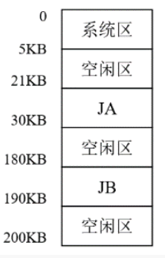
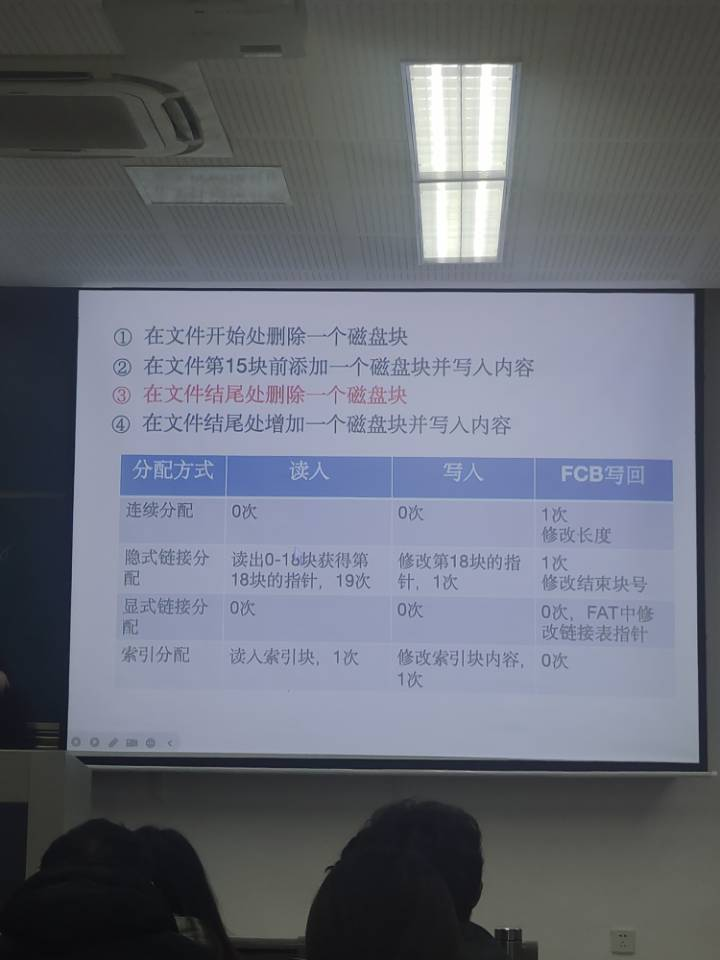

# 期末大纲

## chap1

操作系统作用

操作系统与其他组件关系

OS主要服务形式

PPT里提到的计算机的发展(尤其是多道程序和分时系统)

## chap2

无

## chap3

线程和进程相关观念(五状态图,转换,什么导致转换)

父进程创建子进程 执行的细节

线程 内核线程 用户级线程 两者的特色

对比线程和进程二者异同

## chap6

### 概念

竞争条件 临界区 信号量 以理解为基础 给案例分析出信号量的值的变化 临界区的值

大题 同步互斥算法设计

+   ==生产者消费者问题==
+   ==读者写者问题==
+   哲学家进餐问题
+   吸烟者问题


### 例题:

#### 例题6.1

>   什么是临界区？对临界区的访问应该遵循什么准则？

临界区是进程中访问临界资源的代码段

准则:

+   空闲让进
+   忙则等待
+   有限等待
+   让权等待

#### 例题6.2

>   请谈谈同步信号量的值有什么含义。

信号量其实就是一个变量 (可以是一个整数，也可以是更复杂的记录型变量)，可以用一个信号量 来表示系统中某种资源的数量


#### 例题6.3 读者写者问题

>   有四个进程 S1、R1、R2和R3，其中 S1向缓冲区BUFF发送消息，R1、R2 和R3 从缓冲区中接收消息。发送和接收的规则如下：
>
>   1)   缓冲区 BUFF任何时候只能存放 1个消息；
>   2)   R1、R2 和 R3每次可取 S1存放在缓冲区中的消息；
>   3)   每个存放在缓冲区中的消息必须被 R1、R2 和R3 均接收后才能清除。
>
>   请用信号量机制来实现这4个进程间的同步。

```
S1:
	P(S1)
	//send message
	V(R1)
	V(R2)
	V(R3)
Rx(1,2,3):
	P(Rx)
	//recieve message
	P(mutex)
	count++
	if(count==3){
		V(S1)
	}
  V(mutex)
  
```

#### 例题6.4 生产者消费者问题

>   桌上有一个空的水果盘，且盘中一次只能放一个水果。爸爸专向盘中放苹果，妈妈专向盘中放桔子，一个儿子专等吃盘子中的桔子，一个女儿专等吃盘子中的苹果。固定每次当盘子空时爸爸或妈妈可向盘中放一个水果，仅当盘中有自己需要的水果时，儿子或女儿可从中取出。请用 PV操作实现爸爸、妈妈、儿子和女儿四个进程的同步。

```c++
semaphore plate = 1;
semaphore apple = 0;
semaphore orange = 0;

dad(){
    while(true){
        //准备苹果
        P(plate);
        //放入苹果
        V(apple);
    }
}

mom(){
    while(true){
        //放入橘子
        P(plate);
        //放入桔子
        V(orange);
    }
}

son(){
    while(true){
        P(apple);
        //取出苹果
        V(plate);
        //吃掉苹果
    }
}

doughter(){
    while(true){
        P(orange);
        //取出橘子
        V(plate);
        //吃掉橘子
    }
}
```

#### 例题6.5 哲学家进餐问题

假设有五位哲学家围坐在一张圆形餐桌旁，做以下两件事情之一：吃饭，或者思考。吃东西的时候，他们就停止思考，思考的时候也停止吃东西。餐桌上有五碗意大利面，每位哲学家之间各有一只餐叉。因为用一只餐叉很难吃到意大利面，所以假设哲学家必须用两只餐叉吃东西。他们只能使用自己左右手边的那两只餐叉。哲学家就餐问题有时也用米饭和五根筷子而不是意大利面和餐叉来描述，因为吃米饭必须用两根筷子。

##### 基础想法

```c++
semaphore chopstick[5] = {1, 1, 1, 1, 1};
Pi(){
    do{
        think()
        P(chopstick[i]);
        P(chopstick[(i+1)%5]);
        eat();
        V(chopstick[i]);
        V(chopstick[(i+1)%5]);
        thick();
    }while(1);
}
```

若五位哲学家同时饥饿而各自拿起了左边的筷子，这使五个信号量 chopstick 均为 0，当他们试图去拿起右边的筷子时，都将因无筷子而无限期地等待下去，即可能会引起死锁。


##### 方式1

至多只允许四位哲学家同时去拿左筷子，最终能保证至少有一位哲学家能进餐，并在用完后释放两只筷子供他人使用

```C++
semaphore chopstick[5] = {1, 1, 1, 1, 1};
semaphore count = 4;
Pi(){
    do{
    	think();
    	P(count)
        P(chopstick[i]);
        P(chopstick[(i+1)%5]);
        eat();
    	V(count)
        V(chopstick[i]);
        V(chopstick[(i+1)%5]);
        thick();
    }while(1);
}
```


##### 方式2

仅当哲学家的左右手筷子都拿起时才允许进餐。

解法1:

通过互斥信号量 mutex 对 eat() 之前取左侧和右侧筷子的操作进行保护，可以防止死锁的出现。

```C++
semaphore chopstick[5] = {1, 1, 1, 1, 1};
semaphore mutex = 1;
Pi(){
    do{
    	think();
    	P(mutex)
        P(chopstick[i]);
        P(chopstick[(i+1)%5]);
        eat();
    	P(mutex)
        V(chopstick[i]);
        V(chopstick[(i+1)%5]);
        thick();
    }while(1);
}
```

#### 例题6.6 吸烟者问题

>   假设一个系统中有三个吸烟者进程和一个供应者进程，每个抽烟者不停的卷烟并抽掉它，但是要卷烟并抽调一支烟
>   抽烟者需要三种材料：烟草 卷纸 胶水 三个抽烟者中第一个拥有烟草，第二个拥有卷纸 第三个拥有胶水
>   供应者进程不停的供应三种材料，供应者每次将两种材料放在桌子上，拥有剩下的那种材料的抽烟者卷一根抽掉它
>   并通知供应者进程一个信号完成了。供应者进程就会将两种材料藏在桌上 这个过程一直重复（三个抽烟者轮流吸烟）

```C++
semaphore offer1=0;桌子上的组合1的数量
semaphore offer2=0;桌子上的组合2的数量
semaphore offer3=0;桌子上的组合3的数量
semaphore finish=0;抽烟是否完成
int i=0;用于实现三个抽烟者轮流抽烟的功能

provider(){
while(1){
	if(i==0){
	V(offer1);//提供第一组材料
	}
	else if(i==1){
	V(offer2);//提供第二组材料
	}
	else if(i==2){
	V(offer3);//提供第三组材料
	}
	i=(i+1)%3;
	P(finish);//如果未完成会一直阻塞在这里
}
}
smoker1(){
	P(offer1);
	从桌子上拿走组合1
	V(finish);
}
somker2(){
P(offer2);
	从桌子上拿走组合2
	V(finish);
}
smoker3(){
P(offer3);
	从桌子上拿走组合3
	V(finish);
}

```


## chap7

### 概念

了解死锁产生的原因(例题2)

死锁的特性:(四个条件)

+   互斥条件
+   不剥夺条件
+   请求并保持条件
+   循环等待条件

处理死锁的方法

+   资源剥夺法
+   撤销进程法
+   进程回退法

死锁避免算法

+    ==银行家算法==(一定要掌握) 
+   最起码判断当前是否安全(系统能按照某种进程推进顺序为每个进程分配资源) (见例题7.4第二问) 
+   能否申请资源(例题7.4第三问)

### 例题

#### 例题 7.1

> 在有$m$个进程的系统中出现死锁时，死锁进程的个数$k$应该满足的条件是什么？

$k$需要满足的条件:$2 \leq k \leq m$

原因:

1.   出现死锁至少需要两个进程,因此$k \geq 2$
2.   进程数不会超过操作系统的进程数,因此$k \leq m$

#### 例题 7.2

> 什么是死锁？产生死锁的原因是什么？

死锁的定义:
多个进程因竞争资源而造成一种僵局,若无外力作用,这些进程都将无法向前推进

原因:

1.   系统资源的竞争
2.   进程推进顺序非法

#### 例题 7.3

> 假设一个系统有$m$个相同类型的资源被$n$个进程共享，进程每次只请求或释放一个资源。试证明只要符合下面两个条件，系统就不会发生死锁。
>
> +  每个进程需要资源的最大值在$1 \sim m$之间。
> +  所有进程需要资源的最大值的和小于$m + n$。

证明过程:

条件1:每个进程需要资源的最大值在$1 \sim m$之间。

条件2:所有进程需要资源的最大值的和小于$m + n$。

结论:系统发生死锁

反证法:假设条件1,2均满足,但是系统发生了死锁
$$
\begin{align*}
&设第i个进程所需要的资源数量为Resource(i),记为R_i \\
&根据条件1,我们可以得知1 \leq R_i \leq m \nonumber \\
&根据条件2,我们可以得知\Sigma{R_i} < m + n \nonumber \\
&我们可得n \leq \Sigma{R_i} < m + n \\
&0 \leq \Sigma{R_i}  - m < n \\
&意味着\forall i,R_i \geq 1,此时剩下的资源数\Sigma{R_i}  - m仍然小于进程数n \\
&所以表明系统中必然至少有一个资源是空闲的，可以被某个等待资源的进程使用 \\
&由于\forall i,\ i运行的条件为m - (\Sigma{R-i} - n) > 0,即\Sigma{R_i}  - m < n \\
&而且上面我们已经证明了\forall i,\Sigma{R_i}  - m < n \\
&因此至少有一个进程会运行,因此系统未发生死锁. \\
&综上,满足条件1,条件2,结论是不可能的,因此在满足条件1和条件2时,系统一定不会发生死锁 \\
&Q.E.D
\end{align*}
$$

#### 例题 7.4

> 考虑一个系统在某一时刻的状态：
>
> $$
> Allocation = 
> \begin{pmatrix}
> 0 & 0 & 1 & 2 \\
> 1 & 0 & 0 & 0 \\
> 1 & 3 & 5 & 4 \\
> 0 & 6 & 3 & 2 \\
> 0 & 0 & 1 & 4 \\
> \end{pmatrix} \\
> 
> Max = 
> \begin{pmatrix}
> 0 & 0 & 1 & 2 \\
> 1 & 7 & 5 & 0 \\
> 2 & 3 & 5 & 6 \\
> 0 & 6 & 5 & 2 \\
> 0 & 6 & 5 & 6 \\
> \end{pmatrix} \\
> 
> Avilable = 
> \begin{pmatrix}
> 1 & 5 & 2 & 0 \\
> \end{pmatrix} \\
> $$
>
>
> 使用银行家算法回答下列问题：
>
> 1.   Need 矩阵的内容是怎样的？
>
> 2.   系统是否处于安全状态？
>
> 3.   如果从进程 P1发来一个请求（0, 4, 2, 0），这个请求能否立刻被满足？

1.   Need 矩阵的内容

$$
\begin{align*}
&Allocation = 
\begin{pmatrix}
0 & 0 & 1 & 2 \\
1 & 0 & 0 & 0 \\
1 & 3 & 5 & 4 \\
0 & 6 & 3 & 2 \\
0 & 0 & 1 & 4 \\
\end{pmatrix} \\

&Max = 
\begin{pmatrix}
0 & 0 & 1 & 2 \\
1 & 7 & 5 & 0 \\
2 & 3 & 5 & 6 \\
0 & 6 & 5 & 2 \\
0 & 6 & 5 & 6 \\
\end{pmatrix} \\

&Avilable = 
\begin{pmatrix}
1 & 5 & 2 & 0 \\
\end{pmatrix} \\

&Need = Max - Allocation = 
\begin{pmatrix}
0 & 0 & 1 & 2 \\
1 & 7 & 5 & 0 \\
2 & 3 & 5 & 6 \\
0 & 6 & 5 & 2 \\
0 & 6 & 5 & 6 \\
\end{pmatrix} 
-
\begin{pmatrix}
0 & 0 & 1 & 2 \\
1 & 0 & 0 & 0 \\
1 & 3 & 5 & 4 \\
0 & 6 & 3 & 2 \\
0 & 0 & 1 & 4 \\
\end{pmatrix} 
=
\begin{pmatrix}
0 & 0 & 0 & 0 \\
0 & 7 & 5 & 0 \\
1 & 0 & 0 & 2 \\
0 & 0 & 2 & 0 \\
0 & 6 & 4 & 2 \\
\end{pmatrix}
\end{align*}
$$


2.   是否安全

$$
\begin{align*}
&\text{初始} Available = 
\begin{pmatrix}
1 & 5 & 2 & 0 \\
\end{pmatrix} \\
&\text{需求矩阵} Need = 
\begin{pmatrix}
0 & 0 & 0 & 0 \\
0 & 7 & 5 & 0 \\
1 & 0 & 0 & 2 \\
0 & 0 & 2 & 0 \\
0 & 6 & 4 & 2 \\
\end{pmatrix} \\
&\text{安全序列生成步骤：} \\
&1.\ work = 
\begin{pmatrix}
1 & 5 & 2 & 0 \\
\end{pmatrix},\ \text{work} \geq \text{Need}[0],\ \text{将} P_0 \text{放入安全队列} \\
&\text{更新} work \text{为}
\begin{pmatrix}
1 & 5 & 3 & 2 \\
\end{pmatrix} \text{（加上} P_0 \text{释放的资源）} \\
\\
&2.\ work = 
\begin{pmatrix}
1 & 5 & 3 & 2 \\
\end{pmatrix},\ \text{work} \geq \text{Need}[2],\ \text{将} P_2 \text{放入安全队列} \\
&\text{更新} work \text{为}
\begin{pmatrix}
2 & 8 & 8 & 6 \\
\end{pmatrix} \text{（加上} P_2 \text{释放的资源）} \\
\\
&3.\ work = 
\begin{pmatrix}
2 & 8 & 8 & 6 \\
\end{pmatrix},\ \text{work} \geq \text{Need}[1],\ \text{将} P_1 \text{放入安全队列} \\
&\text{更新} work \text{为}
\begin{pmatrix}
3 & 8 & 8 & 6 \\
\end{pmatrix} \text{（加上} P_1 \text{释放的资源）} \\
\\
&4.\ work = 
\begin{pmatrix}
3 & 8 & 8 & 6 \\
\end{pmatrix},\ \text{work} \geq \text{Need}[3],\ \text{将} P_3 \text{放入安全队列} \\
&\text{更新} work \text{为}
\begin{pmatrix}
3 & 14 & 11 & 8 \\
\end{pmatrix} \text{（加上} P_3 \text{释放的资源）} \\
\\
&5.\ work = 
\begin{pmatrix}
3 & 14 & 11 & 8 \\
\end{pmatrix},\ \text{work} \geq \text{Need}[4],\ \text{将} P_4 \text{放入安全队列} \\
&\text{更新} work \text{为}
\begin{pmatrix}
3 & 14 & 12 & 12 \\
\end{pmatrix} \text{（加上} P_4 \text{释放的资源）} \\
\end{align*}
$$

3. 


$$
\begin{align*}
&Requset_1 = 
\begin{pmatrix}
0 & 4 & 2 & 0
\end{pmatrix} \\
&Need_1 = 
\begin{pmatrix}
0 & 7 & 5 & 0
\end{pmatrix} \\
&Available_1 = 
\begin{pmatrix}
1 & 5 & 2 & 0
\end{pmatrix} \\
&\text{检查条件 1: 请求} \leq \text{需求} \\
&\text{即}
\begin{pmatrix}
0 & 4 & 2 & 0
\end{pmatrix} 
\leq
\begin{pmatrix}
0 & 7 & 5 & 0
\end{pmatrix} \\
&\text{条件 1 满足。} \\
&\text{检查条件 2: 请求} \leq \text{当前可用资源} \\
&\text{即}
\begin{pmatrix}
0 & 4 & 2 & 0
\end{pmatrix} 
\leq
\begin{pmatrix}
1 & 5 & 2 & 0
\end{pmatrix} \\
&\text{条件 2 也满足。} \\
&\text{因此，进程} P1 \text{的请求可以立即被满足。}
\end{align*}
$$


## chap8

### 概念

内存管理(重点)

五个点
+ ==内存的分配==
+ ==回收==
+ ==地址绑定==
+ 内存的保护
+ 共享

内存的分配
+ ==连续分配管理方式==
	+ 单一连续分配
		+ 优点:简单,==无外部碎片==,无需进行内存保护 
		+ 缺点:只能用于单用户,单任务,==有内部碎片==
	+ 固定分区分配
		+ 将用户内存空间划分为若干固定大小的区域,每个分区只装入一道作业
		+ 分区大小可以相等,也可以不相等.需要建立分区使用表,通常按照分区大小排队
		+ ==有内部碎片,无外部碎片==
	+ 动态分区分配
		+ ==四个算法==:
		+ 首次适应算法
		    + 最简单,通常最好最快.
		        +  会使得内存的低地址部分出现很多小的空闲分区
		    + 邻近使用算法
		        	+ 在内存空间的尾部分裂成小碎片
		    + 最佳适应算法
		         + 性能差,产生最多的外部碎片
		    + 最坏适应算法
		         + 很快导致没有可用的大内存块,性能也很差
+ ==基本分页存储管理==(非连续分配管理方式)
    + 不会产生外部碎片.每个进程平均产生半个块大小的内部碎片(也称页内碎片)
        + ==页表一般存放在内存中==
        + ==快表(TLB)==:用来存放最近访问的页表项的副本
            + 进程切换时,TLB内容清空
            + TLB的有效性基于局部性原理

+ 基本分段存储管理
    + 按照用户进程中的自然段划分逻辑空间(段内要求连续,段间不要求连续,逻辑地址由段号$S$和业内偏移量$W$组成)

+ 段页式管理
    + 一个进程中段表只有一个,页表可以有多个
    + 进行一次访问实际需要访问三次主存


==连续分配,分页==

各种分区方法,首次适应等的优缺点 外碎片内碎片问题

离散内存 ==分页== 分段 段页式

TLB的使用,在使用TLB时访问了几次内存

有效的访问时间的计算(根据TLB访问是否成功的两种方法)

页表结构 一级页表,二级页表 结合文件系统

地址绑定 虚拟地址如何映射到物理地址

根据不同的内存分配算法 根据帧的大小 

根据页的分段情况 定位到物理地址

### 例题

#### 2

>   在页式存储管理中，假设作业的地址为 16 位，页长为 4KB，作业的第 0,1,2 逻辑页分别放在内存的第 5,10,11物理块中，试计算作业中逻辑地址 2F6AH,0E3CH,526CH（十六进制数）相对应的内存物理地址，说明转换过程、写出转换结果

$4KB = 4 * 2^{10} Byte = 2^{12} Byte$

$\frac{2^{16}}{2^{12}} = 4位$

因此,地址中,前4位表示页号P,后12位表示页内地址W

| 15 ... 11 |   11... 0   |
| :-------: | :---------: |
|   页号P   | 页内偏移量W |

页号和对应的物理块号映射：$0 \rightarrow 5, 1 \rightarrow 10, 2 \rightarrow 11$


1. 逻辑地址 $2F6A_{16}$：
    + 页号：$2_{16} \rightarrow B_{16}$
    + 页内偏移：$F6A_{16}$
    + 物理地址：$BF6A_{16}$

2. 逻辑地址 $0E3C_{16}$：
    + 页号：$0_{16} \rightarrow 5_{16}$
    + 页内偏移：$E3C_{16}$
    + 物理地址：$5E3C_{16}$

3. 逻辑地址 $526C_{16}$：
    + 页号：$5_{16}$
    + 页内偏移：$26C_{16}$
    + 物理地址：无效地址

#### 3

>   假设有下面的段表：
>
>   |  段  | 基地址 | 长度 |
>   | :--: | :----: | :--: |
>   |  0   |  219   | 600  |
>   |  1   |  2300  |  14  |
>   |  2   |   90   | 100  |
>   |  3   |  1327  | 580  |
>   |  4   |  1952  |  96  |
>
>   下面的逻辑地址的物理地址是多少？
>
>   a. 0, 430
>
>   b. 1,10
>
>   c. 2, 500
>
>   d. 3,400
>
>   e. 4,122

1. 逻辑地址 (0, 430)
    - 段 0 的基地址是 219，长度是 600。
    - 段内偏移 430 在长度范围内（小于 600）。
    - 物理地址 = 基地址 + 偏移 = 219 + 430 = 649。

2. 逻辑地址 (1, 10)
    - 段 1 的基地址是 2300，长度是 14。
    - 段内偏移 10 在长度范围内（小于 14）。
    - 物理地址 = 基地址 + 偏移 = 2300 + 10 = 2310。

3. 逻辑地址 (2, 500)
    - 段 2 的基地址是 90，长度是 100。
    - 段内偏移 500 超出了长度范围（大于 100），所以地址无效。

4. 逻辑地址 (3, 400)
    - 段 3 的基地址是 1327，长度是 580。
    - 段内偏移 400 在长度范围内（小于 580）。
    - 物理地址 = 基地址 + 偏移 = 1327 + 400 = 1727。

5. 逻辑地址 (4, 122)
    - 段 4 的基地址是 1952，长度是 96。
    - 段内偏移 122 超出了长度范围（大于 96），所以地址无效。

#### 4

>   某系统采用可变分区方式管理主存储器，在主存分配情况如图所示时，有 4个作业要求装入主存，它们各自所需的主存空间为：J1：8KB, J2：15KB, J3：30KB, J4：115KB，系统不允许移动。请回答下列问题：
>
>   
>
>   1. 采用首次适应分配算法分配主存，应按怎样的次序才能将 4 个作业同时全部装入主存？写出所有可能的装入次序。
>   2. 从上述作业装入次序中选择一种，描述作业装入内存后的情况。
>
>   3. 在采用首次适应算法回收内存时，可能出现哪几种情况？怎样处理这些情况？
>
>   4. 请比较连续分配、分页和分段三种存储分配机制的优缺点？

##### 4.1

首次适应算法 (First Fit)

1.  $J2 \rightarrow J3 \rightarrow J4 \rightarrow J1$
2.  $J2 \rightarrow J4 \rightarrow J3 \rightarrow J1$
3.  $J3 \rightarrow J2 \rightarrow J4 \rightarrow J1$
4.  $J3 \rightarrow J4 \rightarrow J2 \rightarrow J1$
5.  $J4 \rightarrow J2 \rightarrow J3 \rightarrow J1$
6.  $J4 \rightarrow J3 \rightarrow J2 \rightarrow J1$

##### 4.2

1.  **J2** 被分配到第一个足够大的空闲区域，即从 5KB 开始的空闲区。J2 需要 15KB，因此它会被放置在 5KB 到 20KB 的范围内。这会留下一个 1KB 的小空闲块（从 20KB 到 21KB）。
2.  **J3** 接下来被分配。它需要 30KB，不能放在前面剩下的 1KB 空闲区，所以会被放置在下一个大空闲区，即从 30KB 到 180KB。J3 占用后，该空闲区域将从 30KB 到 60KB，剩余空闲区域为 60KB 到 180KB。
3.  **J4** 然后被分配。由于它需要 115KB 的空间，它会接着 J3 被放置在 60KB 到 175KB 的位置。这样，从 175KB 到 180KB 会留下一个 5KB 的小空闲块。
4.  最后，**J1** 需要 8KB 的空间。它将被分配到最后一个空闲区，即 190KB 到 200KB 的区域。J1 占用后，该空闲区域将从 190KB 到 198KB，剩余一个 2KB 的空闲块（从 198KB 到 200KB）。

| 内存范围      | 内容   |
| ------------- | ------ |
| 0KB - 5KB     | 系统区 |
| 5KB - 20KB    | J2     |
| 20KB - 21KB   | 空闲区 |
| 21KB - 30KB   | JA     |
| 30KB - 60KB   | J3     |
| 60KB - 175KB  | J4     |
| 175KB - 180KB | 空闲区 |
| 180KB - 190KB | JB     |
| 190KB - 198KB | J1     |
| 198KB - 200KB | 空闲区 |

##### 4.3

四种情况:

1.   回收区与插入点的前一空闲分区相邻，将这两个分区合并，并修改前一分区表项的大小为两者之和
2.   回收区与插入点的后一空闲分区相邻，将这两个分区合并，来准改后一分区表项的始址和大小
3.   回收区同时与插入点的前、后两个分区相邻，此时将这三个外区合并，修改前一分区表项的大小为三者之和，取消后一分区表项
4.   回收区没有相邻的空肉分区，此时应为回收区新建一个表项，填写始址和大小，并插入空闲分区链。

##### 4.4

###### 连续分配

**优点**:

+   **简单易懂**：连续分配的算法通常比较直观，容易实现。
+   **无需特殊硬件**：不需要页表或段表等复杂的硬件支持。

**缺点**:

+   **内存碎片**：容易产生外部碎片，需要定期进行碎片整理。
+   **内存利用率低**：可能因为没有足够的连续空间而无法分配大的内存块，即使有足够的总空闲内存。
+   **分配和回收开销大**：可能需要搜索整个内存空间来找到合适的空闲区域。

###### 分页存储分配

**优点**:

+   **消除外部碎片**：每个页面都是固定大小，易于管理，不会产生外部碎片。
+   **提高内存利用率**：可以将任何空闲的物理页分配给任何进程，从而提高内存利用率。
+   **灵活且易于扩展**：进程可以分散在物理内存的不同部分，便于实现虚拟内存系统。

**缺点**:

+   **内部碎片**：每个页面的最后可能会有未使用的空间，尤其是当进程大小不是页面大小的整数倍时。
+   **需要额外的硬件和开销**：需要内存管理单元（MMU）来管理页表，且页表本身也占用内存空间。
+   **页表可能很大**：对于大的地址空间，页表本身可能会非常大，需要特殊技术如分层页表或倒排页表来管理。

###### 分段存储分配

**优点**:

+   **支持模块化编程**：每个段通常对应于程序的一个逻辑单位，如函数或数据结构，这支持模块化编程。
+   **动态增长**：段可以动态增长，适合实现动态数据结构和栈。
+   **有利于保护和共享**：可以为不同的段设置不同的访问权限，便于实现共享和保护。

**缺点**:

+   **可能产生外部碎片**：随着段的动态增长和删除，内存中可能出现不连续的空闲区域。
+   **管理复杂度高**：分段系统的内存管理比分页系统更为复杂，需要维护一个段表。
+   **段表大小**：段表的大小取决于程序的结构，可能会非常大。


#### 5

>   一个分页存储系统，页表存放在内存：
>
>   （1） 如果直接访问一次内存单元需要 200ns，则在分页系统中（单级页表）访问一个地址中的数据需要多少时间？
>
>   （2） 如果系统采用三级页表，则通过三级页表访问一个内存单元需要多少时间？
>
>   （3） 如果单级页表系统引入联想寄存器，90％的页表项可以在快表中命中，则访问一个地址中的数据需要多少时间？（假设访问一次快表需要10ns）

##### 5.1

~~首先访问页表,然后根据页表去内存中寻找物理地址~~

先查找快表，再看是否命中决定是否访问页表，即使快表没命中也要算时间的（你总得访问了才知道到底命中了没有），不是简单的200+200，而是10+200+200

$t = 10ns + 200ns + 200ns = 410ns$

##### 5.2

$t = 4 * 200ns = 800ns$

##### 5.3

两种可能

1.   若快慢表不是同时查找:

$t = 0.9 * (10 + 200) + 0.1 * (10 + 200 + 200) = 230ns$

2.   若快慢表同时查找:

$t = 0.9 * (10 + 200) + 0.1 * (200 + 200) = 229ns$


#### 6

>   假定某采用分页式存储管理的系统中，主存容量为 1M，被分成 256 块，块号为 0，1，2，……，255。某作业的地址空间占 4 页，其页号为 0，1，2，3，被分配到主存的第2，4，1，5 块中。回答：
>
>   1.   主存地址应该用多少位来表示？
>
>   2.   作业每一页的长度是多少？逻辑地址中的页内偏移应用多少位来表示？
>
>   3.   写出作业中的每一页在主存块中的起始地址。

##### 6.1

$1MB = 2^{20} B$,因此需要二十位

##### 6.2

$每一页的大小 = \frac{2^{20}}{256} = 2^{12}B = 4096B$

每一页的长度为4096B,页内偏移需要12位

##### 6.3

作业中每一页在主存块中的起始地址如下：

+   页号 0 在主存块号 2 中，起始地址为 8192（2×40962×4096)。
+   页号 1 在主存块号 4 中，起始地址为 16384（4×40964×4096)。
+   页号 2 在主存块号 1 中，起始地址为 4096（1×40961×4096)。
+   页号 3 在主存块号 5 中，起始地址为 20480（5×40965×4096)。


## 9

### 概念

页面置换算法

+   最佳置换算法
+   先进先出算法
+   最久未使用算法
+   时钟置换算法

 颠簸 为什么产生颠簸,如何解决

+   根本原因:系统中同时运行的进程太多, 由此分配给每个进程的物理块太小,不能满足进程正擦会给你运行的基本要求,导致每个进程在运行时频繁出现缺页.
+   解决(见例题9.1)

帧的分配

==系统抖动问题==(需要分析)(见例题9.1)


### 例题:

#### 例题9.1

>   在一个请求式分页系统中，目前系统的利用率如下：
>
>   CPU操作 ：20%
>
>   分页磁盘的I/O操作：97.7%
>
>   其它I/O设备 ：5%
>
>   下列方法是否可以提高 CPU 利用率，分别说出你的理由。
>
>   1.   安装一个更加快速的CPU；
>   2.   增加一个容量更加大的磁盘；
>   3.   增加更多的内存；
>   4.   增加页面的大小。

1.   安装一个更加快速的CPU错误.系统处于频繁的换入换出过程中,CPU处于空闲状态,利用率不高

2.   增加一个容量更加大的磁盘错误.系统已经处于实际的换入换出过程中,增加磁盘,增加磁盘的swap分区的容量无用

3.   增加更多的内存正确.因为增加内存可以使每个程序获得更多的页框,能减少缺页率,进而减少换入换出过程,可提高CPU的利用率

4.   增加页面大小正确.页面大小增大后缺页率降低,可减少换入换出过程,提高CPU利用率

## chap10

### 概念

相对简单

查找某些文件 计算读入的物理块数 绝对路径相对路径来计算(见例题10.1)

### 例题

#### ==例题10.1==

>    一个文件系统的每个目录文件最多存放 40 个下级文件（目录文件或普通文件），每个物理块可以存放 10个目录项。若下级文件为目录文件，上级目录指向该目录文件的第一块，否则指向普通文件的文件控制块。请问：
>
>    1.   如果采用单级目录，查找一个文件最多和最少需要读入多少个物理块？
>    2.   如果采用二级目录，查找一个文件最多和最少需要读入多少个物理块？

首先 先明确一下题目的前提

**前提：**我们有两种假设

+   我们是已知这个文件的目录，例如这个文件叫'/usr/test.txt'(二级目录)
+   我们不知道这个文件的目录，只知道标识符，比如inode号（也就是我们只能遍历所有文件去逐个比较）

“查找”文件是不需要读取文件内容的，只需要比较目录项就可以（可以理解为我们是在逐个的比较文件名），例如在Linux系统当中，目录项包含文件名和文件对应inode号，我们只需要比较即可，不需要再读入inode之类的

我们默认根目录对应的目录项本身是读入到内存当中的，也就是说我们不需要将根目录对应的目录项再读入。

目录项的存放顺序是不确定的，也就是没有字典序之类的

(1)最好情况是第一块就是文件，且就是我们需要的，那么只需要读入1个物理块，最坏情况就是以此读入所有物理块才发现了所需文件，也就是4个物理块，这在(a)(b)两种设定下是没有区别的

(2)采用二级目录的最好情况和单级目录一样，第一个物理块里面存的第一个目录项就是我们需要的，最坏情况是第一级目录里40个目录，且最后一个子目录的最后一个物理块包含着我们所需的文件，在(a)设定下，我们需要搜索所有一级目录，再读入对应目录的二级目录，共4（所有一级目录）+4（该目录下的所有二级目录），而在设定(b)下最多读入4（所有一级目录）+40*4（所有一级目录下的所有二级目录）=164

## 11

### 概念

文件系统的层次的架构

文件系统的分配(文件的物理结构) 

+   连续分配 
    +   FCB给出起始块号和长度
+   链接分配 
    +   隐式链接分配
        +   FCB给出起始块号和结束块号
        +   特点:只适合顺序访问
        +   代价:增加了内部碎片
    +   显式链接分配
        +   FCB给出起始块号
        +   特点:==FAT表==在系统启动时就会读入==内存==,因此查找记录的过程是在内存中进行的.显著提升了检索速度,明显减少了访问磁盘的速度
+   索引分配
    +   FCB给出索引块块号
    +   特点:只需将==该文件对应盘块==的编号调入==内存==即可.将每个文件所有的盘块号都集中在一起构成索引块(表
    +   优点:支持直接访问,没有外部碎片问题
    +   缺点:由于索引块的分配,增加了系统存储空间的开销

在这些分配下的FCB的结构

目录存放位置

+   FCB的有序集合称为`文件目录`

空闲管理 需要知道位视图的目的

+   空闲表法(不适合大型文件系统)
+   空闲链表法(不适合大型文件系统)
+   ==位示图法==
    +   利用二进制的一位来表示磁盘中的一个盘块的使用情况

### 例题

#### 例题11.1

>   一个文件有 20 个磁盘块（块号： 0-19），假设文件控制块在内存（如果文件采用索引分配，索引表不在内存）。在下列情况下，请计算在连续分配，链接分配，单级索引分配三种分配方式下，分别需要多少次磁盘 I/O 操作？（每读入或写出一个磁盘块需要一次磁盘 I/O 操作，另外，假设在连续分配方式下，文件头部无空闲的磁盘块，但文件尾部有空闲的磁盘块。
>
>   1.   在文件开始处删除一个磁盘块；
>   2.   在文件第 15 块前添加一个磁盘块并写入内容；
>   3.   在文件结尾处删除一个磁盘块；
>   4.   在文件结尾处增加一个磁盘块并写入内容。





#### 例题11.2
> 目录文件采用链接式，每个磁盘块存放 10 个下级文件的描述，最多存放 40 个下级文件，若下级文件为目录文件，上级目录指向该目录文件的第一块，否则指向普通文件的文件控制块。普通文件采用二级索引形式，文件控制块中给出 12 个磁盘块地址，前 10个磁盘块地址指出前 10 页的物理地址，第 11 个磁盘块地址指向一级索引表，一级索引表给出 256 个磁盘块地址，即指出该文件第 10 页至第 265 页的地址，第 12 个磁盘块地址指向二级索引表，二级索引表中指出 256 个一级索引表的地址。
> 1.   该文件系统中的普通文件最大可有多少页？
> 2.   若要读文件/A/D/K/Q 中的某一页，最少要启动磁盘几次？最多要启动磁盘几次？（每读一个磁盘块需要启动一次磁盘操作）

(1)10+256+256*256=65802
(2)最少5，最多19
最多的情况是/A在/的最后一块（读入4个块），/A/D在?A的最后一块（读入4个块），...故找到/A/D/K/Q对应的FCB所在的物理块最多需要读入16块，在找到FCB之后，读取某一页最坏的情况是该页作为二级索引表下属的一级索引表的某个页，那么需要依次读入二级索引表，一级索引表，对应的页。共16+3=19次

## 12

柱面磁道 扇区 磁盘物理磁道的定位

磁盘调度算法

## 13

jiacuoji

设备驱动


## 题型

+   判断题 给出理由

+   简答题

+   综合题

